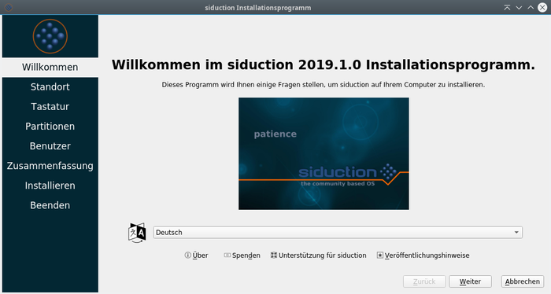
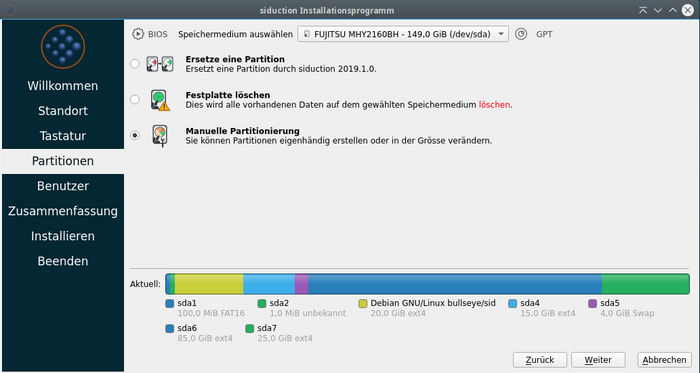
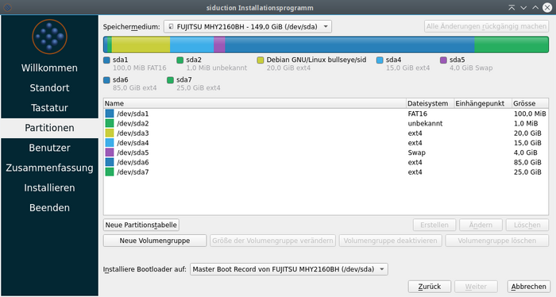
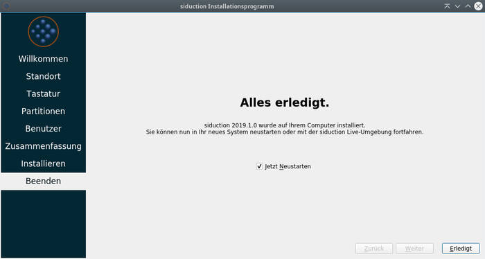
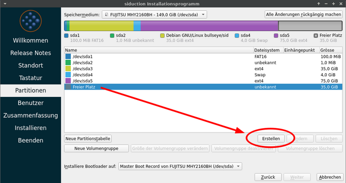

% Installation auf HDD

## Installation auf HDD

### Datensicherung

> **WICHTIG: IMMER EINE DATENSICHERUNG ANLEGEN!**  
> Wenn auf dem Installationsziel bereits ein Betriebssystem beheimatet ist, oder Daten erhalten bleiben sollen, bitte vor der Installation von siduction immer eine Sicherung anlegen.  

### Installationsvorbereitungen

Zuerst stellt man die Bootreihenfolge auf das zu bootende Medium (DVD, Flashcard oder USB-Stick) um. Bei den meisten Computern kommt man durch Drücken der `F2` oder `Entf`-Taste während des Bootvorgangs in das Setup von UEFI oder BIOS. Alternativ kann während des Bootvorgangs die Taste `F12`, `F11` `F7` oder `F8` (je nach Angaben der Hardwarehersteller) gedrückt werden um dann das Live-Medium als Startlaufwerk auszuwählen.

siduction startet jetzt in der Regel problemlos. Sollte das nicht der Fall sein, helfen Bootoptionen (Cheatcodes), die an den Bootmanager übergeben werden können. Die Handbuchseite [Cheatcodes](cheatcodes_de.md#bootoptionen-cheatcodes) erläutert die möglichen Optionen.  
Am Startbildschirm des Live-Mediums wird, je nachdem was zutrifft, mit den Pfeiltasten zu "From CD/DVD/ISO: ..." oder "From Stick/HDD: ..." navigiert und die Taste `e` betätigt. So gelangt man zum editieren der Kernelbefehlszeile um die Cheatcodes hinzuzufügen. Mit der Taste `F10` wird der Bootvorgang fortgesetzt.

**Vor der Installation bitte alle USB-Sticks, Kameras etc. entfernen.**

Soll siduction nicht von, sondern **auf ein USB-Medium** installiert werden, ist ein anderes Verfahren notwendig. Siehe dazu die Handbuchseite [Installation auf ein USB-Medium](0302-hd-ins-fromiso_de.md#fromiso).

**HDD, RAM und Swap**

Die Mindestanforderungen zur Installation der siduction Varianten sind auf der Handbuchseite [Inhalt der Live-ISO](cd-content_de.md#minimale-systemanforderungen) beschrieben.  
Mit 15 GB Festplattenvolumen und 2 GB Arbeitsspeicher ist man zur Zeit noch auf der sicheren Seite. 
Auf PCs mit maximal 1 GB RAM sollte eine Swap-Partition angelegt werden. Mehr als 2 GB Swap wird normal nicht benötigt und ist nur bei Suspend-to-Disk und Serversystemen wirklich sinnvoll.

### Partitionierung

Die Partitionierung der Laufwerke ist von vielen Faktoren abhängig:

+ Auswahl der siduction-Variante
+ Größe der vorhandenen Laufwerke und des Arbeitsspeichers
+ Single-Boot oder Dual-Boot mit einem bereits installierten System (Windows, Linux, MAC)
+ Gemeinsame Nutzung von Daten für die installierten Systeme

Beispiele und Größen für unterschiedliche Installationssituationen beschreibt die Handbuchseite [Partitionierung](part-size-examp_de.md#partitionierung-von-installationsmedien).  
Wir empfehlen, das **/home**-Verzeichnis auf der Wurzel-Partition zu belassen. Das Verzeichnis **/home** sollte der Ort sein, an dem die individuellen Konfigurationen abgelegt werden, und nur diese. Für alle weiteren privaten Daten, dazu zählen auch .ssh, .gnupg und die Mail-Archive, sollte eine eigene Datenpartition angelegt, und falls erforderlich auf das **home**-Verzeichnis verlinkt werden. Die Vorteile für die Datenstabilität, Datensicherung und auch im Falle einer Datenrettung sind nahezu unermesslich.  

Die Partitionierung kann während der Installation vorgenommen werden, oder bereits im Vorfeld während der Live-Sitzung mit den folgenden Programmen:  
[Gparted](part-gparted_de.md#partitionieren-mit-gparted), ein Programm für die graphische Oberfläche für GTK-Desktops  
KDE Partition Manager, ein weiteres Programm für die graphische Oberfläche für Qt-Desktops  
[gdisk](part-gdisk_de.md#partitionieren-mit-gdisk), empfohlen bei UEFI Hardware für GPT Partitionstabellen  
[cfdisk](part-cfdisk_de.md#partitionieren-mit-fdisk), nur für ältere Hardware mit traditionellem BIOS und MBR Partitionstabellen

### Dateisysteme

Wir empfehlen das Dateisystem **ext4**, welches bei siduction als Default-Dateisystem verwendet wird. Dies gilt für alle Partitionen, wenn ausschließlich Linux Betriebssysteme verwendet werden.

Bei einer Dual-Boot Installation mit *Windows* ist eine eigene Datenpartition mit dem **NTFS** Dateisystem sinnvoll. Linux kann lesend und schreibend darauf zugreifen; für Windows ist es das Standarddateisystem.

Bei einer Dual-Boot Installation mit *MAC* ist ebenfalls eine eigene Datenpartition allerdings mit dem **HFS** oder **HFS+** Dateisystem sinnvoll. Linux und MAC können lesend und schreibend darauf zugreifen.

### Duplizierung auf einen anderen Computer

Mit folgendem Konsolebefehl wird eine Liste der installierten Softwarepakete erstellt, um mit Hilfe dieser eine identische Softwareauswahl auf einem anderen Computer oder bei einer allfälligen Neuinstallation installieren zu können:

~~~sh
~# dpkg -l|awk '/^ii/{ print $2 }'|grep -v -e ^lib -e -dev -e $(uname -r) >/home/username/installed.txt
~~~

Am besten wird diese Textdatei auf einen USB-Stick oder einen Datenträger nach Wahl kopiert.  
Auf der Zielinstallation wird die Textdatei nach $HOME kopiert und als Referenz verwendet, um die benötigten Programmpakete zu installieren. Die gesamte Paketliste kann per

~~~sh
~# apt install $(/home/username/installed.txt)
~~~

installiert werden.

### Das Installationsprogramm Calamares

Während der Installation sollte, wenn möglich, der Computer mit dem Internet verbunden sein, weil Calamares den GeoIP Service verwendet um Voreinstellungen für die Lokalisation und Zeit zu ermitteln.

1. Das Installationsprogramm startet man bequem über das Icon  am Desktop oder im Menü: *System* > *System installieren*.

2. Nach einem Doppelklick auf das Icon startet Calamares und wir sehen das "Willkommen" - Fenster.

   

   Sofern eine Internetverbindung besteht, sollte hier bereits die richtige Sprache eingestellt sein.

3. Im nächsten Fenster "Standort" besteht die Möglichkeit Änderungen zur *Region*, der *Zeitzone* und *Systemsprache*, sowie dem *Format* für das Datum und die Zahlen vorzunehmen.

    

4. Es folgen die Einstellungen zur Tastatur.

   

   Im oberen Teil wird die Tastatur graphisch dargestellt und die Änderungen werden sofort sichtbar. Ganz unten befindet sich eine Eingabezeile um das Tastaturlayout zu testen.

5. Im nächsten Schritt erreichen wir die bereits oben erwähnte Partitionierung mit der bestimmt wird, welche Teile der Festplatte(n) siduction verwendet.

   

   In unserem Beispiel verwenden wir die *Manuelle Partitionierung* weil bereits im Vorfeld die Partitionen angelegt wurden und wir nur noch das richtige Installationsziel auswählen. Nach einem Klick auf *Weiter* erscheint das nächste Fenster, in dem wir die einzelnen Partitionen auswählen und bearbeiten können.

   

   Wir benutzen die Partitionen  
   sda7 für / (root)  
   sda6 für /daten gemeinsam mit dem bereits auf sda3 und sda4 vorhandenem Linux

   Nach Auswählen der betreffenden Partition und Betätigen des Schalters *Ändern* öffnet sich ein Fenster, in dem wir den oben bezeichneten Mountpiont eintragen und für sda7 auch die Formatierung mit dem Dateisystem **ext4** vornehmen. Die Partition sda6 wird nicht formatiert, da wir die dort schon abgelegten Daten gemeinsam mit dem bereits vorhandenen Linux nutzen möchten.  
   Die Swap-Partition (sda5) brauchen wir nicht bearbeiten, da sie während der Installation automatisch erkannt und integriert wird.  
   Das Ergebnis unserer Bemühungen sehen wir im nächsten Bild.

   

6. Als nächstes werden Benutzername, Anmeldename, Computername, Benutzerpasswort und Root-Passwort festgelegt (bitte gut merken!). Die Passwörter sollen aus Sicherheitsgründen nicht zu einfach gewählt werden. Weitere Benutzer können nach der Installation in einem Terminal mit [adduser](0301-hd-install_de.md#benutzer-hinzufügen) hinzugefügt werden.

   

   Vor der Verwendung der beiden Optionen  
   "Automatisches Einloggen ohne Passwortabfrage" und  
   "Nutze das gleiche Passwort auch für das Administratorenkonto"  
   wird hier ausdrücklich gewarnt. Sie stellen schon für sich allein ein Sicherheitsrisiko dar (siehe auch [sudo](term-konsole_de.md#arbeit-als-root)). Sind beide Optionen aktiviert ist die Eingabe von Passwörtern nur noch eine Farce!

7. Nach Betätigen der Taste *Weiter* erscheint eine Zusammenfassung aller zuvor getätigten Eingaben. Jetzt besteht noch die Möglichkeit über *Zurück* Änderungen vorzunehmen. Sind wir mit dem Ergebnis zufrieden, öffnet ein Klick auf *Installieren* das kleine Warnfenster in dem wir die Installation bestätigen müssen.

    

8. Nun startet die Installation. Dies dauert je nach Hardware einige Zeit. Der Fortschritt wird entsprechend angezeigt. Auch wenn es etwas länger dauert, bitte die Installation nicht abbrechen, sondern dem Prozess Zeit geben.

   

9. Am Ende erhalten wir die Möglichkeit zu einem Reboot in das neu installierte System. 

   

   Vor dem Reboot die CD aus dem Laufwerk nehmen!

### System verschlüsseln

Ab *siduction 2021.2 Farewell* besteht innerhalb des Installationsprogramms Calamares die Möglichkeit, das vollständige System in eine verschlüsselte Partition oder Festplatte zu installieren. Lediglich die erste Stufe des Bootmanagers *Grub* befindet sich unverschlüsselt auf der "*BIOS-boot*"-Partition. Grub fragt bei jedem Bootvorgang das Passwort für die verschlüsselte Installation ab, bevor das Bootmenü erscheint.  
Die oben unter 5 beschriebene Partitionierung gestaltet sich nun geringfügig anders. Bei der Auswahl einer der drei ersten Optionen, erscheint zusätzlich die Funktion "*Verschlüssele System*", in der wir auch gleich das Passwort eingeben.

Benutzen wir "*Manuelle Partitionierung*", so benötigen wir einen leeren, unbenutzten Bereich auf der Festplatte. Ist dieser nicht vorhanden, löschen wir zuerst eine oder mehrere nicht mehr benötigte Partitionen. Dann erstellen wir die neue Partition.

Im nächsten Schritt ist jetzt die Funktion *"Verschlüsseln"* auswählbar.

Wir geben unser Passwort ein und wählen anschließend als Einhängepunkt das Wurzelverzeichnis "**/**" aus.  
Nach Beendigung der Partitionierung setzen wir die Installation mit dem Menüpunkt *"Benutzer"*, wie oben unter 6 beschrieben, fort.

### Benutzer hinzufügen

Um neue Benutzer mit automatischer Übernahme der Gruppenberechtigungen hinzuzufügen, führt man folgenden Befehl als root aus:

~~~sh
~# adduser <nutzername>
~~~

Nach drücken der Eingabetaste werden weitere Optionen angezeigt, die zusätzliche Einstellungen ermöglichen. Zuletzt folgt eine Aufforderung zum zweimaligen Eingeben des Passworts.

siduction spezifische Desktopsymbole (für das Handbuch und den IRC) müssen selbst hinzugefügt werden. 

So entfernt man einen Benutzer

~~~sh
~# deluser <nutzername>
~~~

Mehr Informationen:

~~~sh
man adduser
man deluser
~~~

Zuletzt bearbeitet: 2022-02-09

