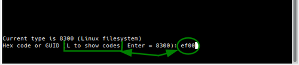
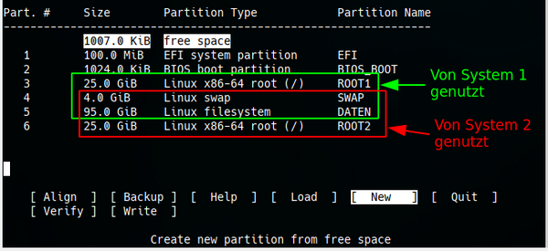

% Partitionieren mit gdisk

## Partitionieren mit gdisk

**Warum gdisk (GPT fdisk) verwenden?**

**gdisk** leitet sich von **G**lobally Unique Identifier **P**artition **T**able (GPT) ab und ist eine Anwendung, um Datenträger von jeder Größe zu partitionieren. gdisk wird unbedingt benötigt für Datenträger, die größer als 2TB sind.  
gdisk sorgt dafür, dass Partitionen für SSDs eingerichtet sind (bzw. für Speicher, die keine 512 Byte großen Sektoren besitzen).

Ein entscheidender Vorteil von GPT ist, dass man nicht mehr auf die dem MBR inhärenten primären, erweiterten oder logischen Partitionen angewiesen ist. GPT kann eine beinahe unbegrenzte Anzahl von Partitionen unterstützen und ist nur durch den für Partitionseinträge reservierten Speicherplatz des GPT-Datenträgers eingeschränkt. Zu beachten ist, dass die Anwendung gdisk standardmäßig für 128 Partitionen eingestellt ist.

Falls GPT auf kleinen USB/SSD-Datenträgern eingesetzt wird (zum Beispiel auf einem USB-Stick mit 8GB), könnte sich dies kontraproduktiv auswirken, wenn Daten zwischen verschiedenen Computern oder Betriebssystemen ausgetauscht werden sollen.  
Für diesen Zweck, und sofern ältere Hardware zum Einsatz kommt, verwenden wir besser `fdisk`, das Partitionstabellen auf Basis des MBR erstellt. Siehe die Handbuchseite [Partitionieren mit Cfdisk](0314-part-cfdisk_de.md#partitionieren-mit-fdisk).

**Wichtige Anmerkungen**

+ Die Begriffe UEFI und EFI sind austauschbar und bezeichnen das gleiche Konzept - **U**nified **E**xtensible **F**irmware **I**nterface (englisch für Vereinheitlichte erweiterbare Firmware-Schnittstelle).  
  Siehe [Wikipedia UEFI](https://de.wikipedia.org/wiki/Unified_Extensible_Firmware_Interface).  
  Die GPT ist ein Teil des UEFI Standards.

+ GPT-Datenträger verwenden

    + GPT-Datenträger können unter Linux auf Computern mit 32 bit und 64 bit eingesetzt werden.

    + Einige Betriebssysteme unterstützen keine GPT-Datenträger.  
    Dazu zählen alle MS Betriebssysteme vor Windows Vista SP1.  
    Ziehe bitte die Dokumentation des jeweiligen Systems zu Rate.

+ Booten von GPT-Datenträgern

    + Dual- und Triple-Boot von GPT-Datenträgern mit Linux, BSD und Apple ist mit dem EFI-Modus mit 64 bit unterstützt.

    + Dual-Boot von GPT-Datenträgern mit Linux und MS Windows ist ab Windows Vista SP1 möglich. Voraussetzung ist dabei für Windows die 64 bit Version.

+ Graphische Partitionierungsprogramme für GPT  
Neben dem Befehlszeilenprogramm `gdisk` unterstützen graphische Anwendungen wie `gparted` und `partitionmanager` GPT-Datenträger. Trotzdem empfehlen wir gdisk, um unerwünschten Anomalien vorzubeugen. Gparted sowie KDEs Partition Manager (und andere) sind dennoch großartige Hilfsmittel besonders um die Partitionierung zu visualisieren.

**Grundlegende Lektüre:**

+ man gdisk

+ [GPT fdisk Tutorial by Roderick W. Smith (Englisch)](http://www.rodsbooks.com/gdisk/)

+ [Wikipedia UEFI-Unterstützung der Betriebssysteme](https://de.wikipedia.org/wiki/Unified_Extensible_Firmware_Interface#Betriebssysteme)

+ [Wikipedia GUID-Partitionstabelle (Deutsch)](https://de.wikipedia.org/wiki/GUID_Partition_Table)

### Partitionierung einer Festplatte

> **Daten zuvor sichern!**  
> Bei Verwendung jedweder Partitionierungssoftware droht Datenverlust. Daten, die erhalten bleiben sollen, immer zuvor auf einem anderen Datenträger sichern.

In dem folgenden Beispiel werden wir eine 150GB Festplatte so formatieren, dass anschließend zwei Linux Systeme als Dualboot installierbar sein werden. Damit die Vorteile des UEFI zum tragen kommen, benötigen wir in der GPT eine *"EFI-System"*-Partition und für die zweite Stufe des GRUB-Bootloader eine *"BIOS-boot"*-Partition.  
Wir zeigen die notwendigen Arbeitsschritte mit dem Partitionierungsprogramm `cgdisk`, das GPT mit UEFI unterstützt.

cgdisk ist die Curses-basierte Programmvariante von gdisk. Sie bietet eine benutzerfreundliche Bedienoberfläche innerhalb des Terminals.  
Die Navigation erfolgt mittels der Pfeiltasten.

+ Für die Partitionen **`auf`** und **`ab`**
+ Für die Aktionsauswahl **`rechts`** und **`links`**.
+ Mit **`Enter`** wird die Auswahl bzw. Eingabe bestätigt.

### cgdisk verwenden

Der Startbefehl in einem root-Terminal lautet: **`cgdisk /dev/sdX`**.

cgdisk startet mit einer Warnmeldung, wenn keine GPT gefunden wird.

Wir benötigen für die beiden Betriebssysteme insgesamt sechs Partitionen: Zwei ROOT-, eine gemeinsame DATEN- sowie eine SWAP-Partition für den Auslagerungsspeicher. Zusätzlich die bereits oben erwähnte *"EFI-System"*-Partition (maximal 100MB) und die *"BIOS-boot"*-Partition (1MB).  
Wir empfehlen, das `/home`-Verzeichnis auf der ROOT-Partition zu belassen. Das Verzeichnis `/home` sollte der Ort sein, an dem die individuellen Konfigurationen abgelegt werden, und nur diese. Für alle weiteren privaten Daten sollte eine eigene Datenpartition angelegt werden. Die Vorteile für die Datenstabilität, Datensicherung und auch im Falle einer Datenrettung sind nahezu unermesslich.

Das Startbild

#### Partition erstellen

Wir wählen **`New`** und bestätigen mit **`Enter`**. Mit einem zweiten **`Enter`** übernehmen wir den voreingestellten ersten Sektor für die neue Partition. Dann geben wir die gewünschte Größe von `100M` für die *"EFI-System"*-Partition ein und bestätigen die Eingabe.

Nun wird von uns die Eingabe des Type-Code für die Partition erwartet.

Nach Eingabe von **`L`** erscheint eine lange Liste mit den Codes und ihrer Verwendung. Die integrierte Suchfunktion vereinfacht die Auswahl. Für uns sind folgende Codes notwendig:  
ef00 für EFI-System  
ef02 für BIOS-boot  
8200 für Swap  
8304 für Linux Root  
8300 für Linux Daten

Wir tragen also `ef00` ein und bestätigen. Anschließend dürfen wir optional noch einen Namen (Label) vergeben, was im Beispiel getan wurde, und die Eingabe wieder bestätigen. Mit den Partitionen für BIOS-boot, Linux-root und Swap wird nach gleichem Muster verfahren. Das nächst Bild zeigt das Ergebnis unserer Bemühungen. Wie wir sehen ist noch reichlich Platz für ein zweites System und vor allem für eine gemeinsam genutzte Daten-Partition vorhanden.

Nachdem die zwei Partitionen erstellt wurden, sehen wir die Aufteilung der gesamten Festplatte im nächste Bild. 

Die Partitionen, die die beiden Systeme später im Betrieb verwenden, sind farblich gekennzeichnet.  
An Anfang und Ende befinden sich noch kleine, freie Bereiche. Sie entstehen durch die Ausrichtung der Partition an die Blockgrenzen der Festplatte und können auch zwischen den Partitionen auftauchen. Mit **`Align`** kann der Wert für die Anzahl der Sektoren geändert werden. Für SSD und M2-Disk sind es in der Regel 2048 Sektoren und für alte Festplatten 512 Sektoren. gdisk liest die Metadaten der Festplatten aus und stellt den Wert für die Sektoren danach ein. Deshalb ist in der Regel keine Änderung notwendig.

Zusätzliche, detailierte Informationen zu den Partitionen lassen sich einsehen, wenn der Befehl **`Info`** benutzt wird.

Mit *Verify* wird die Partitionierung überprüft und eventuelle Fehler werden angezeigt.

Hier ist alles in Ordnung.  
Sollten Fehler gemeldet werden, markieren wir die Partition und benutzen den Befehl **`Info`**, und entscheiden ob die Partition gelöscht und neu angelegt werden muss und ob dabei z. B. die Größe zu ändern ist. Wenn mit diesen Mitteln eine Reparatur nicht möglich ist, stehen routinierten Usern die [Erweiterten Befehle von gdisk](0313-part-gdisk_de.md#erweiterte-befehle-von-gdisk) zur Verfügung.

#### Partition löschen

Um eine Partition zu löschen, markieren wir diese und benutzen den Befehl **`Delete`**.

Bei Notwendigkeit verfahren wir mit anderen Partitionen genauso und können dann mit geänderten Werten die Partitionen wieder erstellen.

#### GPT schreiben

Entspricht die Partitionierung der Festplatte unseren Vorstellungen prüfen wir noch einmal mit dem Befehl **`Verify`** ob alles in Ordnung ist. Werden keine Fehler angezeigt, wählen wir **`Write`** und

dürfen die Sicherheitsabfrage mit **`yes`** beantworten.

Der Warnhinweis sollte ernst genommen werden, denn nach Betätigung der **`Enter`**-Taste verschwinden alle Daten, die zuvor auf der Festplatte waren im Nirwana.

Da cgdisk nur Partitionen, aber keine Dateisysteme erstellt, muss jede der neuen Partitionen formatiert werden. Mit **`Quit`**  wird cgdisk beendet.

### Formatieren der Partitionen

Wir bleiben im Root-Terminal und lassen uns die Pfade mit den Nummern für jede Partition anzeigen:

~~~
fdisk -l | grep /dev/sdb
~~~

Der Befehl generiert die folgende Ausgabe:

~~~
Disk /dev/sdb: 149,5 GiB, 160041885696 bytes, 312581808 sectors
/dev/sdb1       2048    206847    204800  100M EFI System
/dev/sdb2     206848    208895      2048    1M BIOS boot
/dev/sdb3     208896  52637695  52428800   25G Linux root (x86-64)
/dev/sdb4   52637696  61026303   8388608    4G Linux swap
/dev/sdb5   61026304 260255743 199229440   95G Linux filesystem
/dev/sdb6  260255744 312581808  52326064   25G Linux root (x86-64)
~~~

Mit diesen Informationen formatieren wir unsere zuvor erstellten Partitionen.

Bitte unbedingt die man pages **`man mke2fs`**, **`man mkfs.fat`** und **`man mkswap`** lesen.

Die EFI-Systempartition erhält ein **FAT32** Dateisystem.

~~~
mkfs.vfat /dev/sdb1
~~~

**Die BIOS_Boot-Partition darf nicht formatiert werden!**  
Sofern der Bootmanager `GRUB` bei der Installation die *"EFI-System"*- und die *"BIOS\_Boot"*-Partition findet, benutzt er sie, gleichgültig, welches Installationsziel wir angegeben haben.

Die Linuxpartitionen `sdb3`, `sdb5` und `sdb6` formatieren wir mit **ext4**.

~~~
mkfs.ext4 /dev/sdb3
~~~

Die Swap-Partition wird mit:

~~~
mkswap /dev/sdb4
~~~

eingerichtet. Danach machen wir sie mit:

~~~
swapon /dev/sdb4
~~~

dem System bekannt und kontrollieren, ob der Swap-Speicher verfügbar ist:

~~~
swapon -s
Filename			Type		Size	Used	Priority
/dev/sdb4          	partition	4194304	0	    -2
~~~

Falls Swap korrekt erkannt wurde:

~~~
swapoff /dev/sdb4
~~~

**Als nächstes ist es unbedingt notwendig, das System neu zu starten, damit das neue Partitionierungs- und Dateisystemschema vom Kernel eingelesen wird.** 

### Booten mit GPT-UEFI oder GPT-BIOS

Falls ein bootbarer Datenträger mit GPT erstellt werden soll, gibt es zwei Möglichkeiten den Bootsektor eines GPT-Datenträgers zu erstellen.

Diese Möglichkeiten sind:

+ Der Computer (das Mainboard) besitzt ein UEFI

+ UEFI soll zum Booten des GPT-Datenträgers verwendet werden.

**oder** 

+ Der Computer (das Mainboard) hat **kein** UEFI sondern ein BIOS. (Alle Mainboard vor 2009 haben kein UEFI)

+ Das BIOS soll zum Booten des GPT-Datenträgers verwendet werden.

#### Booten mit UEFI

Wenn UEFI zum Booten verwendet werden soll, muss eine mit FAT formatierte *"EFI System"*-Partition (Typ "EF00" ) als erste Partition, und eine unformatierte *"BIOS boot"*-Partition (Typ "EF02" ) als zweite erstellt werden. Die erste Partition enthält den/die Bootloader.  
Während der Installation von siduction wird jegliche Auswahlmöglichkeit der install-gui, wohin der Bootloader installiert werden soll, ignoriert, sofern die vorgenannten Partitionen existieren. Der Bootloader von siduction wird in der *"EFI-System"*-Partition unter `/efi/siduction`  gespeichert. Die EFI-Systempartition wird auch als `/boot/efi`  eingebunden, solange die Option der Einbindung weiterer Partitionen ("mount other partitions") gewählt ist. Die Einbindung der *"EFI-System"*-Partition muss im Installer nicht extra angegeben werden.

#### Booten mit BIOS

Falls das System kein UEFI besitzt, muss als erste eine **BIOS-Boot**-Partition erstellt werden. Diese ersetzt den Sektor eines MBR-partitionierten Datenträgers, der sich zwischen der Partitionierungstabelle und der ersten Partition befindet, und in diesen wird Grub direkt geschrieben.  
Die Partition sollte die Größe von 200MB haben. (Der Grund dieser Größe anstelle der konventionellen 32MB liegt darin, um für den Fall eines Wechsels zu UEFI eine ausreichend große Partition zur Verfügung zu haben.)

### Erweiterte Befehle von gdisk

gdisk besitzt erweiterte Optionen und Sicherheitsmechanismen die in cgdisk nicht zur Verfügung stehen.

Falls Probleme entdeckt wurden (z. B. überlappende Partitionen oder nicht entsprechende Haupt- und Sicherungspartitionstabellen), besteht die Möglichkeit, diese mit verschiedenen Optionen im Menü `recovery & transformation` zu beheben. Wir starten gdisk mit

~~~
gdisk  /dev/sdb
~~~

An der Eingabeaufforderung **`Command (? for help):`** geben wir den Befehl **`r`** ein, um in das Untermenü von *"recovery & transformation"* zu gelangen und anschließend das **`?`**.

~~~
recovery/transformation command (? for help): ?
b use backup GPT header (rebuilding main)
c load backup partition table from disk (rebuilding main)
d use main GPT header (rebuilding backup)
e load main partition table from disk (rebuilding backup)
f load MBR and build fresh GPT from it
g convert GPT into MBR and exit
h make hybrid MBR
i show detailed information on a partition
l load partition data from a backup file
m return to main menu
o print protective MBR data
p print the partition table
q quit without saving changes
t transform BSD disklabel partition
v verify disk
w write table to disk and exit
x extra functionality (experts only)
? print this menu
~~~

Ein drittes Menü, **`experts`** , erreicht man mit **`x`**  entweder vom *"main menu"*  oder dem *"recovery & transformation menu"*.

~~~
recovery/transformation command (? for help): x

Expert command (? for help): ?
a set attributes
c change partition GUID
d display the sector alignment value
e relocate backup data structures to the end of the disk
g change disk GUID
i show detailed information on a partition
l set the sector alignment value
m return to main menu
n create a new protective MBR
o print protective MBR data
p print the partition table
q quit without saving changes
r recovery and transformation options (experts only)
s resize partition table
v verify disk
w write table to disk and exit
z zap (destroy) GPT data structures and exit
? print this menu
~~~

Dieses Menü ermöglicht Low-Level-Bearbeitung wie Änderung der Partitions GUID oder der GUIDs des Datenträgers (**`c`** bzw. **`g`** ). Die Option **`z`** zerstört augenblicklich die GPT-Datenstrukturen. Dies kann sinnvoll sein, wenn der GPT-Datenträger mit einem anderen Partitionierungsschema verwendet werden soll. Falls diese Strukturen nicht ausgelöscht werden, können einige Partitionierungsprogramme wegen des Vorhandenseins von zwei Partitionierungssystemen Probleme haben.

Trotz alledem: die Optionen der Menüs *"recovery & transformation"*  und *"experts"*  sollten nur benutzt werden, wenn man sich sehr gut mit GPT auskennt. Als "Nicht-Experte" sollte man diese Menüs nur verwenden, wenn ein Datenträger beschädigt ist. Vor jeder drastischen Aktion sollte die Option **`b`**  im Hauptmenü verwendet werden, um eine Sicherungskopie in einer Datei anzulegen und diese auf einem separaten Datenträger speichern. Dadurch kann die originale Konfiguration wieder hergestellt werden, falls die Aktion nicht nach Wunsch läuft.

Zuletzt bearbeitet: 2021-11-28

