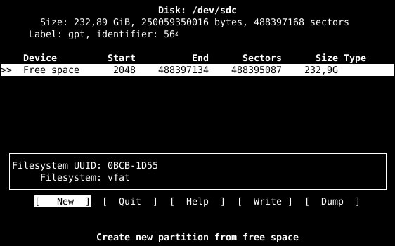
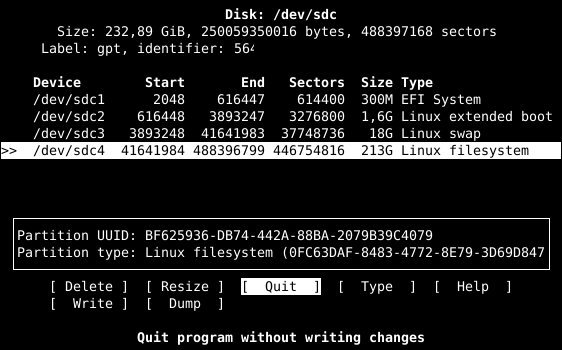

% Partitionieren mit cfdisk

## Partitionieren mit fdisk

> **ACHTUNG !**  
> Das Anlegen von Partitionstabellen, Partitionen und das Bearbeiten von Partitionen vernichtet alle Daten auf dem betreffenden Datenträger.

Im Jahr 2000 begann die Einführung von GPT Partitionstabellen auf Basis des UEFI. Der neuere Standard **G**lobally Unique Identifier **P**artition **T**able (GPT), der Teil des UEFI Standards ist, hat bei aktueller Hardware den MBR ersetzt und erlaubt Platten/Partitionen größer als 2 TByte und eine theoretisch unbegrenzte Anzahl primärer Partitionen. Weitere Informationen dazu gibt es in [Wikipedia GUID-Partitionstabelle](https://de.wikipedia.org/wiki/GUID_Partition_Table)

**fdisk** und das mit einer benutzerfreundlicheren ncurses Oberfläche versehene **cfdisk** erlauben die Bearbeitung von DOS Partitionstabellen auf Basis des BIOS und GPT Partitionstabellen auf Basis des UEFI.

Möchte man nicht nur eine vorhandene Partitionstabelle bearbeiten, sondern eine neue erstellen oder von DOS zu GPT wechseln, ist das Kommandozeilenprogramm `parted` die richtige Wahl. Ein kurzer Befehl erstellt auf `/dev/sda` eine neue GPT Partitionstabelle.

~~~
parted /dev/sda mktable gpt
~~~

Die Aktion ist noch einmal zu bestätigen, da alle bisher auf der Festplatte vorhandenen Daten verloren gehen.

### Informationen zu Speichergeräten

Einige Informationen über die Geräte erhält man leicht von einem Pop-Up Fenster, wenn man auf dem Desktop mit der Maus auf das Icon eines Geräts geht. Dies funktioniert sowohl vom Live-ISO als auch bei einem installierten siduction.  
Ausführlichere Informationen bietet die Verwendung von `lsblk`, `blkid` und `fdisk` in einem root Terminal. Der Befehl  
**`fdisk -l | tee /root/fdisk-l_$(date +%F_%H-%M-%S)`**  
erzeugt neben dem unten gezeigten Auszug auch eine Datei mit Zeitstempel im Verzeichnis des Benutzers root. Dies kann sehr hilfreich sein, falls Probleme auftreten.

~~~
[...]
Disk /dev/sda: 149,5 GiB, 160041885696 bytes, 312581808 sectors
Disk model: FUJITSU MHY2160B
Units: sectors of 1 * 512 = 512 bytes
Sector size (logical/physical): 512 bytes / 512 bytes
I/O size (minimum/optimal): 512 bytes / 512 bytes
Disklabel type: dos
Disk identifier: 0xXXXXXXXX

Device   Boot   Start       End   Sectors Size Id Type
/dev/sda1        2048  83888127  83886080  40G 83 Linux
/dev/sda2    83888128  88291327   4403200 2,1G 82 Linux swap
/dev/sda4    88291328 312581807 224290480 107G  5 Extended
/dev/sda5    88293376 249774079 161480704  77G 8e Linux LVM
/dev/sda6   249776128 312581807  62803632  30G 8e Linux LVM

Disk /dev/nvme0n1: 465,76 GiB, 500107862016 bytes, 976773168 sectors
Disk model: CT500P3SSD8
Units: sectors of 1 * 512 = 512 bytes
Sector size (logical/physical): 512 bytes / 512 bytes
I/O size (minimum/optimal): 512 bytes / 512 bytes
Disklabel type: gpt
Disk identifier: XXXXXXXX-XXXX-XXXX-XXXX-XXXXXXXXXXXX

Device        Start       End   Sectors  Size Type
/dev/sdb1      2048    206847    204800  100M EFI System
/dev/sdb2    206848 922953727 922746880  440G Linux filesyst
/dev/sdb3 922953728 976766975  53813248 25,7G Linux swap
~~~

**DOS Partitionstabelle**

DOS Partitionstabellen gelten auf aktueller Hardware für Laptop und PC als veraltet und sollten dort nicht mehr verwendet werden. Auf kleineren Speichergeräten wie USB Stick oder Speicherkarte sind sie häufiger anzutreffen.  
Die Partitionen in einer DOS Partitionstabelle können vom Typ *primär*, *erweitert* und *logisch* sein. Sie werden durch eine Zahl zwischen 1 und 15 definiert.  
Es sind maximal vier primäre Partitionen anlegbar. Eine dieser Partitionen kann eine erweiterte sein. Innerhalb der erweiterten Partition wiederum sind bis zu elf logische Partitionen möglich. Somit ist die Anzahl der Partitionen auf 14 begrenzt.  
Primäre oder erweiterte Partitionen erhalten eine Bezeichnung zwischen 1 und 4 (zum Beispiel sda1 bis sda4). Logische Partitionen sind immer gebündelt und Teil einer erweiterten Partition. Ihre Bezeichnungen beginnen mit Nummer 5 und enden mit Nummer 15.

**Beispiel**

~~~
4 Partitionen, alles primäre:

|sda1|sda2|sda3|sda4|

6 mountbare Partitionen
  2 primäre, 1 erweiterte, darin 4 logische:

|sda1|sda2|-
            |
          |sda4|  (erweiterte Partition)
            |
          |sda5|sda6|sda7|sda8|
~~~

*/dev/sda5* kann nur eine logische Partition sein (in diesem Fall die erste logische auf diesem Gerät).

**GPT Partitionstabelle**

Im Gegensatz zu der DOS Partitionstabelle erlaubt die GPT Partitionstabelle Platten/Partitionen größer als 2 TByte und eine theoretisch unbegrenzte Anzahl primärer Partitionen. Es gibt keine erweiterte Partition und auch keine logischen Partitionen.  
Das Beispiel in dem folgenden Kapitel *Cfdisk verwenden* beruht auf einer Festplatte mit GPT Partitionstabelle.

### Cfdisk verwenden

> **Daten zuvor sichern!**  
> Bei Verwendung jedweder Partitionierungssoftware droht Datenverlust. Daten, die erhalten bleiben sollen immer zuvor auf einem anderen Datenträger sichern.

Das Programm cfdisk bitte nur auf einer Festplatte anwenden, deren sämtliche Partitionen nicht eingehangen sind.  
Wir starten cfdisk in einer root Konsole (nach **`su`** ist die Eingabe des root Passworts gefordert).

~~~
user1@pc1:/$ su
Passwort:
root@pc1:/#
cfdisk /dev/sdc
~~~

**Die Bedienoberfläche**

Im ersten Bildschirm zeigt cfdisk die aktuelle Partitionstabelle. Am unteren Ende des Fensters befinden sich die Befehlsschalter. Um zwischen den Partitionen zu wechseln, benutzt man die Pfeiltasten **`auf`** und **`ab`**, um Befehle auszuwählen, die Pfeiltasten **`rechts`** und **`links`**. Mit der **`Enter`** Taste wird der Befehl ausgeführt.

Die Festplatte */dev/sdc* enthält nur eine leere GPT Partitionstabelle.

**Erstellen einer neuen Partition**

Im ersten Schritt legen wir eine 300 MB große Efi System Partition (ESP) an. Der bereits markierte Befehl **`New`** wird mit der **`Enter`** Taste bestätigt.

Damit das UEFI die ESP erkennt muss ihr Partitonstyp auf *EFI System* gesetzt werden. Mit dem Befehl **`Type`** fahren wir fort.

Die Pfeiltasten führen uns zu *EFI System*. Am unteren Rand wird die GUID des Partitonstyps angezeigt. Die **`Enter`** Taste schließt die Auswahl ab.

In den nächsten Schritten legen wir mit der gleichen Vorgehensweise drei weitere Partitionen an.

1,6G Typ: Linux extended boot  
18G Typ: Linux swap  
213G Typ: Linux filesystem

Das Ergebnis:

Für unser siduction haben wir jetzt eine 213 GB große Partition. Das ist sinnvoll, wenn wir LVM oder das Dateisystem Btrfs nutzen möchten. Eine andere Variante wäre eine Systempartition mit 60 GB und eine weitere Partition mit 153 GB für davon unabhängige Daten. Beide erhalten später das Dateisystem ext4.

**Größe einer Partition ändern**

Die Partition */dev/sdc4* wird markiert und der Befehl **`Resize`** ausgewählt und bestätigt.

Wir ändern die Größe auf 60G. Wieder beendet die **`Enter`** Taste den Vorgang.

Anschließend erstellen wir mit dem gesamten Rest (153 GB) eine Partition vom Typ *Linux filesystem*.  
Die Partitionierung ist jetzt abgeschlossen.

**Partitionstabelle schreiben**

Wenn alles fertig partitioniert ist, kann das Resultat mit dem Befehl **`Write`** gesichert werden. Die Partitionstabelle wird jetzt auf die Platte geschrieben.

Da damit alle vorher vorhandenen Daten auf der Festplatte gelöscht werden, sollte man sich seiner Sache wirklich sicher sein, bevor man **`yes`** eintippt und noch einmal mit **`Enter`** bestätigt.

**Cfdisk beenden**

Mit dem Befehl **`Quit`** verlassen wir das Programm. Nach Beendigung von cfdisk und vor der Installation sollte man auf jeden Fall rebooten, um die Partitionstabelle neu einzulesen.

### Formatieren von Partitionen

Es gibt für Linux verschiedene Dateisysteme, die man benutzen kann. Da wären **Ext2**, **Ext4**, **Btrfs**, **XFS**, **JFS** und **ZFS**.  
Ext2 kann von Interesse sein, wenn man von Windows aus zugreifen möchte, da es Windows-Treiber für dieses Dateisystem gibt. [Ext2-Dateisystem für MS Windows (Treiber und englischsprachige Doku)](http://www.fs-driver.org/).

Für normalen Gebrauch empfehlen wir das Dateisystem ext4. Es ist das Standard-Dateisystem von siduction.

Nach Beendigung von cfdisk wird die Root-Konsole weiter verwendet. Eine Formatierung erfordert root Rechte.  
Der Befehl lautet **`mkfs.ext4 /dev/sdXX`**. Für "XX" trägt man die Bezeichnung der ausgewählten Partition ein.

~~~
mkfs.ext4 /dev/sdc4
[...]
mkfs.ext4 /dev/sdc5
~~~

Nach Abschluss der Formatierung erscheint eine Meldung über den Erfolg der Aktion. Ist das nicht der Fall, so ist bei der Partitionierung etwas schief gelaufen oder die Partition ist keine Linux Partition. Wir überprüfen das mit:

~~~
fdisk -l /dev/sdc
~~~

Gegebenenfalls muss noch einmal partitioniert werden.

War die Formatierung erfolgreich, wiederholen wir dieser Ablauf für die anderen Partitionen, wobei der Befehl an die Partition und das gewünschte Dateisystem anzupassen ist. (z. B.: `mkfs.ext2` oder `mkfs.fat` oder `mkfs.btrfs` usw.)  
Bitte die Manpage **`man mkfs`** lesen.

Unserem Beispiel folgend erhalten die Partitionen /dev/sdc1 und /dev/sdc2 ein fat Dateisystem vom Typ 32.

~~~
mkfs.fat -F 32 /dev/sdc1
[...]
mkfs.fat -F 32 /dev/sdc2
~~~

Zuletzt wird die Swap Partition formatiert, in diesem Fall /dev/sdc3:

~~~
mkswap /dev/sdc3
~~~

Im Anschluss wird die Swap Partition aktiviert:

~~~
swapon /dev/sdc3
~~~

Danach kann in der Konsole überprüft werden, ob die Swap Partition erkannt wird:

~~~
swapon -s
~~~

Bei eingebundener Swap Partition sollte die Ausgabe auf den vorherigen Befehl etwa so aussehen:

~~~
Filename        Type        Size       Used   Priority
/dev/sdc3       partition   37748736   0      -2
~~~

Anschließend informieren wir den Kernel über die Änderungen mit dem Befehl **`systemctl daemon-reload`**.

Jetzt kann die Installation beginnen.

Zuletzt bearbeitet: 2026-02-21

