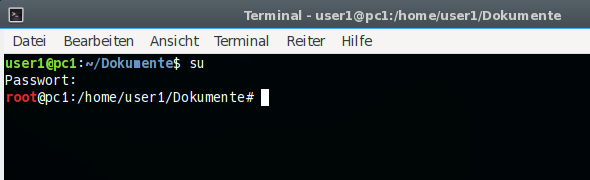

% Terminal - Kommandozeile

# Systemadministration

## Terminal - Kommandozeile

Ein Terminal, auch Konsole genannt, ist ein Programm, das es einem ermöglicht, durch direkt ausgeführte Befehle unmittelbar mit dem GNU/Linux Betriebssystem zu interagieren. Das Terminal, auch häufig die "Shell"  oder "Kommandozeile"  genannt, ist ein äußerst mächtiges Werkzeug und den Aufwand wert, die Grundlagen seiner Handhabung zu erlernen.

In siduction kann man das Terminal/die Konsole aufrufen, indem man das PC-Monitorsymbol rechts des Menüs anklickt oder in Menü > System > Terminal aufruft, oder, noch einfacher, in die Suchleiste des Menü  *kons* oder *term* eintippt. 

Nach dem Aufrufen des Terminals sieht man die Eingabeaufforderung "prompt":

~~~ sh
username@hostname:~$
~~~

**username** in obigem Beispiel entspricht dem Nutzernamen des angemeldeten Benutzers. Die Tilde **~**  zeigt, man befindet sich in seinem Heimverzeichnis **/home/username** , und das Dollarzeichen (der Promt) **$**  bedeutet, dass man im Terminal mit eingeschränkten Benutzerrechten angemeldet ist. Am Ende blinkt der Cursor. Dies alles ist die Kommandozeile. Hier werden Befehle eingegeben, die das Terminal ausführen soll.

Viele Befehle kann man nur mit Root-Rechten, also Administratorrechten, ausführen. Root-Rechte erhält man, indem man **su**  eingibt und `Enter` drückt. Hiernach muss man das Rootpasswort eingeben. Das Passwort wird während der Eingabe auf dem Bildschirm nicht angezeigt. (Siehe unten [Arbeit als root](#arbeit-als-root))

Ist die Eingabe korrekt, zeigt die Kommandozeile nun:

~~~ sh
root@hostname:/home/username#
~~~

Zu beachten ist, dass das Dollarzeichen **\$** durch eine Raute **#**  ersetzt wurde. In einem Terminal bedeutet die Raute **#**  immer, dass man mit Root-Rechten angemeldet ist.  
Wenn im Handbuch Kommandozeilenbefehle angegeben werden, werden die Angaben vor dem Prompt ($ oder #) ausgelassen. Ein Befehl wie:

~~~
# chmod g+w <Datei>
~~~

bedeutet also: man öffnet ein Terminal, meldet sich als root an (su) und führt dann den Befehl an einem Rootprompt **#** aus. Die Raute **#** wird nicht mit eingegeben.

Ein weiterer Hinweis:  
Für User, die neu am Terminal arbeiten, ist es oft verwirrend, wenn nach dem Ausführen eines Befehls keine Meldung erscheint, sondern nur wieder der leere Prompt. Diese Funktion ist gewollt und bedeutet, dass der Befehl fehlerfrei ausgeführt wurde. (Im obigen Beispiel erhielten die Gruppenmitglieder Schreibrechte an der \<Datei\>.)

### Arbeit als root

> **Achtung:**  
> Während man mit Root-Rechten im Terminal eingeloggt ist, darf man alles, z. B. Dateien löschen, ohne die das Betriebssystem nicht mehr funktioniert, uvm. Wenn man mit Root-Rechten arbeitet, muss man sich darüber im Klaren sein, *was* man gerade macht, denn es ist leicht möglich, dem Betriebssystem irreparable Schäden zuzufügen.

Berücksichtigen muss man, dass alle Aktionen, soweit im Programm vorgesehen, auch mit root-Rechten ausgeführt werden. Der einfache copy-Befehl *cp \<Quelle\> \<Ziel\>* in einem User-Verzeichnis führt zu Dateien mit dem Eigentümer *ROOT* im Zielverzeichnis. Das ist vermutlich nicht gewollt und auch nicht sinnvoll.

Deshalb: **Arbeiten als Root nur dort wo es wirklich notwendig ist!**

**Über su**

Eine Anzahl von Befehlen muss mit Root-Rechten gestartet werden. Diese Rechte erhält man durch Eingabe von **su**. Nach der Eingabe des richtigen Passwortes erscheint der Root-Prompt.

~~~
$ su
Passwort: 
#
~~~

Jetzt ist es möglich im Terminal alle Befehle auszuführen und alle Programme zu starten, die root-Rechte erfordern. Beenden kann man diesen Status mit der Eingabe von

~~~
# exit
$
~~~

und es erscheint wieder der Promt für den User.

**Über su-to-root**

Im Gegensatz zum allgemeinen Befehl **su** erlaubt **su-to-root** das Ausführen von Programmen mit graphischer Oberfläche mit Root-Rechten. **su-to-root** transferiert unter Benutzung von 'su' die X-Eigenschaften an den Zielnutzer. Die Eingabe lautet:

~~~
su-to-root -X -c <Programm>
~~~

Wenn Fehlermeldungen mit Bezug zu **dbus** auftreten, ist die Eingabe zu erweitern:

~~~
su-to-root -X -c 'dbus-launch <Programm>'
~~~

Es öffnet sich ein weiteres Terminal, in das das root-Passwort einzugeben ist. Bei Erfolg startet das gewünschte Programm mit root-Rechten.  
Beispiele für die Verwendung graphischer Anwendungen mittels *su-to-root* sind: die Bearbeitung einer Konfigurationsdatei mit einem Texteditor, der Einsatz des Partitionierungsmanagers gparted oder die Verwendung von Dateimanagern wie dolphin oder thunar.

**Verwendung in den Desktopumgebungen:**

+ Plasma (KDE und LXQt)  
  Der Befehl ist in Plasma nicht notwendig und wird nicht unterstützt, denn für Programme, die root-Rechte benötigen erfolgt eine Passwortabfrage und beim Editor erfolgt die Abfrage wenn man die geänderte Datei speichern möchte. Deshalb nur **su** im Terminal verwenden, wenn nötig.
+ Gnome und Cinnamon  
  Das Verhalten ist dem in Plasma ähnlich, mit der Ausnahme, dass der Befehl (su-to-root) unterstützt wird, aber nicht notwendig ist.
+ XFCE und Xorg  
  Hier entfaltet der Befehl seine volle Macht, und man ist in der Lage das gewünschte graphische Programm mit root-Rechten zu starten. Mann ist jedoch auch in der Pflicht zu beachten, wann und mit welchem Programm root-Rechte wirklich erforderlich sind.
  
> Unter keinen Umständen sollten Produktivprogramme, die normalerweise mit Benutzerrechten gestartet werden, mit dieser Option als root hochgefahren werden: Internet-Browser, E-Mail-Programme, Büroprogramme u.a.

**sudo ist nicht konfiguriert**

**sudo** steht nur im Live-Modus zur Verfügung, da im Live-Modus kein Root-Passwort gesetzt ist.  
Nach einer Installation ist **sudo** nicht aktiviert. Der Grund ist: Sollte ein Angreifer das Nutzer-Passwort abgreift, erlangt er noch keine Super-User-Rechte und kann keine schädlichen Veränderungen am System durchführen.

Ein anderes Problem mit **sudo** ist, dass eine Root-Anwendung, die mit der Nutzerkonfiguration läuft, Berechtigungen ändern und somit für den Nutzer unbrauchbar machen kann. Die Verwendung von [*su*](#su) oder [*su-to-root*](#su-to-root) wird empfohlen!

Sollte man trotz aller Warnungen *sudo* nutzen wollen, so muss man den entsprechenden $user der Gruppe sudo hinzufügen!

Dies kann mit dem Befehl "adduser BENUTZER GRUPPE" als root ausgeführt werden.

Als Alternative zu *sudo* kann auch *doas* (apt install doas) genommen und eingerichtet werden.

* https://man.openbsd.org/doas
* https://github.com/slicer69/doas

### Farbiges Terminal

Farbige Prompts am Terminal können einen vor unangenehmen oder katastrophalen Fehlern bewahren, falls man als **root #** eine Aufgabe durchführt, die man als **user $** machen wollte.  
Deshalb ist in siduction in der Grundeinstellung der Prompt des **user $** grün, blau und weiß, und bei dem von **root #** wird das Wort "root" in roter Farbe dargestellt.  

Der Fokus beim Arbeiten mit dem Terminal sollte auf den Eingaben und Ausgaben der Befehle liegen und nicht auf bunten Prompts. In siduction haben wir uns trotzdem für die Farben entschieden, um den Usern einen Warnhinweis zu geben, wenn sie als Systemadministrator mit root-Rechten unterwegs sind.  

**Farbe des Prompt ändern**

Bevor die Konfigurationsdatei geändert wird, erstellen wir im Terminal erst eine Sicherungskopie mit einem Datumsstempel.

~~~
$ cp ~/.bashrc ~/.bashrc_$(date +%F)
~~~

Dann öffnen wir mit einem Texteditor unserer Wahl (z. B.: kate, gedit, mcedit, vim...) die Datei **~/.bashrc** und suchen nach folgender Zeile, die sich etwa in der Mitte der Datei befindet:

~~~
PS1='${debian_chroot:+($debian_chroot)}\[\033[01;32m\]\u@\h\[\033[00m\]:\[\033[01;34m\]\w\[\033[00m\]\$ '
~~~

Dem Schrift- und Farbcode folgen unmittelbar die Promtteile, die diese Darstellung erhalten sollen. In der folgenden Abbildung wird der Bezug zwischen den Promtteilen und ihren Kürzeln gezeigt.

Die anschließende Tabelle erklärt die Werte der Syntax "\[\033[**01;32**m\]", wobei der fett gedruckte Teil die Schriftattribute und die Farbe bestimmt.

| Schriftcode | Schriftattribut | Farbcode | Farbe |
| --- | ---| --- | --- |
| 00m | Standard für Schrift und Farbe |
| 00;XX | Standardschrift | XX;m | Standardfarbe |
| 01;XX | fett | XX;30 | schwarz |
| 02;XX | dunkel | XX;31 | rot |
| 03;XX | kursiv | XX;32 | grün |
| 04;XX | unterstrichen | XX;33 | gelb |
| 05;XX / 06;XX | blinkend | XX;34 | blau |
| 07;XX | block, invertiert | XX;35 | magenta |
| 08;XX | Hintergrundfarbe (unsichtbar) | XX;36 | cyan |
| 09;XX | durchgestrichen | XX;37 | weiß |

Die oben zitierte "PS1"-Zeile wird demnach wie folgt angezeigt:

| Schriftcode | Promtteile und ihre Darstellung |
| --- | --- |
| [01;32m\]\\u@\\h | user, @ und host erhalten die Attribute "fett" und "grün" |
| [00m\]: | Doppelpunkt erhält die Standardattribute des Teminals |
| [01;34m\]\\w | das Arbeitsverzeichnis erhält die Attribute "fett" und "blau" |
| [00m\]\\$ | der Prompt erhält die Standardattribute des Teminals |

Soll aus dem Prompt die Farbe entfernt werden, stellen wir der PS1-Zeile eine Raute **#** und ein **Leerzeichen** voran. Damit ist die Zeile auskommentiert. Nun genügt es die Zeile

~~~
PS1='${debian_chroot:+($debian_chroot)}\[\033[00m\]\u@\h:\w\$ '
~~~

unmittelbar als nächste Zeile einzufügen.

Soll in dem Prompt die Farbe geändert werden, ist für jeden Teil des Prompt die Farbkodierung anzupassen.

~~~
 PS1='${debian_chroot:+($debian_chroot)}\[\033[03;32m\]\u@\h\[\033[01;34m\]:\w\[\033[00m\]\$ '
~~~

Dieses Codebeispiel erzeugt einen Promt, in dem **Username @ Hostname** grün und kursiv; der **:** und das **Arbeitsverzeichnis** blau und fett; das **$**-Zeichen und die Befehlseingabe die Kontrastfarbe zum Hintergrund des Terminals erhalten.

Die neuen Farben und Formate erscheinen nach öffnen eines neuen Terminals.

**Farbeinstellungen des Terminals**

Im Menü des Terminals gibt es unter *Bearbeiten* - *Einstellungen...* - Reiter *Farben* eine Unmenge an Einstellungsmöglichkeiten. Wir empfehlen eine eher schlichte Einstellung.

### Wenn das Terminal hängt

Manchmal kann ein Terminal nicht mehr so reagieren wie gewünscht. Das liegt meist daran, dass sich ein Programm fehlerfaft beendet und das Teminal in einem abnormalen Zustand zurückgelassen hat. Dann muss

~~~
reset
~~~

eingegeben und die Eingabetaste `Enter` gedrückt werden.

Wenn die Ausgabe eines Terminals verzerrt erscheint, kann dies meist durch das Drücken von `Strg` + `l` behoben werden, dadurch wird das Terminal-Fenster neu aufbaut. Solche Verzerrungen treten meist auf, wenn man mit Programmen arbeitet, eine eine ncurses-Schnittstelle benutzen, zum Beispiel *cgdisk*.

Ein Terminal kann eingefroren erscheinen, was aber in der Regel nicht der Fall ist, sondern die Eingaben werden weiterhin verarbeitet, auch wenn es nicht so scheint. Dies kann durch versehentliches Drücken von `Strg` + `s` verursacht sein. In diesem Fall kann `Strg` + `q`  versucht werden, um die Konsole wieder frei zu geben.

### Hilfe im Terminal

Die meisten Befehle/Programme haben eine Kommandozeilenhilfe und auch Anleitungen. Die Anleitungen werden "man page" oder "manual page" genannt. Die Syntax zum Aufrufen der "man page" ist:

~~~
$ man <Befehl>
~~~

oder

~~~
$ man -k <keyword>
~~~

Dies ruft die "man page" eines Befehls auf. Die Navigation in den "man pages" erfolgt durch die Pfeiltasten, beendet werden sie mit "q" für quit. Beispiel:

~~~
$ man apt-get
~~~

Um eine manpage zu verlassen, tippt man `q` 

Ein anderes nützliches Werkzeug ist der "apropos"-Befehl. "Apropos" ermöglicht es, die man pages nach einem Befehl zu durchsuchen, wenn man z. B. die Syntax vergessen hat. Beispiel:

~~~
$ apropos apt-
~~~

Dies listet alle Befehle für den Paketmanager apt auf. "apropos" ist ein mächtiges Werkzeug, für eingehendere Informationen über "apropos" siehe

~~~
$ man apropos
~~~

### Linux Konsolenbefehle

Eine sehr gute Einführung in die Konsole BASH findet sich auf [linuxcommand.org](http://linuxcommand.org/)(englisch).

Natürlich kann auch die favorisierte Suchmaschine verwendet werden, um mehr zu finden.

### Skripte benutzen

Ein Konsolen-Skript ist ein bequemer Weg, um mehrere Befehle in einer Datei zu bündeln. Die Eingabe des Dateinamen des Skripts führt die Befehle, die im Skript stehen, aus. siduction wird mit einigen sehr nützlichen Skripten ausgeliefert, welche Vereinfachungen der Systemadministration bieten.

Ein Skript wird in der Konsole folgendermaßen gestartet, wenn man sich im gleichen Verzeichnis befindet:

~~~
./name_des_skripts
~~~

Einige Skripte benötigen root-Zugang, abhängig vom Aufgabenbereich des Skripts.

**Installation und Ausführung**

Mit wget kann ein Skript auf den Rechner geladen werden, und man platziert es am besten in das empfohlene Verzeichnis, zum Beispiel nach **/usr/local/bin**. Zum Kopieren und Einfügen in der Konsole kann auch die Maus benutzt werden, nachdem man mit **su** Root-Rechte erlangt hat.

**Beispiel mit wget und root-Rechten**

~~~
$ su
Passwort:
# cd /usr/local/bin
# wget -c ftp://<entfernter_server>/script-name.sh
~~~

Danach muss die Datei ausführbar gemacht werden:

~~~
# chmod +x script-name.sh
~~~

Da das Verzeichnis */usr/local/bin* im Suchpfad von root enthalten ist, reicht für root der einfache Befehl

~~~
# script-name.sh
~~~

aus, um das Script zu starten.

Die Datei kann auch mit einem Browser auf den Computer geladen und an den geeigneten Ort verschoben werden, aber sie muss auch dann ausführbar gemacht werden.

**Beispiel mit wget als Nutzer**

So speichert man als Nutzer eine Datei im \$HOME (der Promt ist '$'):

~~~
$ wget -c ftp://<entfernter_server>/user-script-name.sh
$ chmod +x user-script-name.sh
~~~

Das Skript wird so gestartet:

~~~
$ ./user-script-name.sh
~~~

Das funktioniert als *user* natürlich nur, wenn das Script keine Befehle enthält, die root-Rechte benötigen.

Zuletzt bearbeitet: 2021-05-10

