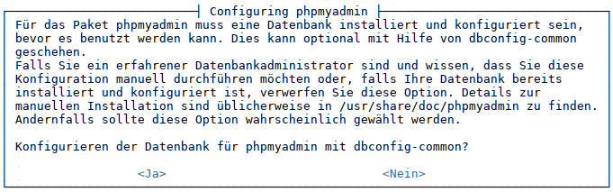

% LAMP-Testserver für Entwickler (lokal)

## LAMP-Webserver

**Ein lokaler Testserver für Entwickler**

Das Akronym **LAMP** bezieht sich auf eine Reihe freier Software, die gemeinsam genutzt wird, um dynamische Webseiten zu betreiben:

+ **L**inux: Betriebssystem
+ **A**pache: Web-Server
+ **M**ariaDb: Datenbank-Server (ab Debian 9 'Stretch', zuvor mySQL)
+ **P**HP, Perl und/oder Python: Skriptsprachen

Verwendungsmöglichkeiten als Server:

1. **ein lokaler Testserver für Webdesigner ohne Internetverbindung (siehe dieses Kapitel)**
2. ein privater (Daten-)Server mit Internetverbindung
3. ein privater Webserver mit umfassender Internetverbindung
4. ein kommerzieller Webserver

Unser Ziel ist es, einen LAMP-Testserver für Entwickler aufsetzen, der über LAN direkt mit dem Arbeitsplatz-PC verbunden ist. Darüber hinaus soll es aus Gründen der Sicherheit für den Server keine Verbindung zu einem lokalen Netzwerk oder gar zum Internet geben.
Einzige Ausnahme: Der Server wird temporär und ausschließlich für System- und Software- Aktualisierungen über eine zweite Netzwerkschnittstelle mit dem Internet verbunden.

> Zur Beachtung:  
> Der Desktop-PC, mit dem täglich gearbeitet wird, soll nicht als Server dienen. Als Server soll ein eigener PC verwendet werden, der ansonsten keine weiteren Aufgaben erfüllt.

Im Server-PC sollte mindestens 500MB RAM Arbeitsspeicher zur Verfügung stehen. Weniger RAM wird Probleme bereiten, da ein Server mit MariaDB/MySQL viel RAM benötigt, um ansprechend zu laufen.

Die zu installierenden Pakete sind:

~~~
apache2
mariadb-server
mariadb-client
php
php7.4-mysql
phpmyadmin
~~~

Wie bei siduction üblich, erledigen wir die Installationen im "multi-user.target" (init 3) im Terminal.

**Vorbereitungen**

Falls der Kommandozeilenbrowser *w3m* noch nicht installiert wurde, holen wir das jetzt nach:

~~~
# apt update
# apt install w3m
~~~

Das ermöglicht es uns Apache und PHP sofort im Terminal zu testen und erst nach Abschluss aller notwendigen  Installationen wieder in die graphische Oberfläche zurückzukehren.

Nun räumen wir noch apt auf.  
Der Befehl `apt autoremove` sollte zu der folgenden Ausgabe führen. Wenn nicht, bestätigen wir das Entfernen nicht mehr benötigter Pakete mit `j`.

~~~
#apt autremove
Paketlisten werden gelesen... Fertig
Abhängigkeitsbaum wird aufgebaut.
Statusinformationen werden eingelesen.... Fertig
0 aktualisiert, 0 neu installiert, 0 zu entfernen und 0 nicht aktualisiert.
~~~

Diese Maßnahme erleichtert uns im Fall einer fehlerhaften Installation die Reparatur ganz wesentlich.  
Siehe unten [Troubleshooting](0520-lamp-start_de.md#troubleshooting)

Es ist sinnvoll sich bereits vor der Installation einige Daten zu notieren.

Während der Installation notwendig:

+ Ein **Passwort** für den Datenbankbenutzer **root** in phpMyAdmin.

Später, für die Konfiguration notwendig:

+ **Apache**  
    + Server Name
    + Server Alias
    + IP-Adresse des Servers
    + Name des PC
    + IP-Adresse des PC

+ **MariaDB:**  
    + Den *Namen* der Datenbank die für das Entwicklungsprojekt verwendet werden soll.
    + Den *Namen* (Login-Name) eines neuen Datendank-Benutzers für das Entwicklungsprojekt.
    + Das *Passwort* für den neuen Datendank-Benutzer.
    + Den *Namen* (Login-Name) eines neuen Datenbank Administrators.
    + Das *Passwort* für den Datenbank Administrator.

### Apache installieren

Die Installation des Webservers Apache erfordert nur die beiden folgenden Befehle. Der install-Befehl holt sich noch die zusätzlichen Pakete *apache2-data* und *apache2-utils* herein. Anschließend fragen wir den Status von Apache ab und testen gleich die Start- und Stopanweisungen.

~~~
# apt update
# apt install apache2
[...]
Die folgenden NEUEN Pakete werden installiert:
  apache2 apache2-data apache2-utils
[...]
Möchten Sie fortfahren? [J/n] j
[...]

# systemctl status apache2.service
apache2.service - The Apache HTTP Server
     Loaded: loaded (/lib/systemd/system/apache2.service;
             enabled; vendor preset: enabled)
     Active: active (running) since Sun 2020-12-06
             14:24:44 CET; 4min 8s ago
[...]
~~~

Wie zu erkennen ist, wurde Apache sofort aktiviert.

~~~
# systemctl stop apache2.service
# systemctl status apache2.service
apache2.service - The Apache HTTP Server
     Loaded: loaded (/lib/systemd/system/apache2.service;
             enabled; vendor preset: enabled)
     Active: inactive (dead) since Sun 2020-12-06
             14:30:27 CET; 6s ago
[...]

# systemctl start apache2.service
# systemctl status apache2.service
apache2.service - The Apache HTTP Server
     Loaded: loaded (/lib/systemd/system/apache2.service;
             enabled; vendor preset: enabled)
     Active: active (running) since Sun 2020-12-06
             14:30:59 CET; 3s ago
[...]
~~~

Der Apache Webserver ist geladen und lässt sich problemlos handhaben. Jetzt prüfen wir seine Funktion mit:

~~~
w3m http://localhost/index.html
~~~

Die Apache-Begrüßungsseite mit *"It works!"* erscheint.  
Wir beenden w3m mit `q` und bestätigen mit `y`.

Als **ServerRoot** wird das Verzeichnis `/etc/apache2/` bezeichnet. Es enthält die Konfiguration.  
Als **DocumentRoot** wird das Verzeichnis `/var/www/html/` bezeichnet. Es enthält die Dateien der Webseite.

Für weitere Informationen und Hinweise zur Absicherung bitte die Handbuchseite  
[LAMP-Apache](0521-lamp-apache_de.md#apache-einrichten) lesen.

### MariaDB installieren

Die Installation von MariaDB gestaltet sich ähnlich einfach in dem die Metapakete "mariadb-server" und "mariadb-client" angefordert werden.

~~~
# apt install mariadb-server mariadb-client
[...]
Die folgenden NEUEN Pakete werden installiert:  
galera-4 libcgi-fast-perl libcgi-pm-perl libdbd-mariadb-perl
libfcgi-perl libhtml-template-perl libmariadb3
mariadb-client mariadb-client-10.5 mariadb-client-core-10.5
mariadb-common mariadb-server mariadb-server-10.5
mariadb-server-core-10.5 mysql-common socat
[...]
Möchten Sie fortfahren? [J/n] j
~~~

Weitere Informationen zu MariaDB und der Konfiguration liefert unser Handbuch in [LAMP-MariaDB](0522-lamp-sql_de.md#mariadb-einrichten)

### PHP installieren

Zur Installation der Scriptsprache PHP genügt der Befehl:

~~~
# apt install php
[...]
Die folgenden NEUEN Pakete werden installiert:
apache2-bin libapache2-mod-php7.4 libaprutil1-dbd-sqlite3
libaprutil1-ldap php php-common php7.4 php7.4-cli
php7.4-common php7.4-json php7.4-opcache php7.4-readline
[...]
Möchten Sie fortfahren? [J/n] j
~~~

Wie schon zuvor, holt das Metapaket eine ganze Reihe von Abhängigkeiten zusätzlich herein.  
Um nach der Installation zu prüfen, ob php korrekt läuft, wird die Datei `info.php` in `/var/www/html` mit der Funktion phpinfo() auf die Art erstellt, wie es hier angegeben ist:

~~~
mcedit /var/www/html/info.php  
~~~

Den folgenden Text einfügen

~~~
<?php
phpinfo();
?>
~~~

mit `F2` speichern, `F10` beendet mcedit.

Danach wird der Terminal-Browser w3m dorthin gelinkt:

~~~
w3m http://localhost/info.php  
oder  
w3m http://yourip:80/info.php  
~~~

~~~
PHP logo

PHP Version 7.4.11

System     Linux <hostname> 5.9.13-towo.1-siduction-amd64
Build Date Oct 6 2020 10:34:39
server API Apache 2.0 Handler
[...]
~~~

Erhalten wir eine Ausgabe, die wie oben gezeigt beginnt und alle php-Konfigurationen und Grundeinstellungen enthält, so funktioniert PHP und benutzt als *"server API"* den *"Apache 2.0 Handler"*.  

Wir beenden w3m mit `q` und bestätigen mit `y`.

Jetzt fehlt noch die Unterstützung für MariaDB/mysql in PHP. Wir benötigen das PHP-Modul *php7.4-mysql*.

~~~
# apt install php7.4-mysql
~~~

Wenn wir jetzt wieder die Seite http://localhost/info.php aufrufen, finden wir im Bereich der Module (sie sind alphabetisch sortiert) die Einträge zu *"mysqli"* und *"mysqlnd"*.

Weitere Informationen zu der Konfiguration von PHP und der Verwaltung ihrer Module enthält die Handbuchseite [LAMP-PHP](0523-lamp-php_de.md#php-einrichten)

### phpMyAdmin installieren

Um die Datenbank MariaDB zu administrieren benötigen wir *phpmyadmin*:

~~~
# apt install phpmyadmin
[...]
Die folgenden NEUEN Pakete werden installiert:
dbconfig-common dbconfig-mysql icc-profiles-free
libjs-openlayers libjs-sphinxdoc libjs-underscore
libonig5 libzip4 php-bacon-qr-code php-bz2
php-dasprid-enum php-gd php-google-recaptcha
php-mbstring php-mysql php-phpmyadmin-motranslator
php-phpmyadmin-shapefile php-phpmyadmin-sql-parser
php-phpseclib php-psr-cache php-psr-container
php-psr-log php-symfony-cache php-symfony-cache-contracts
php-symfony-expression-language php-symfony-var-exporter
php-symfony-service-contracts php-tcpdf php-twig
php-twig-extensions php-xml php-zip php7.4-bz2 php7.4-gd
php7.4-mbstring php7.4-xml php7.4-zip phpmyadmin
0 aktualisiert, 38 neu installiert, 0 zu entfernen und 60
nicht aktualisiert. Es müssen noch 15,7 MB von 15,8 MB an
Archiven heruntergeladen werden. Nach dieser Operation
werden 70,9 MB Plattenplatz zusätzlich benutzt.
Möchten Sie fortfahren? [J/n]  j
~~~

Während der Installation erscheinen die zwei Dialoge.  
Im ersten, zu Beginn, wählen wir *"apache2"* und bestätigen mit `ok`

im zweiten, am Ende der Installation, wählen wir *"ja"* aus.

In den folgenden Dialogen benötigen wir das Passwort für den Datenbankbenutzer *phpmyadmin* (siehe das Kapitel *Vorbereitungen*).

### Weitere Software

Wer sich mit der Entwicklung von Webseiten befasst, kann ein CMS zum Beispiel, WordPress, Drupal oder Joomla installieren, sollte zuvor jedoch unsere Handbuchseiten [LAMP-Apache](0521-lamp-apache_de.md#apache-einrichten) und [LAMP-MariaDB](0522-lamp-sql_de.md#mariadb-einrichten) für die Konfiguration des Servers und MariaDB berücksichtigen.

### Statusaugaben Log-Dateien

**Apache**

Der Konfigurationsstatus des Apache Webservers wird mit `apache2ctl -S` ausgegeben.  
Die Ausgabe zeigt den Status ohne Änderungen an der Konfiguration unmittelbar nach der Installation.

~~~
# apache2ctl -S
AH00558: apache2: Could not reliably determine the server's
fully qualified domain name, using 127.0.1.1. Set the
'ServerName' directive globally to suppress this message
VirtualHost configuration:
[::1]:80     127.0.0.1 (/etc/apache2/sites-enabled/000-default.conf:1)
127.0.0.1:80 127.0.0.1 (/etc/apache2/sites-enabled/000-default.conf:1)
ServerRoot: "/etc/apache2"
Main DocumentRoot: "/var/www/html"
Main ErrorLog: "/var/log/apache2/error.log"
Mutex default: dir="/var/run/apache2/" mechanism=default 
Mutex mpm-accept: using_defaults
Mutex watchdog-callback: using_defaults
PidFile: "/var/run/apache2/apache2.pid"
Define: DUMP_VHOSTS
Define: DUMP_RUN_CFG
User: name="www-data" id=33
Group: name="www-data" id=33
~~~

Die Handbuchseite [LAMP-Apache](0521-lamp-apache_de.md#apache-einrichten) enthält eine Reihe von Hinweisen zur Anpassung der Konfiguration.  
Das Verzeichnis `/var/log/apache2/` enthält die Log-Dateien. Ein Blick in diese ist behilflich um Fehlerursachen zu erkennen.

**MariaDB**

In der Konsole zeigt der Befehl

~~~
# systemctl status mariadb.service
~~~

den aktuellen Status von MariaDB und die letzten zehn Logeinträge.  
Die letzten zwanzig Zeilen des Systemd-Journals zeigt der Befehl

~~~
# journctl -n 20 -u mariadb.service
~~~

und

~~~
# journctl -f -u mariadb.service
~~~

hält die Verbindung zum Journal offen und zeigt laufend die neuen Einträge.  
Weitere Informationen liefert die Handbuchseite [LAMP-MariaDB](0522-lamp-sql_de.md#mariadb-einrichten)

**PHP**

Die Fehlermeldungen von PHP speichert der Apache Server in seinen Log-Dateien unter `/var/log/apache2/`. Fehlerhafte PHP-Funktionen erzeugen eine Meldung in der aufgerufenen Webseite.  
Dieses Verhalten lässt sich in den php.ini-Dateien des jeweiligen Interface konfigurieren.  
Siehe die Handbuchseite [LAMP-PHP](0523-lamp-php_de.md#php-einrichten)

### Troubleshooting

Die hier aufgeführten Beispiele zeigen exemplarisch einige Möglichkeiten der Fehlersuche.

**Dateirecht in "DocumentRoot"**

Sollte unmittelbar nach der Installation der Aufruf der Dateien `index.html` und `info.php` fehlschlagen, bitte unbedingt zuerst die Eigentümer- und Gruppenzugehörigkeit des Webseitenverzeichnisses überprüfen und ggf. ändern:

~~~
# ls -la /var/www/html
drwxr-xr-x 2 www-data www-data  4096 14. Dez 18:56 .
drwxr-xr-x 3 root     root      4096 14. Dez 18:30 ..
-rw-r--r-- 1 www-data www-data 10701 14. Dez 19:04 index.html
-rw-r--r-- 1 root     root        20 14. Dez 19:32 info.php
~~~

In diesem Fall wird die Apache Testseite angezeigt, die PHP-Statusseite nicht. Dann hilft ein beherztes

~~~
# chown -R www-data:www-data /var/www/html
~~~

Nun sollten sich beide Seiten aufrufen lassen.

**HTML-Seiten-Ladefehler**

Die Webseite http://localhost/index.html wird nicht angezeigt und der Browser meldet einen Seiten-Ladefehler.

Wir fragen den Status des Apache Webservers ab:

~~~
# systemctl status apache2.service
apache2.service - The Apache HTTP Server
     Loaded: loaded (/lib/systemd/system/apache2.service;
             enabled; vendor preset: enabled)
     Active: failed (Result: exit-code) since
             Mon 2020-12-14 18:29:23 CET; 13min ago
       Docs: https://httpd.apache.org/docs/2.4/
    Process: 4420 ExecStart=/usr/sbin/apachectl start
             (code=exited, status=1/FAILURE)

Dez 14 18:29:23 lap1 systemd[1]: Starting The Apache HTTP Server...
Dez 14 18:29:23 lap1 apachectl[4423]: AH00526: Syntax error on line 63 of /etc/apache2/conf-enabled/security.conf:
[...]
~~~

Wir sehen, dass die Datei *"security.conf"* in Zeile 63 einen Fehler aufweist.  
Wir bearbeiten die Datei und versuchen es noch einmal.

~~~
# systemctl start apache2.service
# systemctl status apache2.service
apache2.service - The Apache HTTP Server
     Loaded: loaded (/lib/systemd/system/apache2.service;
             enabled; vendor preset: enabled)
     Active: active (running) since Mon 2020-12-14
             18:34:59 CET; 3s ago
[...]
~~~

Generell ist nach jeder Änderung der Konfiguration ein Reload oder Restart des Apache notwendig.

**Apache Log-Dateien prüfen**

Ein Blick in die Logdateien unter `/var/log/apache2/` hilft um Fehler in der Konfiguration des Netzwerks oder des Apache Servers zu erkennen.

**PHP, info.php nur weiße Seite**

Das bedeutet, dass PHP aktiv ist, aber die Seite nicht anzeigen kann.  
Bitte überprüfen:

+ Der Inhalt der Datei `info.php` muss exakt dem im Kapitel PHP gegebenem Beispiel entsprechen.

+ Die Dateirechte, wie zu Beginn des Kapitels Troubleshooting erläutert, prüfen und ggf. ändern.

+ Zusätzliche PHP-Module wurden installiert oder die Konfiguration geändert und der Webserver nicht neu gestartet.  
  Dann hilft:

  ~~~
  # systemctl restart apache2.service
  ~~~

**phpMyAdmin - Error**

Der Aufruf von http://localhost/phpmyadmin schlägt mit der Meldung *"phpMyAdmin - Error"* fehl und die folgenden Informationen werden angezeigt.

~~~
Error during session start; please check your PHP and/or
webserver log file and configure your PHP installation
properly. Also ensure that cookies are enabled in your
browser.

session_start(): open(SESSION_FILE, O_RDWR) failed: Permission denied (13)
session_start(): Failed to read session data: files (path: /var/lib/php/sessions)
~~~

Die Berechtigungen für den Ordner `/var/lib/php/sessions` prüfen:

~~~
# ls -l /var/lib/php/
~~~

Die Ausgabe sollte diese Zeile enthalten:

~~~
drwx-wx-wt 2 root root 4096 14. Dez 17:32 sessions
~~~

Zu beachten ist das Sticky-Bit (**t**) und der Eigentümer **root.root**. Bei Abweichungen beheben wir den Fehler.

~~~
# chmod 1733 /var/lib/php/sessions
# chown root:root /var/lib/php/sessions
~~~

Nun ist der Login zu phpmyadmin möglich.

#### Wenn nichts hilft

Die Installation des LAMP-Stack ist in weniger als fünfzehn Minuten erledigt. Eine Fehlersuche kann jedoch Stunden in Anspruch nehmen.  
Deshalb ist es, sofern die zuvor genannten Maßnahmen zu keiner Lösung führen, sinnvoll den LAMP-Stack oder Teile davon zu entfernen und neu zu installieren. Wenn, wie im Kapitel Vorbereitungen erwähnt, apt aufgeräumt wurde, hilft der Befehl `apt purge` um die zuvor installierten Pakete mit ihren Konfigurationsdateien zu entfernen ohne das irgendwelche anderen Pakete stören.

Hier ein Beispiel mit Apache:

~~~
# apt purge apache2
Paketlisten werden gelesen... Fertig
Abhängigkeitsbaum wird aufgebaut.
Statusinformationen werden eingelesen.... Fertig
Die folgenden Pakete wurden automatisch installiert und
werden nicht mehr benötigt:
apache2-data apache2-utils
Verwenden Sie »apt autoremove«, um sie zu entfernen.
Die folgenden Pakete werden ENTFERNT:
  apache2*
0 aktualisiert, 0 neu installiert, 1 zu entfernen und 0 nicht aktualisiert.
~~~

*"Apache2"* wird entfernt und die Pakete *"apache2-data"* und *"apache2-utils"* blieben noch erhalten.  
Jetzt bitte **nicht** *"apt autoremove"* verwenden, denn dann bleiben die Konfigurationsdateien, in denen möglicherweise der Fehler liegt, zurück.  
Wir verwenden den Befehl `apt purge`.

~~~
# apt purge apache2-data apache2-utils
~~~

Bei Bedarf verfahren wir mit den anderen Programmteilen ebenso. Anschließend starten wir einen neuen Versuch.

### Sicherheit

Die bis hierher erklärte Installation führt zu einem Webserver der **"offen wie ein Scheunentor für Jedermann ist"**. Deshalb sollte er ausschließlich autark an einem Arbeitsplatz verwendet und nicht mit dem privaten Netzwerk und auf keinen Fall mit dem Internet verbunden werden.

Für die Absicherung des Servers bitte die Handbuchseiten

[LAMP-Apache](0521-lamp-apache_de.md#apache-einrichten) 
[LAMP-MariaDB](0522-lamp-sql_de.md#mariadb-einrichten) 
[LAMP-PHP](0523-lamp-php_de.md#php-einrichten)

bezüglich der Konfiguration beachten.

Danach kann der Server, ausschließlich für System- und Software- Aktualisierungen, temporär über eine zweite Netzwerkschnittstelle mit dem Internet verbunden werden.

Zuletzt bearbeitet: 2021-11-29

