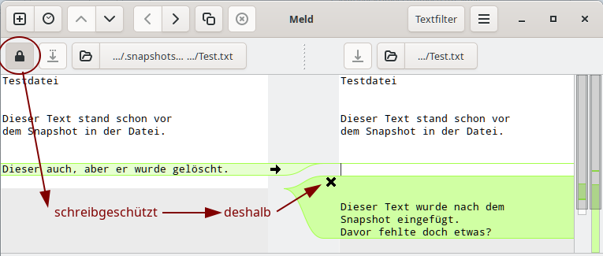

% Btrfs und Snapper

## Btrfs

Btrfs ist ein modernes Copy-on-Write (COW) Dateisystem für Linux.  
siduction unterstützt die Installation in eine mit *Btrfs* formatierte Partition. Mit der Veröffentlichung von 2022.12.0 kommt die Möglichkeit hinzu, mit Snapper Snapshots von Btrfs zu verwalten und über Grub zu booten. Das Installationsprogramm legt dabei innerhalb der ausgewählten Partition Subvolumen für das Wurzelverzeichnis `@`, die Benutzerverzeichnisse `@home` und `@root`, die Verzeichnisse `@tmp` und `@var@log` sowie ein Subvolumen `@snapshots` für System Snapshots an.

Btrfs funktioniert gut mit SSDs und herkömmlichen Festplatten. Der eigene eingebaute RAID Mechanismus (unterstützt wird RAID 0, 1 und 10) arbeitet auch bei Festplatten verschiedener Größe zuverlässig. Metadaten und Dateidaten behandelt Btrfs unterschiedlich. Normalerweise werden Metadaten auch bei nur einem Laufwerk doppelt gespeichert. Bei mehreren Laufwerken kann der Administrator innerhalb des gleichen Dateisystems unterschiedliche RAID Level für die Metadaten und Dateidaten festlegen.  
Btrfs verwaltet die Daten innerhalb der Laufwerke in Subvolumen, oberflächlich betrachtet ähnlich herkömmlichen Partitionen. Von den Subvolumen kann Btrfs Snapshots anfertigen, die bei Bedarf der Datenrekonstruktion dienen. Ein eingehängtes Btrfs-Dateisystem verhält sich meistens wie jedes andere Linux-Dateisystem. Gelegentlich treten jedoch einige Unterschiede zutage, denn Btrfs erledigt seine Arbeit vorwiegend im Hintergrund. Für Verwirrung sorgt zum Beispiel das Löschen einer großen Datei, ohne dass sich sofort der verfügbare freie Speicherplatz erhöht. Einige Zeit später ist der fehlende Platz dann doch da, oder auch nicht wenn ein vorangegangener Snapshot die Datei referenziert.

Zu Btrfs finden sich im Internet zahlreiche Dokumentationen. Wir werden deshalb hier nicht die umfangreichen Möglichkeiten sowie die Befehle und deren Anwendung wiederholen. Die Lektüre von **`man btrfs`** und **`man btrfs-<Befehl>`** ist obligatorisch. Darüber hinaus empfehlen wir das umfangreiche [Wiki von kernel.org](https://btrfs.wiki.kernel.org/index.php/Main_Page) und die ausführliche Dokumentation von [readthedocs.io](https://btrfs.readthedocs.io/en/latest/index.html).

**Btrfs verwenden**

Für die fortschrittlichen Eigenschaften von Btrfs (Snapshots, Komprimierung, Defragmentierung, Selbstheilung für Daten und Metadaten, integrierte Datenträgerverwaltung ...) z.B. gegenüber ext4, benötigen wir erkennbar größere Laufwerke. Das ist derzeit meist kein Problem, denn selbst preiswerte PCs und Laptop verfügen oft über 500 GB große Laufwerke.  
Als Mindestgröße des Btrfs Laufwerks, in das die vollständige Installation erfolgen soll, empfehlen wir 100 GB. Abhängig vom Volumen der privaten Daten auch deutlich mehr. Möchte man Btrfs nur für die root-Partition verwenden, sollte diese eine Größe von mindestens 50 GB aufweisen. Für Benutzer die nicht so viel Speicherplatz zuweisen wollen, ist die übliche Vorgehensweise entweder Btrfs ohne Snapshots oder ext4 zu verwenden.  
Btrfs versteht auf der Kommandozeile für seine Befehle und Optionen beliebige Abkürzungen, sofern diese eindeutig sind. So wird zum Beispiel **`btrfs su li /`** intern zu **`btrfs subvolume list /`**.

### Btrfs Subvolumen

Bei der Erstinstallation in eine einzige Partition werden die folgenden Subvolumen angelegt.

| Subvolumen | Einhängepunkt | Bemerkungen |
| --- | --- | ----- |
| @ | / | |
| @home | /home | |
| @root | /root | Der Benutzer **root** |
| @tmp | /tmp | |
| @var@log | /var/log | |
| @snapshots | /.snapshots | Ablageort für die Snapshot von `@` |

Für Btrfs liegen sie gleichwertig auf der höchsten Ebene (*'top level 5'* ). Wir hängen sie alle separat an dem gewünschten Platz im Dateibaum ein. Es wird auch als *"flaches Layout"* bezeichnet bei dem die Dateisystemwurzel an sich nicht eingehängt wird. Sobald die Subvolumen erstellt wurden, ist es nicht mehr nötig, das "Root"-Gerät einzuhängen, wenn nur der Inhalt der Subvolumen von Interesse ist. Im laufenden Betrieb befinden wir uns bereits in dem Subvolumen `@`.

**Subvolumen anlegen**

Um ein neues *top level 5* Subvolumen `@data` anzulegen, booten wir in ein Livesystem und hängen die siduction Btrfs-Partition unter `/mnt` ein.

~~~
# mount -t btrfs /dev/sdxX /mnt/
# ls -a /mnt/
 .  ..  @  @home  @root  @snapshots  @tmp  @var@log
~~~

Der *ls* Befehl zeigt die vorhandenen *top level 5* Subvolumen nach der Installation.  
Jetzt legen wir das neue Subvolumen und seinen Einhängepunkt an und geben den Inhalt von `/mnt` erneut aus. 

~~~
# btrfs subvolume create /mnt/@data
# mkdir /mnt/@/data
# ls -a /mnt/
 .  ..  @  @data  @home  @root  @snapshots  @tmp  @var@log
~~~

Nach einem Reboot in unser siduction enthält das Wurzelverzeichnis den neuen Ordner `/data`. Damit die normalen Benutzer das Verzeichnis verwenden könnsnapper-konfigurationen, änder wir die Gruppe:

~~~
# chgrp users /data
~~~

Subvolumen lassen sich auch verschachteln und somit innerhalb bestehender Subvolumen erstellen. Wir raten zur besseren Übersicht eher zu dem flachen Schema.

**Subvolumen einhängen**

Mit dem Befehl  
**`mount -t btrfs -o subvol=/@data,defaults /data/`**  
hängen wir das Subvolumen manuell ein.  
Diese einfache Variante eignet sich nicht für eine dauerhafte Verwendung. Außerdem unterdrückt sie die vorteilhaften Fähigkeiten von Btrfs. Wir schauen uns einen Eintrag aus der Datei `/etc/fstab` an.

~~~
# grep home /etc/fstab
UUID=<hier>  /home  btrfs  subvol=/@home,defaults,noatime,space_cache=v2,autodefrag,compress=zstd 0 0
~~~

Mit der Option *"space_cache=v2"* werden die Adressen der freien Blöcke des Laufwerks zwischengespeichert um die Schreibvorgänge zu beschleunigen.  
Die Option *"autodefrag"* sorgt für die Defragmentierung der Dateien während der Laufzeit.  
Datenkomprimierung erreichen wir mit der Option *"compress=zstd"*.

Unser selbst erstelltes Subvolumen `@data` soll automatisch und dauerhaft mit diesen Optionen verfügbar sein. Deshalb ergänzen wir die `/etc/fstab` um den benötigten Eintrag entweder mit einem Editor oder mittels zweier Befehle.

~~~
# echo "# Extended by root on $(date +%F)" >> /etc/fstab
# grep home /etc/fstab | sed 's!home!data!g' "$@" >> /etc/fstab
~~~

Sofort im Anschluss steht das Subvolumen durch den kurzen Befehl **`mount /data`** zur Verfügung und es wird wie alle anderen bei jedem Bootvorgang eingehangen.

### Btrfs Snapshot

Ein Snapshot ist ein Subvolumen wie jedes andere, jedoch mit einem vorgegebenen Anfangsinhalt. Im Dateimanager betrachtet scheint es eine vollständige Kopie des ursprünglichen Subvolumens zu enthalten. Btrfs ist ein Copy-on-Write-Dateisystem, sodass es nicht notwendig ist alle Daten tatsächlich zu kopieren. Der Snapshot hat einfach einen Verweis auf die aktuelle Wurzel des Dateisystems seines ursprünglichen Subvolumens. Erst wenn etwas geändert wird erstellt Btrfs eine Kopie der Daten. Dateiänderungen in einem Snapshot haben keine Auswirkungen auf die Dateien im ursprünglichen Subvolumen.

Ein Snapshot ist nicht rekursiv. Ein Subvolumen oder ein Snapshot ist effektiv eine Barriere. Dateien in verschachtelten Subvolumen erscheinen nicht im Snapshot. Stattdessen gibt es ein Blind-Subvolumen, was bei verschachtelten Layouts für Verwirrung sorgen könnte. Das nicht rekursive Verhalten erklärt, weshalb siduction während der Installation zusätzliche Subvolumen angelegt hat. So gelangen keine privaten und variablen Daten aus den Subvolumen `@home`, `@root`, `@tmp` und `@var@log` in einen Snapshot von `@`.

Man sollte beachten, dass Snapshots von Btrfs Dateisystemen in keinem Fall eine durchdachte Datensicherung ersetzen. Selbst bei RAID1 und RAID10 Systemen mit Btrfs steht die Ausfallsicherheit im Vordergrund und nicht die Datensicherung.

**Snapshot erstellen**

> **Achtung**  
> Nur anwenden, wenn Sie Snapper **nicht** verwenden wollen.

Da ein Snapshot ein Subvolumen innerhalb seiner Quelle ist, bietet es sich an, ein entsprechendes Unterverzeichnis anzulegen. Wir nehmen für das Beispiel unser selbst erstelltes Subvolumen `@data`, legen das Verzeichnis an und gleich anschließend den ersten Snapshot.

~~~
# mkdir /data/.snapshots
# btrfs subvolume snapshot -r /data/ /date/.snapshots/01
~~~

Der Befehl erinnert von der Syntax her an einen einfachen Kopiervorgang, wobei `01` der Ordner ist, in dem sich die Dateien des Snapshot befinden.  
Standardmäßig werden Snapshots mit Lese- und Schreibzugriff erstellt. Mit der Option `-r` sind sie schreibgeschützt. Wir raten dringend, die Option `-r` zu verwenden, denn ein Snapshot bildet zum Zeitpunkt seiner Erstellung den Zustand des Subvolumens ab. Wie man auf die Daten eines Snapshots zugreifen kann erfahren wir im Handbuch in den Kapiteln ab ["Snapper Rollback"](0704-sys-admin-btrfs-snapper_de.md#snapper-rollback).

## Snapper

Snapper ist ein Werkzeug für die Verwaltung von Dateisystem-Snapshots unter Linux für Btrfs Dateisysteme und thin-provisioned LVM Volumen. Neben der Erstellung und Löschung von Snapshots kann es auch Snapshots vergleichen und Unterschiede zwischen Snapshots rückgängig machen. Es ermöglicht Benutzern ältere Versionen von Dateien einzusehen und Änderungen rückgängig zu machen. Außerdem unterstützt Snapper automatische Snapshots nach Zeitplänen oder zu Aktionen.

Die Standardkonfiguration von Snapper in siduction umfasst automatische Pre- und Post-Snapshots des Subvolumen `@` bei Änderungen am System und die Vorbereitung von zeitgesteuerten Snapshots für beliebige andere Subvolumen.

Die Snapper Dateien befinden sich in:

+ `/usr/bin/` Das ausführbare Programm `snapper`.  
+ `/usr/lib/snapper/` Hilfsprogramme für Snapper.  
+ `/etc/default/snapper` Eine Übersicht der konfigurierten Subvolumen.  
+ `/etc/snapper/configs/` Die Konfigurationsdateien der konfigurierten Subvolumen.  
+ `/usr/share/snapper/config-templates/` Die Konfigurationsvorlagen.  
+ `/var/log/snapper.log` Snappers Logdatei.

Bitte die man pages **`man snapper`** und **`nam snapper-configs`** lesen.

### Snapper Konfiguration

Snapper benötigt eine Konfigurationsdatei für jedes Subvolumen bevor es Snapshots darin erzeugen kann. Siduction erstellt bei der Installation automatisch die Konfigurationsdatei `/etc/snapper/configs/root` für das Subvolumen `@`. Für die anderen Subvolumen müssen wir bei Bedarf selbst Konfigurationen nach dem folgenden Muster erstellen.

~~~
# snapper -c <config_name> create-config -t <config_vorlage> <subvolume_mount_point>
~~~

Doch zuvor schauen wir uns die Standardkonfiguration an und prüfen welche Einstellungen sinnvoll sind.  
Die Konfiguration für das Subvolumen `@` mit dem Namen `root`, die Werte der Standardvorlage `default` und die Werte der Vorlage `user`, die wir später erstellen werden:

~~~
Snapper Konfiguration
-----------------------+-------+-------+-------+
Subvolumen             |   @   |  --   |  --   |
-----------------------+-------+-------+-------+
conf-name or templ-name| root  |default| user  |
=======================+=======+=======+=======+
Schlüssel              | Wert  | Wert  | Wert  |
-----------------------+-------+-------+-------+
ALLOW_GROUPS           | users |       | users |
ALLOW_USERS            |       |       |       |
BACKGROUND_COMPARISON  | yes   | yes   | yes   |
EMPTY_PRE_POST_CLEANUP | yes   | yes   | yes   |
EMPTY_PRE_POST_MIN_AGE | 1800  | 1800  | 1800  |
FREE_LIMIT             | 0.2   | 0.2   | 0.2   |
FSTYPE                 | btrfs | btrfs | btrfs |
NUMBER_CLEANUP         | yes   | yes   | yes   |
NUMBER_LIMIT           | 50    | 50    | 5     |
NUMBER_LIMIT_IMPORTANT | 10    | 10    | 2     |
NUMBER_MIN_AGE         | 1800  | 1800  | 1800  |
QGROUP                 |       |       |       |
SPACE_LIMIT            | 0.5   | 0.5   | 0.5   |
SUBVOLUME              | /     | /     | /     |
SYNC_ACL               | yes   | yes   | yes   |
TIMELINE_CLEANUP       | yes   | yes   | yes   |
TIMELINE_CREATE        | no    | yes   | yes   |
TIMELINE_LIMIT_DAILY   | 10    | 10    | 2     |
TIMELINE_LIMIT_HOURLY  | 10    | 10    | 10    |
TIMELINE_LIMIT_MONTHLY | 10    | 10    | 0     |
TIMELINE_LIMIT_WEEKLY  | 0     | 0     | 1     |
TIMELINE_LIMIT_YEARLY  | 10    | 10    | 0     |
TIMELINE_MIN_AGE       | 1800  | 1800  | 1800  |
~~~

Snapper arbeitet mit systemd zusammen. Einige Einstellungen zum Handling der automatischen Snapshots verbergen sich in den zugehörigen systemd Units. Das Kapitel ["Snapper und systemd"](0704-sys-admin-btrfs-snapper_de.md#snapper-und-systemd) erklärt die Funktionen und gibt Hinweise zu deren Anpassung.
  
Bei jeder APT-Aktion werden die **Apt Snapshot** *"pre"* und *"post"* erstellt. Der Schlüssel `NUMBER_LIMIT=50` bewirkt, dass die jüngsten fünfundzwanzig Snapshotpaare erhalten bleiben.

Snapper erzeugt automatisch **Timeline Snapshot** wenn der Schlüssel `TIMELINE_CREATE=yes` in den Konfigurationsdateien eingestellt ist. Die systemd Unit `snapper-timeline.timer` aktiviert die zugehörige Service Unit stündlich. Entsprechend der *default* Konfiguration behält Snapper jeweils mindestens zehn `HOURLY`, `DAILY`, `MONTHLY` und `YEARLY` Snapshots.

Dadurch summieren sich die gehaltenen Snapshots erheblich. Die Tabelle *Gehaltene Snapshots 1* berücksichtigt die *default* Konfiguration für das `@home` Subvolumen und die *root* Konfiguration für `@` mit einem dist-upgrade täglich.

Gehaltene Snapshots 1

| Subvolumen | @ | @home |
| :----------------| :-----: | :-----: |
| am 1. Tag      |  2  |     max 24 |
| nach 1 Tag     |  2  | 10 + max 24 |
| nach 5 Tagen   | 10  | 15 + max 24 |
| nach 1 Woche   | 14  | 17 + max 24 |
| nach 1 Monat   | 50  | 21 + max 24 |
| nach 6 Monaten | 50  | 26 + max 24 |
| nach 1 Jahr    | 50  | 30 + max 24 |
| nach 10 Jahren | 50  | 40 + max 24 |

*"+ max 24"* beschreibt die Anzahl der erstellten *HOURLY Timeline Snapshot* bis zu dem Zeitpunkt an dem der `snapper-cleanup.timer` aktiv wird. Der allererste *Timeline Snapshot* vagabundiert sage und schreibe mindestens zehn Jahre und einen Tag in unseren Dateisystem. Wer möchte sein produktiv eingesetztes System auf diesen Snapshot zurücksetzen und die ganzen Daten so lange behalten?  
Man beachte: Snapper und Snapshots sind kein Mittel zur Datensicherung. Sie ermöglichen das zeitnahe Zurücksetzen des Systems bei auftretenden Fehlern oder durch uns angestoßene Aktionen mit ungewollten Auswirkungen.

Aus diesen Gründen generieren wir eine neue Konfigurationsvorlage aus der Datei `/usr/share/snapper/config-templates/default` mit den Werten der Spalte *"user"* aus der oben abgebildeten Tabelle *"Snapper Konfiguration"* und speichern sie unter dem Namen `user`. Anschließend erzeugen wir die Konfiguration für unser Subvolumen `@data`.

~~~
# snapper -c data_pr create-config -t user /data
~~~

Dies:

1. Erstellt die Konfigurationsdatei `/etc/snapper/configs/data_pr` basierend auf der Vorlage `/usr/share/snapper/config-templates/user`.  
2. Erstellt das Subvolumen `/data/.snapshots`, in dem zukünftige Snapshots von `@data` gespeichert werden. Der Pfad eines Snapshots lautet `/data/.snapshots/#/snapshot`, wobei # die Nummer des Snapshots ist.  
3. Fügt den Namen der Konfiguration `data_pr` zum Schlüssel *"SNAPPER_CONFIGS"* in der Datei`/etc/default/snapper` hinzu.

Jetzt ist die Konfiguration aktiv. Wenn, wie in unserem Beispiel, der Schlüssel `TIMELINE_CREATE=yes` gesetzt ist, übernimmt systemd mit den Timern die regelmäßige Erstellung von *"timeline snapshots"*.  
Wir vergleichen noch einmal die gehaltenen Snapshot.

Gehaltene Snapshots 2

| Subvolumen | @ | @home | @data |
| :----------------| :-----: | :-----: | :-----: |
| am 1. Tag      |  2  | max. 24 | max. 24 |
| nach 1 Tag     |  2  | 10 + max 24 | 2 + max 24 |
| nach 5 Tagen   | 10  | 15 + max 24 | 2 + max 24 |
| nach 1 Woche   | 14  | 17 + max 24 | 3 + max 24 |
| nach 1 Monat   | 50  | 21 + max 24 | 3 + max 24 |
| nach 6 Monaten | 50  | 26 + max 24 | 3 + max 24 |
| nach 1 Jahr    | 50  | 30 + max 24 | 3 + max 24 |
| nach 10 Jahren | 50  | 40 + max 24 | 3 + max 24 |

Im Subvolumen `@data` bleiben nach einer Woche konstant ein Wochensnapschot, zwei Tagessnapshots des Vortages und bis zu vierundzwanzig Snapshots des aktuellen Tages erhalten. Wer die maximal vierundzwanzig Tagessnapshot als zu viel erachtet schaut sich bitte das folgende Kapitel *Snapper und systemd* an.

Wir können einzelne *Schlüssel=Wert* Paare auch auf der Kommandozeile ändern. Im Beispiel verringern wir in der Konfiguration `root` die Anzahl der gehaltenen, nummerierten Snapshot.

~~~
# snapper -c root set-config NUMBER_LIMIT=20
~~~

Jetzt bleiben die jüngsten zehn statt fünfundzwanzig Pre- und Post-Snapshot Paare nach APT Aktionen erhalten. Für den Standardgebrauch eines Laptop oder PCs dürfte dieser Wert ausreichen.  
An dieser Stelle sollte jeder siduction Nutzer abwägen wie viele Snapshot er wie lange halten möchte und die Konfiguration entsprechend anpassen. 
    
### Snapper und systemd

Snapper installiert drei systemd Unit Paare um in Abhängigkeit von APT Aktionen und Zeit Snapshots zu erstellen oder zu löschen.

+ Beim Erstellen von Snapshots mit den Schlüsseln  
  `DISABLE_APT_SNAPSHOT="no"` in der Datei `/etc/default/snapper`  
  unter Mitwirkung der Systemd Unit  
  `grub-btrfs.path` und `grub-btrfs.service`  
  und  
  `TIMELINE_CREATE="yes"` in den Konfigurationsdateien der Subvolumen  
  unter Mitwirkung der Systemd Unit  
  `snapper-timeline.timer` und `snapper-timeline.service`.
  
+ Beim Löschen von Snapshots mit den Schlüsseln  
  `EMPTY_PRE_POST_CLEANUP=yes`,  
  `NUMBER_CLEANUP=yes`,  
  `TIMELINE_CLEANUP=yes` in den Konfigurationsdateien der Subvolumen  
  unter Mitwirkung der Systemd Unit  
  `snapper-cleanup.timer` und `snapper-cleanup.service`.

Das Snapper zu jeder APT-Aktion einen Pre- und Post-Snapshot erstellt, sollte man in siduction auf jeden Fall beibehalten. siduction ist ein Rolling-Release basierend auf Debian sid. Es ist durchaus möglich bei einem Upgrade einzelne, nicht wie vorgesehen funktionierende Pakete zu erhalten. Ein Rollback mit Snapper ist dann für den Benutzer eine gute Alternative um weiterhin zuverlässig zu arbeiten.

Dagegen bietet die *TIMTLINE* Funktion Raum für individuelle Anpassungen. Die richtigen Adressaten sind die beiden Timer-Units `snapper-timeline.timer` und `snapper-cleanup.timer`. Erstere ist der Zeitgeber für die Erstellung von Snapshots, die zweite bestimmt den Zeitpunkt des Entfernen von alten und leeren Snapshots.

Die Handbuchseite [*systemd-timer*](0716-systemd-timer_de.md#systemd-timer) erklärt die Funktionsweise der Timer Unit.

Jetzt wenden wir uns dem Inhalt der systemd Unit `snapper-timeline.timer` im Verzeichnis `/lib/systemd/system/` zu.

~~~
[Unit]
Description=Timeline of Snapper Snapshots
Documentation=man:snapper(8) man:snapper-configs(5)

[Timer]
OnCalendar=hourly

[Install]
WantedBy=timers.target
~~~

Mit dem Befehl **`systemctl edit --full snapper-timeline.timer`** öffnen wir einen Texteditor und ändern die Datei wie folgt:

~~~
[Unit]
Description=Timeline of Snapper Snapshots
Documentation=man:snapper(8) man:snapper-configs(5)

[Timer]
#OnCalendar=hourly
OnBootSec=30
OnUnitActiveSec=2h

[Install]
WantedBy=timers.target
~~~

Mit dieser Änderung erhalten wir einen Snapshot dreißig Sekunden nach dem Boot und danach alle zwei Stunden. Von nun an erstellt Snapper jeden Tag maximal zwölf statt vierundzanzig Snapshots.  
Wir speichern die Datei und schließen den Editor. systemd legt die geänderte Datei mit gleichem Namen im Verzeichnis `/etc/systemd/system/` an und führt den Befehl **`systemctl daemon-reload`** aus um die geänderte Konfiguration zu laden.

Die zweite systemd Timer Unit `snapper-cleanup.timer` kümmert sich um die Entsorgung alter, überzähliger und leerer Snapshots. Sie hat folgenden Inhalt:

~~~
[Unit]
Description=Daily Cleanup of Snapper Snapshots
Documentation=man:snapper(8) man:snapper-configs(5)

[Timer]
OnBootSec=10m
OnUnitActiveSec=1d

[Install]
WantedBy=timers.target
~~~

Mit dem Wissen um den Inhalt des TIMELINE-Timers können wir nun abwägen ob die Konfiguration sinnvoll ist. Für jemanden der seinen PC jeden Tag neu startet dürfte der Schlüssel `OnBootSec=10m` eher ungünstig sein, wenn er feststellt, dass sich am Vortag kurz vor Feierabend ein gravierender Fehler eingeschlichen hat. Sinnvoller ist für diesen Fall vermutlich den Schlüssel auf `OnBootSec=4h` einzustellen. Die Änderung der Datei erfolgt analog dem zuvor gezeigten Beispiel.

### Snapper - manuelle Snapshots

Selbstverständlich können wir mit Snapper auch unabhängig von den automatischen Aktionen Snapshots erstellen. Dafür muss der ausführende Benutzer in der Snapper-Konfiguration des Subvolumens mit Gruppen- oder Userrechten eingetragen sein.

Die Syntax des Befehls entspricht dem folgendem Muster, das auch die häufig zur Anwendung kommenden Optionen zeigt.

~~~
# snapper -c <config_name> create -t <type> -d <description> -c <cleanup-algorithm> -u <userdata>
~~~

+ snapper **-c \<config_name\>** create  
  Der Snapper Befehl erstellt von dem Subvolumen der benannten Konfiguration einen Snapshot. Fehlt die Option, so wendet Snapper den Befehl auf das Subvolumen `@` mit der Konfiguration `root` an. Diese Regel gilt für alle Snapper Befehle.  
+ **-t \<type\>**  
  Die Art des zu erstellenden Snapshot. Mögliche Werte: `single`, `pre`, `post`.  
+ **-d \<description\>**  
  Beliebiger Text. Bei enthaltenen Leer- und Sonderzeichen `"` verwenden.  
+ **-c \<cleanup-algorithm\>**  
  Die Option bestimmt nach welchen Regeln der Snapshot automatisch gelöscht werden soll. Mögliche Werte: `number`, `timeline`, `pre`, `post`. Fehlt diese Option, bleibt der Snapshot so lange erhalten bis der Benutzer ihn manuell löscht.  
+ **-u \<userdata\>**  
  Legt Benutzerdaten für den Snapshot fest. Das Format muss *Schlüssel=Wert* sein. Mehrere Benutzerdaten müssen duch ein Komma getrennt sein. Zum Beispiel `author=Tom,important=yes`.

Snapper legt die Snapshots grundsätzlich im *read-only* Modus an. Man kann die Voreinstellung mit der Option `--read-write` ändern. Eine Änderung von Daten in einem Snapshot führt zu inkonsistenten Datenbeständen. Wir raten dringend davon ab, es sei denn man weiß genau was man tut.

Nun legen wir einen Snapshot an und lassen uns die Snapshots der gleichen Konfiguration anzeigen.

~~~
$ snapper -c data_pr create -t single -d "AB finished" -c number -u user=Pit
$ snapper -c data_pr list
 #|Typ   |Pre #|Date    |User |Cleanup |Description|Userdata
--+------+-----+--------+-----+--------+-----------+--------
 0|single|     |        |root |        |current    |
88|single|     |22:00:38|root |timeline|timeline   |
90|single|     |11:34:41|root |timeline|timeline   |
91|single|     |11:36:23|user1|number  |AB finished|user=Pit
~~~

Der von uns (user1) erstellte Snapshot hat die # 91. Leider ist uns der Fehler unterlaufen das der Snapshot nach der Cleanup Regel *timeline* behandelt wird. Das ändern wir mit dem Befehl **`snapper -c data_pr modify -c "" 91`** damit Snapper ihn nicht automatisch löscht. 

~~~
$ snapper -c data_pr list
 #|Typ   |Pre #|Date    |User |Cleanup |Description|Userdata
--+------+-----+--------+-----+--------+-----------+--------
 0|single|     |        |root |        |current    |
88|single|     |22:00:38|root |timeline|timeline   |
90|single|     |11:34:41|root |timeline|timeline   |
91|single|     |11:36:23|user1|        |AB finished|user=Pit
~~~

Der Snapshot # 91 bleibt jetzt so lange erhalten bis wir ihn selbst löschen.

**Snapshot löschen**

Wir können zu jeder Zeit einen beliebigen Snapshot löschen sofern wir die Rechte dazu haben. Für Snapper ist die Löschaktion nicht von Belang, denn der Cleanup Algorithmus prüft bei jedem Durchlauf neu welche Snapshots gehalten werden. Das obere Kapitel [Snapper Konfiguration](0704-sys-admin-btrfs-snapper_de.md#snapper-konfiguration) erklärt darüber hinaus ausführlich die Einstellungen mit denen wir den Cleanup Algorithmus bei Bedarf anpassen. 

Der folgende Befehl entfernt den Snapshot # 91 aus unserem Subvolumen `@data`.

~~~
$ snapper -c data_pr delete 91
~~~

Der Befehl `delete 34-50` löscht eine Reihe von Snapshots.  
Der Snapshot # 0 mit der Beschreibung *"current"* ist nicht löschbar. Es ist der Snapshot der im Dateibaum eingehangen ist und in dem wir zur Zeit arbeiten.

### Snapper Rollback

Sollte einmal durch eine von uns angestoßene, völlig aus dem Ruder gelaufene Aktion, oder durch ein fehlerhaftes Upgrade das System beschädigt sein, ermöglicht Snapper mit dem *"Rollback"* das System in einen oder mehrere Zustände zurück zu versetzen, der vor dem Auftreten der Probleme vorlag. 

**Voraussetzungen**  
Ein *"Rollback"* wird nur mit Btrfs für das Root-Dateisystem unterstützt. Das Root-Dateisystem muss sich auf einem einzelnen Gerät, in einer einzelnen Partition und auf einem einzelnen Subvolume befinden. Verzeichnisse, die aus `/` Snapshots ausgeschlossen sind, beispielsweise `/tmp`, können sich auf separaten Partitionen befinden.

**Rollback durchführen**  
Wir booten das System, wählen im Bootmenü *"siduction snapshots"* und anschließend den zu bootenden Snapshot (Zum Beispiel # 13). Der jüngste Snapshot steht an oberster Stelle der Liste. Nach Auswahl des Kernels bootet das System im `read-only` Modus. Das erzeugt bevor der Anmeldebildschirm erscheint eine Fehlermeldung zu *sddm*, die wir ignorieren.  
Wir prüfen, ob das System so wie erwartet arbeitet. Wenn das der Fall ist führen wir den Rollback als **`root`** aus:

~~~
# snapper --ambit classic rollback
Anwendungsbereich ist classic
Nur-Lesen-Schnappschuss des Standard-Subvolumens erstellen. (Schnappschuss 15.)
Lesen-Schreiben-Schnappschuss des derzeit laufenden Subvolumens erstellen. (Schnappschuss 16.)
Einstellung des Standard-Subvolumens zu Schnappschuss 16.
~~~

Die Ausgabe beschreibt präzise den Ablauf des Rollback. Anschließend wird automatisch der Bootmanager Grub aktualisiert, damit die neuen Snapshots im Submenü erscheinen und der Snapshot # 16 als Standard-Subvolumen benutzt wird.

Wir führen einen Reboot durch und wählen den Grub Standardeintrag um im zurückgesetzten System zu arbeiten.

### Datei Rollback im Root-Dateisystem

Es handelt sich dabei um das Rückgängigmachen von Änderungen an Dateien. Zu diesem Zweck werden zwei Shnapshots miteinander verglichen und dann die gewünschte geänderte Datei herausgesucht. Anschließend lässt man sich die Änderungen anzeigen und entscheidet ob sie zurückgenommen werden sollen.

Die Ausgabe von **`snapper list`** zeigt die aktuell vorhandenen Snapshots des Subvolumens `@`. (Die Spalten wurden gekürzt). Alle Snapshots mit einer Ziffer # größer Null bilden den Zustand des Dateisystems zu exakt diesem Zeitpunkt ab. Die einzigste Ausnahme ist der mit einem `*` gekennzeichnete. In ihn wurde gebootet und er ist identisch mit dem Snapshot # 0. Darin befindet sich das aktuelle Root-Dateisystem.

~~~
 # |Typ   |Pre #|Date    |User |Cleanup |Description|Us..
---+------+-----+--------+-----+--------+-----------+----
 0 |single|     |        |root |        |current    |
42 |single|     |09:50:36|root |        |IP pc1     |
43 |pre   |     |11:30:18|root |number  |apt        |
44 |post  |   43|11:34:41|root |number  |apt        |
45*|single|     |22:00:38|root |        |           |
46 |single|     |23:00:23|root |timeline|timeline   |
~~~

Der Vergleich zwischen zwei Snapshots erfolgt mit:

~~~
# snapper status 42..45
[...]
c..... /etc/group
+..... /etc/group-
c..... /etc/hosts
[...]
~~~

Jede Zeile benennt eine Datei und die Art der Änderung. Ein `+` am Anfang der Zeile bedeutet, dass die Datei erstellt, ein `-`, dass die Datei gelöscht und ein `c`, dass der Inhalt der Datei geändert wurde.  
Umfasst die Ausgabe sehr viele Zeilen, leiten wir sie mit der Option `-o </Pfad/Name>` in eine Datei um.

Die Anzeige der Unterschiede einer Datei zwischen zwei Snapshots erfolgt mit:

~~~
# snapper diff 42..45 /etc/hosts
--- /.snapshots/42/snapshot/etc/hosts
+++ /.snapshots/45/snapshot/etc/hosts
@@ -5,5 +5,3 @@
 ff02::2    ip6-allrouters
 # This host address
 127.0.1.1  lap1
-# added 2022-12-02
-192.168.3.1 pc1
~~~

Wollen wir die Änderung rückgängig machen, benutzen wir den Befehl:

~~~
# snapper undochange 42..45 /etc/hosts
~~~

Ein *"Datei Rollback"* innerhalb des Root-Dateisystems ergibt nur dann Sinn, wenn ein Snapshot für ein *"System Rollback"* vorbereitet werden soll, oder der Snapshot beteiligt ist, in den das System gebootet wurde (erkennbar an der Markierung `*`). Eventuell ist danach der Neustart von Services oder Daemon, oder sogar ein Reboot notwendig.  
Man darf dem Befehl auch mehrere Dateien getrennt durch Leerzeichen mitgeben.

*Vorsicht*  
Wird der Befehl **`snapper undochange 42..45`** ohne die Angabe einer Datei abgesetzt, macht Snapper alle Änderungen zwischen den Snapshots # 42 und # 45 rückgängig. Die bessere Variante für ein solches Vorhaben ist ein *"System Rollback"*.

### Datei Rollback von User Daten

**Mit Snapper allein**

Snapper behandelt den Snapshot # 0 zwar wie einen Snapshot, aber er stellt den aktuellen Zustand des Subvolumens dar und ist damit variabel. Alle anderen Snapshot bilden, wie bereits zuvor erwähnt, den Zustand des Dateisystems zu exakt diesem Zeitpunkt ab. Änderungen zwischen diesen Snapshots agieren demnach nur in der Vergangenheit.  
Für uns bedeutet das, dass ein *"Datei Rollback"* von User Daten zwischen den Snapshots # 15 und # 17 wertlos ist, da der Vorgang den aktuellen Zustand in unserem Subvolumen nicht betrifft. Wir benötigen also immer den Snapshot # 0 als Ziel für Änderungen.

Wir schauen uns einen derartigen Vorgang anhand der Datei `Test.txt` im Subvolumen `@data` an.

~~~
$ snapper -c data_pr list
  #|Typ   |Vor #|Datum   |Benutzer|Bereinigen|Beschr.
---+------+-----+--------+--------+----------+--------
 0 |single|     |        |root    |          |current
15 |single|     |12:50:48|root    |timeline  |timeline
16 |single|     |13:51:08|root    |timeline  |timeline
17 |single|     |14:51:26|root    |timeline  |timeline
~~~

Der Vergleich zwischen Schnapshot # 15 und # 16:

~~~
$ snapper -c data_pr status 15..16
[...]
+..... /data/user1/Test.txt
[...]
~~~

Die Datei erscheint erstmals im Snapshot # 16. Wir vergleichen mit dem nächsten Snapshot.

~~~
$ snapper -c data_pr status 16..17
[...]
c..... /data/user1/Test.txt
[...]
~~~

Die Datei wurde zwischen den Snapshots # 16 und # 17 verändert.  
Es folgt eine Abfrage mit `diff`, die die Änderungen zwischen # 16 und # 17 ausgibt.

~~~
$ snapper -c data_pr diff 16..17 /data/user1/Test.txt
--- /data/.snapshots/16/snapshot/user1/Test.txt
+++ /data/.snapshots/17/snapshot/user1/Test.txt
@@ -8,6 +8,8 @@
 Testdatei

 Dieser Text stand schon vor
 dem Snapshot # 16 in der Datei.
 
-Dieser auch, aber er wurde gelöscht.
+
+Dieser Text wurde nach dem
+Snapshot # 16 eingefügt.
~~~

Da die Datei seit dem Snapshot # 17 nicht mehr verändert wurde, erzeugt der Befehl **`$ snapper -c data_pr diff 16..0 /data/user1/Test.txt`** für den Vergleich von Snapshot # 16 mit dem aktuellen Inhalt der Datei keine andere Ausgabe.

Nun setzen wir den `undochange` Befehl zwischen # 16 und # 0 ab. Danach enthält die *Test.txt* die ersten sechs Zeilen aus dem Snapshot # 16.

~~~
$ snapper -c data_pr undochange 16..0 /data/user1/Test.txt
angelegt:0 geändert:1 gelöscht:0

$ cat /data/user1/Test.txt
Testdatei

Dieser Text stand schon vor
dem Snapshot # 16 in der Datei.

Dieser auch, aber er wurde gelöscht.
~~~

Eine gelöschte Datei wird mit dem gleichen Befehl zurück in das aktuelle Verzeichnis befördert. Nur die Rückmeldung von Snapper ändert sich geringfügig.

~~~
$ snapper -c data_pr undochange 16..0 /data/user1/Test.txt
angelegt:1 geändert:0 gelöscht:0
~~~

Vermutlich ist diese Anwendung des Snapper *"Datei Rollback"* eine der am häufigsten verwendete.

**Mit Snapper und Meld**

Die vorangegangene Vorgehensweise stellt immer eine Datei als ganzes auf den Stand zurück, der dem ausgewählten Snapshot entspricht. Einzelne Teile der Änderungen können wir so nicht übernehmen.  
Das Vergleichsprogramm **Meld** füllt genau diese Lücke. *Meld* ist zusätzlich in der Lage per *Copy & Paste* Teile an beliebiger Stelle im aktuellen Dokument einzufügen. Ein Vorteil auch gegenüber **Kompare** des KDE Desktop. In siduction wird *Meld* nicht standardmäßig installiert. Wir holen das nach.

Die Aktionen von Snapper sind für den nicht **root** Benutzer immer dann möglich, wenn in der Konfigurationsdatei für das Subvolumen der Schlüssel `ALLOW_GROUPS=users` eingestellt ist. Das ist Standard. Jedoch bleibt ihm der Zugriff auf die Dateien des Snapshots innerhalb des Dateisystems verwehrt, weil das Verzeichnis `/.snapshots` nur für **root** les- und ausführbar ist. Um mit *Meld* arbeiten zu können änder wir das.

Snapshots für Benutzer lesbar machen und *Meld* installieren. (Ausführen als **root**.)

~~~
# chmod a+rx /data/.snapshots
# apt update && apt install meld
~~~

Zur Erinnerung: Snapshots in Btrfs sind immer im nur-lese-Modus gespeichert. Einzige Ausnahme ist der `System Rollback` Snapshot.

Wir benutzen zur Auswahl der Dateiänderungen Snapper in der gleichen Art wie zuvor. Der Befehl **`$ snapper -c data_pr diff 16..0 /data/user1/Test.txt`** enthält den genauen Pfad zur Datei `Test.txt` in dem Snapshot.

~~~
$ snapper -c data_pr diff 16..0 /data/user1/Test.txt
--- /data/.snapshots/16/snapshot/user1/Test.txt
+++ /data/user1/Test.txt
[...]
~~~

Wir starten *Meld* und wählen für den Dateivergleich die beiden Dateien mit den Pfaden aus. Die Unterschiede sind sofort sichtbar.

Ein Klick auf den Pfeil überträgt die Zeile in unsere aktuelle Datei. Ein weiterer Klick auf das Kreuz entfernt die anderen Zeilen. Eine Übertragung auf die Datei im Snapshot ist nicht möglich, da das Dateisystem des Snapshot schreibgeschützt ist.

Da uns Snapper den genauen Pfad zu unserer Datei im Snapshot anzeigt, haben wir auch die ganz konventionelle Möglichkeit eine Datei aus dem Snapshot in unser aktuelles Arbeitsverzeichnis zu kopieren.

~~~
$ cp /data/.snapshots/16/snapshot/user1/Test.txt /home/user1/Test.txt
~~~

### Quellen BTRFS und Snapper

+ **`man btrfs`** und **`man btrfs-subvolume`** sowie weitere Unterseiten von *"man btrfs"*.  
+ [Btrfs im wiki.debianforum.de](https://wiki.debianforum.de/Btrfs)  
+ [Btrfs wiki von kernel.org](https://btrfs.wiki.kernel.org/index.php/Main_Page)  
+ [Btrfs Dokumentation](https://btrfs.readthedocs.io/en/latest/index.html)  
+ [Btrfs Snapshot im grub Menü](https://github.com/Antynea/grub-btrfs)  
+ **`man snapper`** und **`man snapper-cofigs`**  
+ [Snapper Projektseite](http://snapper.io/)  
+ [Snapper auf GitHub](https://github.com/openSUSE/snapper)

Zuletzt bearbeitet: 2022-12-20

