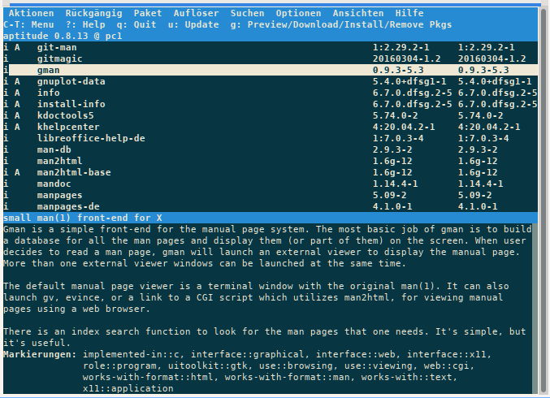

% Ein kleines APT-Kochbuch

## APT Paketverwaltung

APT ist eine Abkürzung für **A**dvanced **P**ackaging **T**ool und stellt eine Sammlung von Programmen und Skripten bereit, welche das System und den Administrator bei der Installation und Verwaltung von Debian-Paketen unterstützt.  
Eine vollständige Beschreibung des APT-Systems findet man in [Debians APT-HOWTO](https://wiki.debian.org/DebianPackageManagement)

### sources.list.d - Liste der Quellen

Das APT-System benötigt mindestens eine Konfigurationsdatei, welche Informationen über den Ort der installierbaren und aktualisierbaren Pakete beinhaltet. Im allgemeinen nennt man diese Datei \<sourcename\>.sources". siduction stellt die Quellen in dem Ordner `/etc/apt/sources.list.d/` bereit. Innerhalb dieses Verzeichnisses befinden sich standardmäßig folgende Dateien: 

`debian.sources`  
`extra.sources`  
`fixes.sources`

Die Aufteilung in mehrere Dateien erleichtert die Auswahl von Spiegelservern ("mirror switching") und das Ergänzen oder Austauschen von Quellen-Listen.

Eigene Quellen-Listen können mit der Benennung `/etc/apt/sources.list.d/<sourcename>.sources` hinzugefügt werden.

Im Januar 2025 führte Debian im Unstable Zweig das Format *deb822* für die Quellen-Listen ein. Die bisher einzeiligen Einträge ersetzt jetzt eine Reihe von aufeinander folgenden Schlüssel-Wert Paaren. Eine Leerzeile trennt die Quellen voneinander. Neu ist der für jede Quelle erforderliche Schlüssel *Signed-By*. Die Aktivierung und Deaktivierung erfolgt über den Schlüssel *Enabled* und ersetzt das zuvor verwendete Kommentarzeichen.

Damit der Umstieg zu dem aktuellen Format leichter gelingt, liefert apt ein Transformationsskript mit. Der Aufruf benötigt **root** Rechte und erfolgt mit `apt modernize-sources`.

Die Quellen-Liste `/etc/apt/sources.list.d/extra.sources`  
sieht bei siduction im Format *deb822* zum Beispiel so aus:

~~~
# This is the default mirror, choosen at first boot.
# One might consider to choose the geographical nearest
#  or the fastest mirror.
Types:      deb
URIs:       https://packages.siduction.org/extra
Suites:     unstable
Components: main contrib non-free non-free-firmware
Enabled:    yes
Signed-By:  /usr/share/keyrings/siduction-archive-keyring.gpg
[...]
~~~

und `/etc/apt/sources.list.d/debian.sources` enthält dann das eigentliche Debian Repo:

~~~
# debian loadbalancer
Types:      deb
URIs:       https://deb.debian.org/debian/
Suites:     unstable
Components: main contrib non-free non-free-firmware
Enabled:    yes
Signed-By:  /usr/share/keyrings/debian-archive-keyring.gpg
[...]
~~~

Weitere Einträge für optionale siduction Repositories finden sich auf [siduction Repositories](https://packages.siduction.org/).

Fügt man zum Beispiel ein oder mehrere Debian Repositories hinzu, so würde dies folgender maßen aussehen:

~~~
# Debian
## Unstable
Types:      deb
URIs:       http://ftp.us.debian.org/debian/
Suites:     unstable
Components: main contrib non-free non-free-firmware
Enabled:    yes
Signed-By:  /usr/share/keyrings/debian-archive-keyring.gpg

## Testing
Types:      deb
URIs:       http://ftp.us.debian.org/debian/
Suites:     testing
Components: main contrib non-free non-free-firmware
Enabled:    no
Signed-By:  /usr/share/keyrings/debian-archive-keyring.gpg

## Experimental
Types:      deb
URIs:       http://ftp.us.debian.org/debian/
Suites:     experimental
Components: main contrib non-free non-free-firmware
Enabled:    no
Signed-By:  /usr/share/keyrings/debian-archive-keyring.gpg
~~~

*ZUR BEACHTUNG:*  
In diesem Beispiel wird der US-amerikanische Debian-Spiegelserver beginnend mit ftp.us verwendet. Diese Einstellung kann als root geändert werden, indem der Landes-Code angepasst wird (zum Beispiel: ftp.at, ftp.de). Die meisten Länder haben lokale Debian-Spiegelserver zur Verfügung. Dies bietet für den Anwender eine höhere Anbindungsgeschwindigkeit und spart auch Bandbreite.

[Liste der aktuell verfügbaren Debian-Server und deren Spiegelserver.](https://www.debian.org/mirrors/)

### apt und apt-get

**apt** ist als Endanwenderschnittstelle gedacht und aktiviert verglichen mit spezialisierteren Werkzeugen wie apt-get und apt-cache standardmäßig einige für den interaktiven Gebrauch besser geeignete Optionen. Mit apt stehen nicht alle Optionen von apt-get und apt-cache zur Verfügung. Bitte die man-Pages von apt, apt-get und apt-cache lesen. Die folgende Tabelle zeigt die jeweiligen Befehle und ihre grundlegende Bedeutung.

| apt | apt-get | Kurzinfo |
| --- | --- | --- |
| [apt update](0705-sys-admin-apt_de.md#aktualisierung-des-systems) | apt-get update | Auffrischen der Paketdatenbank. |
| apt upgrade | apt-get upgrade | Aktualisiert das System auf die neuesten, zur Verfügung stehenden Paketversionen. |
| [apt full-upgrade](0705-sys-admin-apt_de.md#full-upgrade-ausführen) | apt-get dist-upgrade | Aktualisiert das System auf die neuesten, zur Verfügung stehenden Paketversionen auch wenn dadurch bereits installierte Pakete entfernt werden müssen. |
| apt full-upgrade -d | apt-get dist-upgrade -d | Aktualisierung das System wie zuvor, jedoch wird nur der Download durchgeführt und nichts installiert.  |
| [apt install](0705-sys-admin-apt_de.md#pakete-installieren) | apt-get install | Installieren eines oder mehrerer Pakete. |
| [apt remove](0705-sys-admin-apt_de.md#pakete-entfernen) | apt-get remove | Entfernen eines oder mehrerer Pakete. |
| [apt purge](0705-sys-admin-apt_de.md#pakete-entfernen) | apt-get purge | Entfernen eines oder mehrerer Pakete incl. der Konfigurationsdateien. |
| - | [apt-mark hold](0705-sys-admin-apt_de.md#hold-oder-downgraden-eines-pakets) | Verhindert, dass apt eine andere Version das Paketes installiert.  |
| - | [apt-mark unhold](0705-sys-admin-apt_de.md#hold-oder-downgraden-eines-pakets)  | Hebt den Befehl 'apt-mark hold' auf. |
| [apt search](0705-sys-admin-apt_de.md#programmpakete-suchen) | apt-cache search | Sucht entsprechend des eingegebenen Musters nach Paketen. (regex möglich) |
| [apt show](0705-sys-admin-apt_de.md#programmpakete-suchen) | apt-cache show  | Anzeige der Details eines Paketes. |
| apt policy | apt-cache policy | Zeigt die installierte, oder installierbare Version eines Paketes. |

### apt update

Um aktualisierte Informationen über die Pakete zu erhalten, wird eine Datenbank mit den benötigten Einträgen vorgehalten. Das Programm apt benutzt sie bei der Installation eines Pakets, um alle Abhängigkeiten aufzulösen und somit zu garantieren, dass die ausgewählten Pakete funktionieren. Die Erstellung bzw. Aktualisierung dieser Datenbank wird mit dem Befehl **`apt update`** durchgeführt.

~~~
root@siduction# apt update
Holen:1 http://siduction.org sid Release.gpg [189B]
Holen:2 http://siduction.org sid Release.gpg [189B]
Holen:3 http://siduction.org sid Release.gpg [189B]
Holen:4 http://ftp.de.debian.org unstable Release.gpg [189B]
Holen:5 http://siduction.org sid Release [34.1kB]
Holen:6 http://ftp.de.debian.org unstable Release [79.6kB]
Es wurden 404 kB in 8 s geholt (50,8 kB/s).
Paketlisten werden gelesen... Fertig
Abhängigkeitsbaum wird aufgebaut.
Statusinformationen werden eingelesen.... Fertig
Aktualisierung für 48 Pakete verfügbar. Führen Sie »apt list --upgradable« aus, um sie anzuzeigen.
~~~

### Pakete installieren

Ist uns der Name des Pakets bekannt, reicht der Befehl **`apt install <Paketname>`**.  
(Weiter unten wird gezeigt, wie man ein Paket finden kann.)

> **Warnhinweis:**  
> Pakete, die nicht im multi-user.target (ehemals Runlevel 3) installiert werden, können große, nicht unterstützbare Probleme mit sich bringen!

Deshalb empfehlen wir folgenden Ablauf:

1. Aus der Desktopumgebung abmelden.
2. Mit **`Ctrl`**+**`Alt`**+**`F3`** auf die Textkonsole wechseln.
3. Einloggen als **root**.

Anschließend das gewünschte Programmpaket installieren:

~~~
systemctl isolate multi-user.target
apt update
apt install <Paketname>
systemctl isolate graphical.target && exit
~~~

Im unteren Beispiel wird das Paket "funtools" installiert.

~~~
root@siduction# apt install funtools
Paketlisten werden gelesen... Fertig
Abhängigkeitsbaum wird aufgebaut.
Statusinformationen werden eingelesen.... Fertig
Die folgenden zusätzlichen Pakete werden installiert:
  libfuntools1 libwcstools1
Die folgenden NEUEN Pakete werden installiert:
  funtools libfuntools1 libwcstools1
0 aktualisiert, 3 neu installiert, 0 zu entfernen und 48 nicht aktualisiert.
Es müssen 739 kB an Archiven heruntergeladen werden.
Nach dieser Operation werden 2.083 kB Plattenplatz zusätzlich benutzt.
Möchten Sie fortfahren? [J/n] j
Holen:1 http://deb.debian.org/debian unstable/main amd64 libwcstools1 amd64 3.9.5-3 [331 kB]
Holen:2 http://deb.debian.org/debian unstable/main amd64 libfuntools1 amd64 1.4.7-4 [231 kB]
Holen:3 http://deb.debian.org/debian unstable/main amd64 funtools amd64 1.4.7-4 [177 kB]
Es wurden 739 kB in 0 s geholt (1.678 kB/s).
Vormals nicht ausgewähltes Paket libwcstools1:amd64 wird gewählt.
(Lese Datenbank ... 279741 Dateien und Verzeichnisse sind derzeit installiert.)
Vorbereitung zum Entpacken von .../libwcstools1_3.9.5-3_amd64.deb ...
Entpacken von libwcstools1:amd64 (3.9.5-3) ...
Vormals nicht ausgewähltes Paket libfuntools1:amd64 wird gewählt.
Vorbereitung zum Entpacken von .../libfuntools1_1.4.7-4_amd64.deb ...
Entpacken von libfuntools1:amd64 (1.4.7-4) ...
Vormals nicht ausgewähltes Paket funtools wird gewählt.
Vorbereitung zum Entpacken von .../funtools_1.4.7-4_amd64.deb ...
Entpacken von funtools (1.4.7-4) ...
libwcstools1:amd64 (3.9.5-3) wird eingerichtet ...
libfuntools1:amd64 (1.4.7-4) wird eingerichtet ...
funtools (1.4.7-4) wird eingerichtet ...
Trigger für man-db (2.8.5-2) werden verarbeitet ...
Trigger für libc-bin (2.28-8) werden verarbeitet ...
~~~

### Pakete entfernen

Der Befehl **`apt remove <Paketname>`** entfernt ein Paket. Abhängigkeiten werden dabei nicht entfernt:

~~~
root@siduction# apt remove gaim
Paketlisten werden gelesen... Fertig
Abhängigkeitsbaum wird aufgebaut.
Statusinformationen werden eingelesen.... Fertig
Die folgenden Pakete wurden automatisch installiert und werden nicht mehr benötigt:
     libfuntools1 libwcstools1
Verwenden Sie »sudo apt autoremove«, um sie zu entfernen.
Die folgenden Pakete werden ENTFERNT:
     funtools
0 aktualisiert, 0 neu installiert, 1 zu entfernen und 48 nicht aktualisiert.
Nach dieser Operation werden 505 kB Plattenplatz freigegeben.
Möchten Sie fortfahren? [J/n] j
(Lese Datenbank ... 279786 Dateien und Verzeichnisse sind derzeit installiert.)
Entfernen von funtools (1.4.7-4) ...
Trigger für man-db (2.8.5-2) werden verarbeitet ...
~~~

Im letzten Fall werden die Konfigurationsdateien nicht vom System entfernt, sie können bei einer späteren Neuinstallation des Programmpakets (im Beispielfall gaim) wieder verwendet werden. Sollen auch die Konfigurationsdateien entfernt werden, setzen wir den Befehl **`apt purge funtools`** ab.

So werden auch die Konfigurationsdateien mit entfernt. Will man sehen, ob Konfigurationsdateien von bereits entfernten Programmen noch auf dem System verblieben sind, kommt man mit `dpkg` ganz einfach zu einem Ergebnis:

~~~
dpkg -l | grep ^rc
rc  colord             1.4.3-3.1       amd64  system service to manage device colour profiles -- system daemon
rc  hplip              3.18.10+dfsg0-1 amd64  HP Linux Printing and Imaging System (HPLIP)
rc  libsensors4:amd64  1:3.4.0-4       amd64  library to read temperature/voltage/fan sensors
rc  sane               1.0.14-13.1     amd64  scanner graphical frontends
rc  sane-utils         1.0.27-3.1      amd64  API library for scanners -- utilities
rc  systemd-coredump   240-1           amd64  tools for storing and retrieving coredumps
~~~

Die hier gelisteten Pakete wurden removed, ohne purgen.

### Hold oder Downgraden eines Pakets

Manchmal kann es notwendig sein, auf eine frühere Version eines Pakets zurückzugreifen, da die neueste Version einen gravierenden Fehler aufweist.

**Hold (Halten)**

apt bietet mit `apt-mark` die Möglichkeit verschiedene Einstellungen für ein Paket vorzunehmen. Die Option `hold` schützt das Paket vor Änderungen durch apt.

~~~
apt-mark hold <paket>
~~~

So beendet man den Hold eines Pakets:

~~~
apt-mark unhold <paket>
~~~

So sucht man nach Paketen, die auf Hold gesetzt sind:

~~~
apt-mark showhold
~~~

Bitte bedenkt, dass hold nur eine Notfallmaßnahme ist. Man wird sich Probleme einhandeln, wenn man vergisst, einen hold wieder zeitnah aufzuheben. Das gilt umso mehr, je mehr (essentielle) Abhängigkeiten das Paket hat. Also: holds bitte nur im Notfall und schnellstmöglich wieder aufheben.

**Downgraden (Deaktualisierung)**

Debian unterstützt keinen Downgrade von Paketen. In einfachen Fällen kann das Installieren älterer Versionen gelingen, es kann aber auch spektakulär fehlschlagen. Mehr Informationen im englischsprachigen Debian-Handbuch unter dem Kapitel Emergency downgrading.

Obwohl ein Downgrade nicht unterstützt ist, kann er bei einfachen Paketen gelingen. Die Schritte für einen Downgrade werden nun am Paket kmahjongg demonstriert:

Wir editieren die Datei `/etc/apt/sources.list.d/debian.sources` mit **root** Rechten. Bei den Quellen von Unstable erhält der Schlüssel *Enabled* den Wert *no* und bei Testing setzen wir den Wert *yes*. Danach führen wir die folgenden Befehle aus:

~~~
apt update
apt install kmahjongg/testing
~~~

Das nun installierte Paket wird vor Aktualisierungen geschützt, auf Hold gesetzt:

~~~
apt-mark hold kmahjongg
~~~

Anschließend machen wir die Änderungen in `/etc/apt/sources.list.d/debian.sources` wieder rückgängig. Nach dem Speichern der Änderungen:

~~~
apt update
~~~

Wenn ein neues, fehlerfreies Paket in sid eintrifft, kann man die neueste Version wieder installieren, nachden man den "hold"-Status beendet hat:

~~~
apt-mark unhold kmahjongg
apt update
apt install kmahjongg
    oder
apt full-upgrade
~~~

### Aktualisierung des Systems

Eine Aktualisierung des ganzen Systems wird mit diesem Befehl durchgeführt: **`apt full-upgrade`**. Vor einer solchen Maßnahme sollten die aktuellen Upgradewarnungen auf der Hauptseite von siduction beachtet werden, um zu prüfen, ob Pakete des eigenen Systems betroffen sind. Wenn ein installiertes Paket behalten, also auf hold gesetzt werden sollte, verweisen wir auf den Abschnitt [Downgrade bzw. Hold](0705-sys-admin-apt_de.md#hold-oder-downgraden-eines-pakets) eines Pakets.

Ein einfaches **`apt upgrade`** von Debian Sid ist normalerweise nicht empfohlen. Es kann aber hilfreich sein, wenn eine Situation mit vielen gehaltenen oder zu entfernenden Paketen vorliegt, um von der Situation nicht betroffene Pakete zu aktualisieren.

Wie regelmäßig soll eine Systemaktualisierung durchgeführt werden?  
Eine Systemaktualisierung soll regelmäßig durchgeführt werden, alle ein bis zwei Wochen haben sich als guter Richtwert erwiesen. Auch bei monatlichen Systemaktualisierungen sollte es zu keinen nennenswerten Problemen kommen. Theoretisch kann das System mehrmals täglich nach der Synchronisation der Spiegelserver alle 6 Stunden aktualisiert werden. 

Die Erfahrungen zeigen, dass länger als zwei, maximal drei Monate nicht gewartet werden sollte. Besonders beachtet sollten Programmpakete werden, welche nicht aus den siduction- oder Debian-Repositorien stammen oder selbst kompiliert wurden, da diese nach einer Systemaktualisierung mittels full-upgrade wegen Inkompatibilitäten ihre Funktionsfähigkeit verlieren können.

**Aktualisierung nicht mit Live-Medium**

Die Möglichkeit der Aktualisierung einer siduction-Installation mittels eines Live-Mediums existiert nicht. Weiter unten beschreiben wir ausführlich den Aktualisierungsvorgang und warum apt verwendet werden sollte.

### Aktualisierbare Pakete

Nachdem die interne Datenbank aktualisiert wurde, kann man herausfinden, für welche Pakete eine neuere Version existiert (zuerst muss apt-show-versions installiert werden):

~~~
root@siduction# apt-show-versions -u
libpam-runtime/unstable upgradeable from 0.79-1 to 0.79-3
passwd/unstable upgradeable from 1:4.0.12-5 to 1:4.0.12-6
teclasat/unstable upgradeable from 0.7m02-1 to 0.7n01-1
libpam-modules/unstable upgradeable from 0.79-1 to 0.79-3
[...]
~~~

Das gleiche erreicht man mit:

~~~
apt list --upgradable
~~~

Die Aktualisierung eines einzelnes Pakets (hier z. B. xterm 397-1) erfolgt mit:

~~~
root@siduction# apt install xterm=397-1
Upgrading:
  xterm

Summary:
  Upgrading: 1, Installing: 0, Removing: 0, Not Upgrading: 12
  Download size: 860 kB
  Space needed: 1.024 B / 176 GB available

Holen:1 https://deb.debian.org/debian unstable/main amd64 xterm amd64 397-1 [860 kB]
Es wurden 860 kB in 0 s geholt (1.760 kB/s).
Changelogs werden gelesen... Fertig
(Lese Datenbank ... 456325 Dateien und Verzeichnisse sind derzeit installiert.)
Vorbereitung zum Entpacken von .../archives/xterm_397-1_amd64.deb ...
Entpacken von xterm (397-1) über (396-1) ...
xterm (397-1) wird eingerichtet ...
~~~

**(Nur) Downloaden**

Eine wenig bekannte, aber großartige Möglichkeit ist die Option -d:

~~~
apt update && apt full-upgrade -d
~~~

`-d` ermöglicht, die Pakete eines full-upgrades lokal zu speichern, ohne dass sie installiert werden. Dies kann in einer Konsole durchgeführt werden, während man in X ist. Der full-upgrade selbst kann zu einem späteren Zeitpunkt im multi-user.target erfolgen. Dadurch erhält man auch die Möglichkeit, nach eventuellen Warnungen zu recherchieren und danach zu entscheiden, ob man die Aktualisierung durchführen möchte oder nicht:

~~~
root@siduction#apt full-upgrade -d
Reading package lists... Done
Building dependency tree
Reading state information... Done
Calculating upgrade... Done
The following NEW packages will be installed:
  elinks-data
The following packages have been kept back:
  git-core git-gui git-svn gitk icedove libmpich1.0ldbl
The following packages will be upgraded:
  alsa-base bsdutils ceni configure-ndiswrapper debhelper
  discover1-data elinks file fuse-utils gnucash.........
35 upgraded, 1 newly installed, 0 to remove and 6 not upgraded.
Need to get 23.4MB of archives.
After this operation, 594kB of additional disk space will be used.
Möchtest Du fortfahren [J/n]?J 
~~~

**`J`** lädt die zu aktualisierenden bzw. neu zu installierenden Pakete, ohne das installierte System zu verändern.

Nach dem Download der Pakete mittels `full-upgrade -d` können diese jederzeit entsprechend dem Vorgehen im folgendem Absatz installiert werden.

### full-upgrade ausführen

> **Warnhinweis:**  
> Eine Systemaktualisierung, die nicht im multi-user.target (ehemals Runlevel 3) durchgeführt wird, kann zu Problemen führen, wenn es um Updates der installierten Desktop-Umgebung oder des X-Servers geht!

Besuche vor einer Systemaktualisierung die [siduction-Homepage](https://forum.siduction.org/), um eventuelle Upgradewarnungen in Erfahrung zu bringen. Diese Warnungen sind wegen der Struktur von Debian sid/unstable notwendig, welches mehrmals täglich neue Programmpakete in seine Repositorien aufnimmt.
  
Zu beachten ist der folgende Ablauf:

1. Aus der Desktopumgebung abmelden.  
   (Diese Vorgehensweise wird heutzutage nur noch bei der Aktualisierung von X oder der Desktop-Umgebung selbst empfohlen, schadet aber auch in anderen Fällen nicht.)
2. Mit **`Ctrl`**+**`Alt`**+**`F3`** auf die Textkonsole wechseln.
3. Einloggen als **root**.

Anschließend folgende Befehle ausführen:

~~~
systemctl isolate multi-user.target
apt update
apt full-upgrade
apt clean
systemctl isolate graphical.target && exit
~~~

Wurde ein neuer Kernel installiert, ist an Stelle von *"systemctl isolate graphical.target"* der Befehl **`systemctl reboot`** notwendig, um in den neuen Kernel zu booten.

### Warum ausschließlich apt verwenden

Zum Installieren, Löschen und Durchführen einer Systemaktualisierung soll *apt* verwendet werden.  
Bitte von Systemaktualisierungen mit Anwendungen wie `synaptic` oder `discover` absehen!

Die genannten Programme sind exzellent für eine Installation von *Debian stable* und sie eignen sich sehr gut dazu Programmpakete zu suchen, aber sie sind nicht angepasst an die besonderen Aufgaben der dynamischen Distribution Debian Sid. Sie können nicht immer die umfassenden Änderungen in Sid (Änderungen von Abhängigkeiten, Benennungskonventionen, Skripten u.a.) korrekt auflösen. Es handelt sich dabei nicht um Fehler in diesen Programmen oder Fehler der Entwickler.

Paketmanager wie synaptic und discover sind - technisch gesprochen - nicht deterministisch. Bei Verwendung einer dynamischen Distribution wie Debian Sid unter Hinzunahme von Drittrepositorien, deren Qualität nicht vom Debian-Team getestet sein kann, kann eine Systemaktualisierung zur Katastrophe führen, da diese Paketmanager durch automatische Lösungsversuche falsche Entscheidungen treffen können.

Weiterhin ist zu beachten, dass alle GUI-Paketmanager in X ausgeführt werden müssen. Systemaktualisierungen in X (selbst ein ohnehin nicht empfohlenes 'apt upgrade') werden früher oder später dazu führen, dass man sein System irreversibel beschädigt.

Im Gegensatz dazu führt apt ausschließlich das durch, was angefragt ist. Bei unvollständigen Abhängigkeiten in Sid, sprich: wenn das System bricht (dies kann in Sid bei Strukturänderungen vorkommen), können die Ursachen genau festgestellt und dadurch repariert oder umgangen werden. Das eigene System "bricht" nicht. Falls also eine Systemaktualisierung dem Gefühl nach das halbe System löschen möchte, überlässt apt dem Administrator die Entscheidung, was zu tun ist, und handelt nicht eigenmächtig.

Dies ist der Grund, warum Debian-Builds apt nutzen und nicht andere Paketmanager.

### Programmpakete suchen

Das APT-System bietet eine Reihe nützlicher Suchbefehle, mit denen die APT-Datenbank durchsucht und Informationen über die Pakete ausgegeben werden. Zusätzlich existieren einige Programme, die die Suche graphisch aufbereiten.

**Paketsuche im Terminal**

Mit dem einfachen Befehl  
**`apt search <Suchmuster>`**  
erhält man die Liste aller Pakete, die das Suchmuster enthalten. Die Suche mit *search* erlaubt die Verwendung von regex-Begriffen.

Wird z. B. nach *"gman"* gesucht, erhält man dieses Ergebnis:

~~~
user1@pc1:~$ apt search ^gman
Sortierung... Fertig
Volltextsuche... Fertig
gman/unstable,now 0.9.3-5.3 amd64  [installiert]
  small man(1) front-end for X

gmanedit/unstable 0.4.2-7 amd64
  GTK+/GNOME-Editor für Handbuchseiten
~~~

Hier bedeutet das "^", dass "gman" am Zeilenanfang stehen muss. Ohne dieses Zeichen findet das Muster beispielsweise auch khan*gman* und lo*gman*ager.

Möchte man mehr Informationen über die aktuellen Versionen eines Pakets, dann benutzt man:

~~~
user1@pc1:~$ apt show gman
Package: gman
Version: 0.9.3-5.3
Priority: optional
Section: doc
Maintainer: Josip Rodin <joy-packages@debian.org>
Installed-Size: 106 kB
Provides: man-browser
Depends: libc6 (>= 2.14), libgcc1 (>= 1:3.0), libglib2.0-0
 (>= 2.12.0), libgtk2.0-0 (>= 2.8.0), libstdc++6 (>= 5),
 man-db, xterm | x-terminal-emulator Suggests: gv,
 man2html, httpd, sensible-browser, evince
Tag: implemented-in::c, interface::graphical,
 interface::web, interface::x11, role::program,
 uitoolkit::gtk, use::browsing, use::viewing, web::cgi,
 works-with-format::html, works-with-format::man,
 works-with::text, x11::application
Download-Size: 34,3 kB
APT-Manual-Installed: yes
APT-Sources: http://ftp.de.debian.org/debian unstable/main
 amd64 Packages
Description: small man(1) front-end for X
 Gman is a simple front-end for the manual page system. The
 most basic job of gman is to build a database for all the
 man pages and display them (or part of them) on the screen.
 When user decides to read a man page, gman will launch an
 external viewer to display the manual page. More than one
 external viewer windows can be launched at the same time.
[...]
~~~

Alle installierbaren Versionen des Pakets (abhängig von den aktiven Quellen) können folgendermaßen aufgelistet werden:

~~~
user1@pc1:~$ apt list gman
Auflistung... Fertig
gman/unstable,now 0.9.3-5.3 amd64  [installiert]
~~~

Der Befehl **`aptitude`** (im Terminal) öffnet das gleichnamige Programm in einer ncurses-Umgebung. Es wird mit der Tastatur oder Maus bedient und bietet diverse Funktionen, die über die obere Menüleiste erreichbar sind. Die Nutzung von APT oder Aptitude ist Geschmackssache, allerdings ist Aptitude für das Tempo von Debian Unstable oft "zu schlau".

**Graphische Paketsuche**

Das Programm **`packagesearch`** eignet sich hervorragend um nach geeigneten Programmen zu suchen. Meist wird packagesearch nicht automatisch installiert; deshalb:

~~~
apt update
apt install packagesearch
~~~

Nach dem ersten Start von packagesearch muss in *Packagesearch* > *Preferences* "apt" gewählt werden und gelegentlich erscheint ein Infofenster, das das Fehlen von deborphan bemängelt. Die Informationen von deborphan bitte mit größter Vorsicht verwenden.

Packagesearch soll nicht zur Installation von Dateien/Paketen benutzt werden, sondern nur als eine graphische Suchmaschine. Das Upgraden und die Neuinstallation von Dateien ohne vorheriges Beenden von X kann Probleme verursachen (siehe oben).

Folgende Suchkriterien stehen zur Auswahl:

+ pattern (allgemeine Suchanfrage)
+ tags (Suche basierend auf debtags)
+ files (Dateinamen)
+ installed status (Installationsstatus)
+ orphaned packages (verwaiste Pakete)

Zusätzlich werden viele Informationen zu den Debian-Paketen angeboten, so auch welche Dateien in einem Paket geschnürt sind. Weitere ausführliche Informationen zur Verwendung von packagesearch findet man unter *Help* > *Contents*.  Derzeit ist die Benutzerführung von packagesearch ausschließlich Englisch.

Eine vollständige Beschreibung des APT-Systems findet man in [Debians APT-HOWTO](https://wiki.debian.org/DebianPackageManagement)

Zuletzt bearbeitet: 2025-10-04

