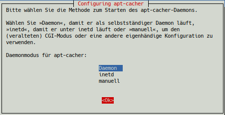

% Lokaler APT-Mirror

## Lokaler APT-Mirror

**Apt-Cacher**, ein Proxy-Server für Debian-Pakete

Apt-Cacher ist ein Proxy-Server, der mehreren lokalen Computern den Zugang zu
einem Debian-Pakete-Cache ermöglicht.  
Die zur Installation von einem Computer bei dem Cache angeforderten Pakete müssen nur einmal von Debian Spiegelservern geladen werden, gleichgültig wie viele Geräte diese Pakete benötigen. Dies spart Netzwerkbandbreite, erhöht die Geschwindigkeit für die Benutzer und reduziert die Last an den Spiegelservern.

Nutzern, die mehrere PC ihr Eigen nennen und sparsam mit Bandbreite und Downloadvolumen umgehen und gleichzeitig die Geschwindigkeit bei Systemaktualisierungen erhöhen wollen, bietet apt-cacher die ideale Lösung um all diese Ziele zu erreichen.

Apt-Cacher ist kein universeller Proxy-Server. Wer dies trotzdem versucht, wird einige unliebsame Überraschungen im Netzwerk erleben.

**Voraussetzungen**

+ Ein PC, auf dem der lokale APT-Proxy-Server eingerichtet wird.
+ 6 GB freier Speicherplatz für den Cache auf dem Server.
+ LAN-Verbindung zu den anderen Geräten.

**Apt-Cacher Setup**

Das Setup für Apt-Cacher erfolgt in zwei Schritten.  
Als Erstes wird Apt-Cacher auf dem als APT-Proxy-Server ausgewählten PC installiert und anschließend konfiguriert man alle Client-PCs so, dass sie den APT-Proxy-Server benutzen.

### Server installieren

Nach einem `apt update` werden die notwendigen Pakete mit folgendem Befehl installiert:

~~~
# apt install apt-cacher
[...]
Die folgenden NEUEN Pakete werden installiert:
  apt-cacher ed libberkeleydb-perl
  libcompress-raw-bzip2-perl libcompress-raw-lzma-perl
  libcompress-raw-zlib-perl libfilesys-df-perl
  libio-compress-lzma-perl libio-compress-perl
  libio-interactive-perl libio-interface-perl
  libipc-shareable-perl libnetaddr-ip-perl libsocket6-perl
  libsys-syscall-perl libwww-curl-perl
0 aktualisiert, 16 neu installiert, 0 zu entfernen und 0 nicht aktualisiert.
Es müssen 992 kB an Archiven heruntergeladen werden.
Nach dieser Operation werden 3.205 kB Plattenplatz zusätzlich benutzt.
Möchten Sie fortfahren? [J]
~~~

Während der Installation von apt-cacher erfolgt automatisch die grundlegende Konfiguration.

Der empfohlene Deamonmodus *"deamon"* wird beibehalten und bestätigt.

Der Cache, in dem in Zukunft alle heruntergeladenen Pakete abgelegt werden, befindet sich in  
`/var/cache/apt-cacher/`  
und die Konfigurationsdateien in  
`/etc/apt-cacher/` .

**Server Konfiguration**

Wir wechseln in das Verzeichnis `/etc/apt-cacher/` und bearbeiten die Datei `apt-cacher.conf`.

~~~
# cd /etc/apt-cacher
/etc/apt-cacher# mcedit apt-cacher.conf
~~~

Jetzt suchen wir etwa bei Zeile 160 die Direktive `allowed_hosts`. Das Kommentarzeichen "#" am Anfang der Zeile wird entfernt, damit die Clients den APT-Proxy-Server kontaktieren dürfen.  
Aus Sicherheitsgründen ersetzen wir das Platzhalterzeichen "\*", das allen den Zugriff erlaubt, durch die IP-Adressen der Clients.

~~~
#allowed_hosts = *
~~~

beispielsweise ändern in

~~~
allowed_hosts = '192.168.3.10-20'
~~~

Die IP-Adressen sind natürlich an die eigenen Gegebenheiten anzupassen. Erläuterungen zur Syntax befinden sich in der Datei unmittelbar vor der Direktive.  
Wird im eigenen Netzwerk ein DHCP-Server betrieben, so ist es notwendig dem APT-Proxy-Server eine feste IP zuzuordnen, z.B. "192.168.3.5" .

Wichtig für uns sind aus der Datei `apt-cacher.conf` der *"user"* und die *"group"* mit der der Daemon läuft und der *"port"* auf den der Daemon lauscht:

~~~
group = www-data
user = www-data
daemon_port = 3142
~~~

Das sind die voreingestellten Werte, die wir nicht verändern. Nach dem Speichern der Datei beenden wir mcedit.

Soll ein anderes Cache-Verzeichnis als `/var/cache/apt-cacher/` Verwendung finden, müssen die Eigentümer- und Dateirechte geprüft und angepasst werden (chmod 644 für die Dateien).

Um sicher zu gehen, dass der APT-Proxy-Server bei jedem Boot des Servers automatisch startet, setzen wir folgenden Befehl ab:

~~~
# systemctl enable --now apt-cacher.service
~~~

Der APT-Proxy-Server wird jetzt auch neu gestartet und damit die geänderte Konfiguration eingelesen.  
Wir überprüfen ob er aktiv ist und auf Port 3142 lauscht.

~~~
# ss -tl | grep 3142
LISTEN 0      4096         0.0.0.0:3142        0.0.0.0:
~~~

Bei dieser Ausgabe ist alles in Ordnung.

**Import vorhandener .deb Pakete**

Apt-Cacher verfügt jetzt über ein Importscript, das auf dem PC bereits vorhandene Debian Archive importiert. Es erspart den nochmaligen Download der Pakete. Dem Aufruf geben wir das vorhandene Archivverzeichnis mit:

~~~
# /usr/share/apt-cacher/apt-cacher-import.pl  /var/cache/apt/archives/
~~~

Mit `-h` aufgerufen erhalten wir Benutzungshinweise und eine Auflistung aller Optionen.

### Client Konfiguration

Die Clients, die auf den APT-Proxy-Server zugreifen, bedürfen nur geringfügiger Konfigurationen.

Zuerst legen wir die Datei `30proxy` im Verzeichnis `/etc/apt/apt.conf.d/` an, die *apt* anweist den Server zu benutzen. Wir verwenden hier die oben genannte IP des Servers. Bitte die IP an die eigenen Gegebenheiten anpassen.

~~~
# echo "Acquire::http { Proxy "http://192.168.3.5:3142"; };" > /etc/apt/apt.conf.d/30proxy
~~~

Als nächstes ändern wir die Adressen der Downloadmirror im Verzeichnis `/etc/apt/sources.list.d/` von "https" auf "http" innerhalb der Dateien `debian.list`, `extra.list` und `fixes.list`.  
Die Verwendung von "https" ist zwar möglich, aber zum Einen mit einigem Konfigurationsaufwand verbunden und zum Anderen zur Zeit nicht notwendig, da alle Downloadmirror "http" noch akzeptieren.

Ein anschließendes

~~~
# apt update
~~~

sollte ohne Fehlermeldungen durchlaufen.  
Der erste Aufruf von **`apt full-upgrade`** auf einem Client lädt alle neuen Pakete in den Cache des APT-Proxy-Servers. Somit dauert dieser Vorgang genauso lang wie es zuvor üblich war. Die weiteren Zugriffe der Clienten bedienen sich des Cache und laufen dann wesentlich schneller ab, ohne erneut Bandbreite zu benötigen

Seite zuletzt aktualisiert 2021-11-29

