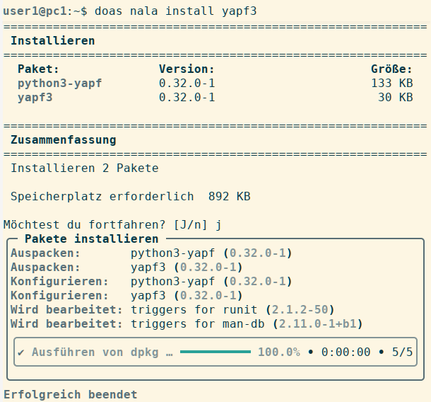
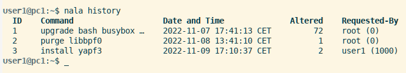
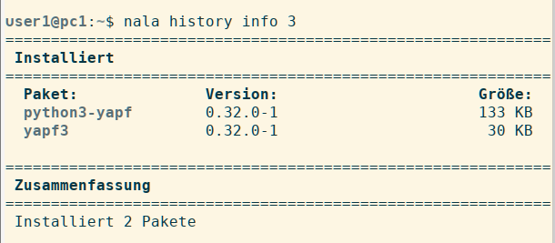
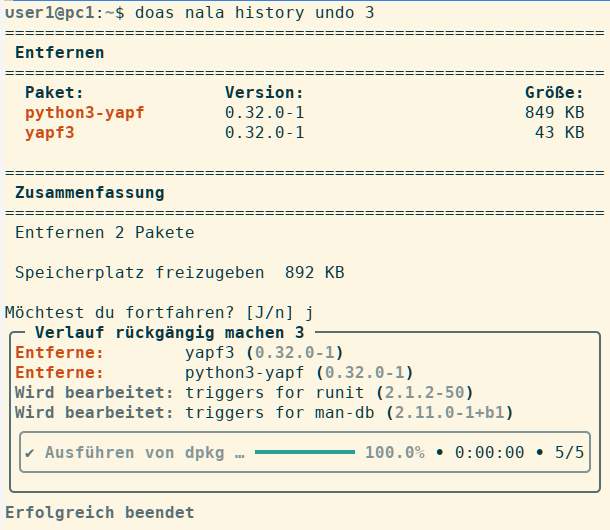

% Nala für das Paketmanagement

## Nala Paketverwaltung

**Benutzerfreundlicher und leistungsstärker als APT**

Nala ist ein Kommandozeilen-Frontend für den APT-Paketmanager. Es benutzt die `python-apt` API statt der APT-Bibliotheken zur Verwaltung der Pakete. Das Ziel von Nala ist eine übersichtlichere und benutzerfreundlichere Darstellung sowohl des aktuellen Paketbestands als auch der angeforderten Aktionen und deren Durchführung. Darüber hinaus soll der Download von Paketen beschleunigt werden.

Nala verwendet viele gleichlautende Befehle von APT, wie etwa `install`, `remove`, `purge`, `update`, `show` und `search`. Außerdem implementiert es den Befehl `history`, um vergangene Transaktionen zu sehen und dem Benutzer die Möglichkeit zu geben diese rückgängig zu machen, und den Befehl `fetch`, der eine Liste der schnellsten Spiegelserver zur Auswahl anzeigt. In der Grundeinstellung beschleunigt Nala den Download dadurch, dass drei Pakete gleichzeitig von einem Server geholt werden. Das Limit von drei Verbindungen pro Spiegelserver besteht, um die Belastung der Spiegelserver zu minimieren.

### Nala verwenden

Ab siduction 2022.1.0 wird Nala automatisch installiert und ist sofort verwendbar. Es kann jederzeit ohne Weiteres zwischen APT und Nala gewechselt werden. Ein Blick in die manpage **`man nala`** sollte obligatorisch sein. Vor der Anwendung empfehlen wir dringend, zwei Änderungen in der Konfigurationsdatei `/etc/nala/nala.conf` vorzunehmen.

Zum einen den Wert für die Konfigurationsoption `auto_remove`, diesen ändern wir zu `false`, so wie es das folgende Listing zeigt:

~~~
# Set to false to disable auto auto-removing
auto_remove = false
~~~

Zum anderen den Wert `full_upgrade = false`, dieser muss auf `true` geändert werden, damit automatisch ein `full-upgrade` ausgeführt wird.

~~~
# Set to true to make full-upgrade the default
full_upgrade = true
~~~

Der Grund für beide Änderungen ist, dass siduction auf *GNU Linux debian unstable/sid* basiert und diese Basis sich täglich verändert und deshalb regelmäßig auf den neusten Stand gebracht werden muss. Bei einem Upgrade von *debian sid* kann gelegentlich eine Situation entstehen, in der wesentliche Teile des Systems entfernt werden sollen. Mit der Option `auto_remove = true` haben wir keine Möglichkeit zu recherchieren, zu prüfen und selbst zu entscheiden, ob oder welche Pakete zu entfernen sind. Auch im normalen Betrieb sollten Pakete nicht mit `auto_remove`, sondern erst nach einer Sichtkontrolle entfernt werden.

Ist es im Ausnahmefall nötig auf einen `full-upgrade` verzichten zu müssen und statt dessen nur einen `upgrade` vorzunehmen, so kann `nala` mit folgendem Befehl aufgerufen werden, **`nala upgrade --no-full`**.

### Befehle analog zu APT

Viele der von APT bekannten Befehle sind in Nala identisch. In der Grundeinstellung erwartet Nala vor dem Ausführen einer angeforderten Aktion, die das System ändert, immer eine Bestätigung.

+ **`nala update`**  
  Aktualisiert die Paketinformationen der konfigurierten Paketquellen.
  
+ **`nala install <Paketname>`**  
  Installiert das benannte Paket in unser System.
  
+ **`nala remove <Paketname>`**  
  Entfernt das benannte Paket aus unserem System.
  
+ **`nala purge <Paketname>`** oder **`nala remove --purge <Paketname>`**  
  Entfernt das benannte Paket mit seinen Konfigurationsdateien aus unserem System.
  
+ **`nala upgrade`**  
  Führt `update`, gefolgt von `upgrade` aus. (Defaulteinstellung in der Datei `/etc/nala/nala.conf`)  
  Führt `update`, gefolgt von `upgrade --full` aus. (Mit den oben genannten Änderungen in der Datei `/etc/nala/nala.conf`)

Die benutzerfreundliche Aufbereitung der Ausgabe im Terminal erleichtert die Übersicht, wie das Beispiel zeigt.  
(Um root-Rechte zu erlangen, wurde im Befehl *"doas"* verwendet.)

Im ersten Teil der Ausgabe erhalten wir eine Liste der zu installierenden Pakete mit der Angabe ihrer Versionen und Größe. Nach der Bestätigung listet der zweite Teil die ausgeführten Aktionen auf.

### Befehle die APT nicht enthält

**Befehl "fetch"**

Der Befehl **`nala fetch`**, ohne weitere Optionen ausgeführt, ermittelt automatisch die Distribution und das Release unserer Installation, sucht nach den schnellsten Spiegelservern, listet diese zur interaktiven Auswahl auf und legt nach der Auswahl eines oder mehrerer Server die Datei `/etc/apt/sources.list.d/nala-sources.list` an.

Die Option `-c, --country` beschränkt die Suche mit Hilfe des ISO-Ländercodes. Eine mehrfache Angabe der Option ist erlaubt.  
Die Option `--non-free` ergänzt die Datei um contrib- und non-free-Komponenten.

Bei einem Download werden von jedem der Server bis zu drei Pakete gleichzeitig geholt.

**Befehl "history"**

Der Befehl **`nala history`**, ohne Unterbefehl aufgerufen, zeigt eine Zusammenfassung aller mit Nala durchgeführten Aktionen. Jede Zeile entspricht einer Aktion und enthält die ID, das Kommando, den Zeitstempel, die Anzahl der geänderten Pakete und den User, der die Aktion angefordert hat. Aktionen, die mit anderen Programmen erfolgten, werden nicht erfasst.

Details zu einer Aktion aus der History zeigt der gleiche Befehl mit dem angehängten Unterbefehl `info <ID>`.

Wollen wir nun die Installation von *"yapf3"* mit den Abhängigkeiten, in unserem Fall *"python3-yapf"*, rückgängig machen, benutzen wir dafür den Unterbefehl `undo <ID>`.  
(Auch hier erlangt **user1** root-Rechte durch die Verwendung von *"doas"*.)

Im ersten Teil der Ausgabe sehen wir die zu entfernenden Pakete mit der Angabe ihrer Versionen und Größe. Nach der Bestätigung listet der zweite Teil die ausgeführten Aktionen auf.  
Sollten wir es uns noch einmal anders überlegen und die Pakete doch wieder verwenden wollen, hilft der Befehl `nala history redo <ID>` weiter, um die Aktion noch einmal auszuführen. Mit dem Befehl `nala history clear <ID>` lassen sich Einträge aus der History entfernen, `nala history clear --all` entfernt alle Einträge.

In der hier beschriebenen Nala Version 0.11.1 unterstützen die Unterbefehle `undo <ID>` und `redo <ID>` derzeit nur die Aktionen Installieren oder Entfernen. In einer zukünftigen Version, die dann auf der Programmiersprache Rust basieren wird, sollen sich komplette Dist-Upgrades zurückrollen lassen.

Zuletzt bearbeitet: 2023-10-13

