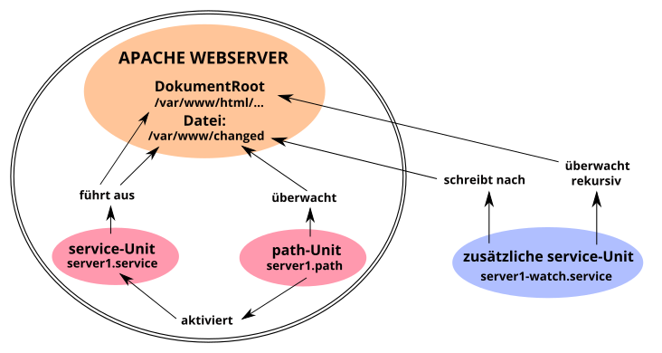

% Systemd - path

## systemd-path

Die grundlegenden und einführenden Informationen zu Systemd enthält die Handbuchseite [Systemd-Start](0710-systemd-start_de.md#systemd-der-system--und-dienste-manager) Die alle Unit-Dateien betreffenden Sektionen *[Unit]* und *[Install]* behandelt unsere Handbuchseite [Systemd Unit-Datei](0711-systemd-unit-datei_de.md#systemd-unit-datei).  
In der vorliegenden Handbuchseite erklären wir die Funktion der Unit **systemd.path**, mit der systemd Pfade überwacht und Pfad-basierte Aktionen auslöst.

Die path-Unit ermöglicht es, bei Änderungen an Dateien und Verzeichnissen (Pfaden) eine Aktion auszulösen.  
Sobald ein Ereignis eintritt, kann Systemd einen Befehl oder ein Skript über eine Service-Unit ausführen. Die path-Unit ist nicht in der Lage Verzeichnisse rekursiv zu überwachen. Es können aber mehrere Verzeichnisse und Dateien angegeben werden.  
Die Pfad-spezifischen Optionen werden in dem Abschnitt [Path] konfiguriert.

### Benötigte Dateien

Die **systemd-path**-Unit benötigt für ihre Funktion mindestens zwei Dateien mit vorzugsweise dem gleichen Namen, aber unterschiedlicher Namenserweiterung im Verzeichnis `/usr/local/lib/systemd/system/`. (Ggf. ist das Verzeichnis zuvor mit dem Befehl **`mkdir -p /usr/local/lib/systemd/system/`** anzulegen.) Das sind die

+ Path-Unit-Datei (\<name\>.path), welche die Überwachung und den Auslöser für die Service-Unit enthält  
    und  
+ Service-Unit-Datei (\<name\>.service), welche die zu startende Aktion enthält.  
    Für umfangreichere Aktionen erstellt man zusätzlich ein Skript in `/usr/local/bin/`, das von der Service-Unit ausgeführt wird.

### path-Unit Optionen

Die path-Unit muss zwingend die Sektion [Path] enthalten, in der festgelegt wird wie und was zu überwachen ist.

Die speziellen Optionen sind:

+ `PathExists=`  
    prüft, ob der betreffende Pfad existiert. Wenn es zutrifft, wird die zugehörige Unit aktiviert.

+ `PathExistsGlob=`  
    Wie oben, unterstützt Datei-Glob-Ausdrücke (siehe dazu auch die Ausgabe von man glob.

+ `PathChanged=`  
    beobachtet eine Datei oder einen Pfad und aktiviert die zugehörige Unit, wenn Änderungen auftreten.  
    Aktionsauslösende Änderungen sind:
    + Erstellen und Löschen von Dateien.  
    + Atribute, Rechte, Eigentümer.  
    + Schließen der zu beobachtenden Datei nach Schreibzugriff und Schließen irgendeiner Datei nach Schreibzugriff bei Beobachtung des Pfades.

+ `PathModified=`  
    wie zuvor, aber zusätzlich wird die zugehörige Unit bei einfachen Schreibzugriffen aktiviert, auch wenn die Datei nicht geschlossen wird.

+ `DirectoryNotEmpty=`  
    aktiviert die zugehörige Unit wenn das Verzeichnis nicht leer ist.

+ `Unit=`  
    die zu aktivierende, zugehörige Unit. Zu beachten ist auch, dass die path-Unit standardmäßig die service-Unit mit dem gleichen Name aktiviert. Nur bei Abweichungen hiervon ist die Option `Unit=` innerhalb der Sektion [Path] notwendig.

+ `MakeDirectory=`  
    das zu beobachtenden Verzeichnis wird vor der Beobachtung erstellt.

+ `DirectoryMode=`  
    legt bei Verwendung für das zuvor erstellte Verzeichnis den Zugriffsmodus in oktaler Notation fest. Standardmäßig 0755.

**Ein Beispiel**  

Basierend auf der Konfiguration des Apache-Webservers, entsprechend unserer Handbuchseite [LAMP - Apache, Benutzer und Rechte](0521-lamp-apache_de.md#benutzer-und-rechte), wollen wir das Zusammenspiel der path-Unit mit anderen systemd-Unit verdeutlichen.

Die Abbildung *path-Unit-Funktion* stellt die Abhängigkeiten der systemd-Units unseres Beispiels dar.

Der doppelt umrandete Teil in der Graphik verdeutlicht die Kernfunktion der path-Unit. Die server1.path-Unit überwacht die Datei `/var/www/changed` und aktiviert bei Änderungen die zugehörige server1.service-Unit. Diese wiederum führt dann die gewünschten Aktionen im Verzeichnis `/var/www/html/` aus und stellt die Datei `/var/www/changed` zurück.  
Die außerhalb der Umrandung liegende server1-watch.service-Unit übernimmt die rekursive Überwachung von *DocumentRoot* des Apache-Webservers.

### path-Unit anlegen

Wir legen die Datei `server1.path` im Verzeichnis `/usr/local/lib/systemd/system/`, die die Datei `/var/www/changed` auf Änderungen überwacht, mit folgendem Inhalt an:

~~~
[Unit]
Description=Monitoring "changed" file!
BindsTo=server1-watch.service
After=server1-watch.service

[Path]
PathModified=/var/www/changed

[Install]
WantedBy=multi-user.target
~~~

**Erklärungen**  
Sektion [Unit]:  
Die Option *"BindsTo="* stellt die stärkste verfügbare Bindung zweier systemd-Einheiten aneinander dar. Falls eine von ihnen während des Starts oder des Betriebs in einen Fehlerzustand übergeht, wird die andere auch unmittelbar beendet.  
Zusammen mit der Option *"After="* wird erreicht, dass die server1.path-Unit erst startet, nachdem die server1-watch.service-Unit ihren erfolgreichen Start an systemd zurückmeldet.

Sektion [Path]:  
*"PathModifid="* ist die richtige Wahl. Die Option reagiert auf Änderungen in der Datei `/var/www/changed`, selbst wenn die Datei nicht geschlossen wird.  
Die Option *"PathModifid="* (oder andere, siehe oben) kann mehrfach angegeben werden.

### service-Unit für path

Die server1.service-Unit wird von der server1.path-Unit aktiviert und kontrolliert und benötigt daher keine [Install] Sektion. Somit reichen die Beschreibung der Unit in der Sektion [Unit], und in der Sektion [Service] die auszuführenden Befehle, aus.

Wir legen die Datei `server1.service` im Verzeichnis `/usr/local/lib/systemd/system/` mit folgendem Inhalt an.

~~~
[Unit]
Description=Change permissions in server1 folder

[Service]
Type=oneshot
ExecStartPre=/usr/bin/truncate -s 0 /var/www/changed
ExecStart=/usr/bin/chown -R www-data /var/www/html/
ExecStart=/usr/bin/chmod -R g+w /var/www/html/
ExecStart=/usr/bin/chmod -R o-r /var/www/html/
~~~

**Erklärungen**  
Sektion [Service]:  
*"ExecStart="*-Befehle werden nur ausgeführt, nachdem sich alle *"ExecStartPre="*-Befehle erfolgreich beendet haben.
Zuerst wird die Datei `/var/www/changed` auf 0-Bite zurückgesetzt und danach der Rest ausgeführt.

#### Zusätzliche service-Unit anlegen

Da die .path-Unit Verzeichnisse nicht rekursiv überwachen kann, benötigen wir für unser Beispiel eine zusätzliche service-Unit. Wir legen die Datei `server1-watch.service` im Verzeichnis `/usr/local/lib/systemd/system/` mit folgendem Inhalt an.

~~~
[Unit]
Description=Watching server1 folder.
Before=server1.path
Wants=server1.path

[Service]
Type=forking
ExecStart=inotifywait -dqr -e move,create -o /var/www/changed /var/www/html/

[Install]
WantedBy=multi-user.target
~~~

Anmerkung:  
Interessant ist, dass systemd intern das inotify-API für path-Unit verwendet, um Dateisysteme zu überwachen, jedoch deren Rekursiv-Funktion nicht implementiert.

**Erklärungen**  
Die Sektion [Unit]:  
*"Before="* und *"Wants="* sind die entsprechenden Korrelationen zu *"BindsTo="* und *"After="* aus der server1.service-Unit.

Sektion [Service]:  
*"inotifywait"* protokolliert in die Datei `/var/www/changed`, die außerhalb von `DocumentRoot` des Apache-Webservers liegt.

### path-Unit eingliedern

Auf Grund der Abhängigkeit gliedern wir zuerst die server1.path-Unit und dann die server1-watch.service-Unit in systemd ein. Die server1.service-Unit benötigt und beinhaltet keine [Install]-Sektion. Bei dem Versuch sie einzugliedern erhielten wir eine Fehlermeldung.

~~~
# systemctl enable server1.path
Created symlink /etc/systemd/system/multi-user.target.wants/server1.path /usr/local/lib/systemd/system/server1.path.

# systemctl enable server1-watch.service
Created symlink /etc/systemd/system/multi-user.target.wants/server1-watch.service /usr/local/lib/systemd/system/server1-watch.service.
~~~

Nun ist das Monitoring auch gleich aktiv, wie uns die Statusausgaben aller drei Units zeigen.

~~~
# systemctl status server1-watch.service
server1-watch.service - Watching server1 folder.
  Loaded: loaded (/usr/local/lib/systemd/system/server1-watch.service; enabled; vendor preset: enabled)
  Active: active (running) since Sun 2021-02-21 [...]
 Process: 23788 ExecStart=inotifywait -dqr -e move,create
          -o /var/www/changed /var/www/html/ (code=exited
          status=0/SUCCESS)
Main PID: 23790 (inotifywait)
   Tasks: 1 (limit: 2322)
  Memory: 216.0K
     CPU: 5ms
  CGroup: /system.slice/server1-watch.service
             └─23790 inotifywait -dqr -e move,create
                -o /var/www/changed /var/www/html/

[...]systemd[1]: Starting Watching server1 folder....
[...]systemd[1]: Started Watching server1 folder..

# systemctl status server1.path
server1.path - Monitoring "changed" file!
  Loaded: loaded (/usr/local/lib/systemd/system/server1.path
          enabled; vendor preset: enabled)
  Active: active (waiting) since Sun 2021-02-21 [...]
Triggers: ● server1.service

Feb 21 19:25:20 lap1 systemd[1]: Started Monitoring "changed" file!.

# systemctl status server1.service
server1.service - Change permissions in server1 folder
     Loaded: loaded (/usr/local/lib/systemd/system/server1.service; static)
     Active: inactive (dead)
TriggeredBy: ● server1.path
~~~

Der Status *"Active: inactive (dead)"* der letzten Ausgabe ist der normale Zustand für die Unit server1.service, denn diese Unit ist nur dann aktiv, wenn sie von server1.path angestoßen wurde ihre Befehlskette auszuführen. Danach geht sie wieder in den inaktiven Zustand über.

### service-Unit manuell ausführen

Sollte es einmal hilfreich oder nötig sein die Dateirechte in *DocumentRoot* des Apache-Webservers manuell zu ändern, setzen wir einfach diesen Befehl ab:

~~~
# systemctl start server1.service
~~~

Eine erneute Statusabfrage generiert zusätzlich einige Protokollzeilen, denen wir den erfolgreichen Durchlauf der Befehlskette entnehmen können.

~~~
# systemctl status server1.service
server1.service - Change permissions in server1 folder
     Loaded: loaded (/usr/local/lib/systemd/system/server1.service; static)
     Active: inactive (dead) since Mon 2021-02-22 [...]
TriggeredBy: ● server1.path
  Process: 2822 ExecStartPre=truncate -s 0 /var/www/changed
           (code=exited, status=0/SUCCESS)
  Process: 2823 ExecStart=chown -R www-data /var/www/html1/
           (code=exited, status=0/SUCCESS)
  Process: 2824 ExecStart=chmod -R g+w /var/www/html1/
           (code=exited, status=0/SUCCESS)
  Process: 2825 ExecStart=chmod -R o-r /var/www/html1/
           (code=exited, status=0/SUCCESS)
 Main PID: 2825 (code=exited, status=0/SUCCESS)
      CPU: 19ms

[...]systemd[1]: Starting Change permissions in server1
[...]systemd[1]: server1.service: Succeeded.
[...]systemd[1]: Finished Change permissions in server1
~~~

### Quellen systemd-path

[Deutsche Manpage 'systemd.path'](https://manpages.debian.org/testing/manpages-de/systemd.path.5.de.html)

Ein anders gelagertes Beispiel:  
[PRO-LINUX.DE, Systemd Path Units...](https://www.pro-linux.de/artikel/2/1994/systemd-path-units-zum-%C3%9Cberwachen-von-dateien-und-verzeichnissen-verwenden.html)

Seite zuletzt aktualisiert 2021-11-29

