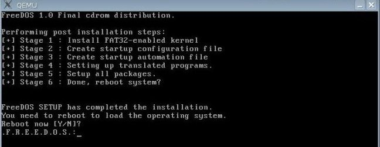

ANFANG   INFOBEREICH FÜR DIE AUTOREN  
Dieser Bereich ist vor der Veröffentlichung zu entfernen !!!  
**Status: RC1**

Änderungen 2020-05:
+ md codierung angepasst

ENDE   INFOBEREICH FÜR DIE AUTOREN

## Aktualisierung des BIOS mit FreeDOS

Das BIOS eines Computers sollte ab und an aktualisiert werden, wenn der Hersteller des Motherboards Verbesserungen der BIOS-Software vornimmt. Das Installationsprogramm ist in der Regel eine Anwendung auf MS-DOS-Basis.

Wir stellen nun eine Möglichkeit vor, wie man das BIOS unter Linux von einem USB-Stick oder einer micro/mini/SD-Karte (mit einem geeigneten Adapter) aktualisieren kann.

Als Erstes muss im BIOS das Booten von USB zugelassen werden, und das BIOS muss mit USB-Festplatten umgehen können. Einige BIOS-Varianten akzeptieren USB-Diskettenlaufwerke, CD-ROMs oder ZIP-Laufwerke. Die meisten davon können geeignet sein, aber eine BIOS-Aktualisierung kann sich schwieriger gestalten. Oft ist das jedoch die einzige Möglichkeit (das betrifft vor allem Netbooks). 

### Drei Voraussetzungen:

1. ein USB-Stick: bevorzugt sind weniger als 2 GByte (FAT16 erlaubt nicht mehr als 2 GByte, aber eine vollständige FreeDOS-Installation benötigt nur 5.8 MByte). FAT16 ist empfohlen, da FAT32 nicht von jedem BIOS als bootfähig erkannt wird.

2. ein FreeDOS-Installationsmedium: fdbasecd.iso (8MByte).

3. qemu (apt-get install qemu): qemu wird für die Installationsroutine benötigt. Das emulierte qemu-BIOS führt dazu, dass FreeDOS den USB-Stick als normale Festplatte erkennt und man auf traditionelle Art installieren kann (man muss keine FreeDOS-CD brennen).

**<warning>SEHR WICHTIGE, KRITISCHE INFORMATION:</warning>**
<warning>
Zu keinem Zeitpunkt darf der USB-Stick eingebunden, d.h. gemountet werden. Es muss peinlichst darauf geachtet werden, die richtige Gerätedatei (engl. device node) zu wählen, ansonsten werden sämtliche Daten auf dem falschen Datenträger (möglicherweise der System-Festplatte!) unwiderruflich gelöscht.
</warning>

---

Der USB-Stick wird angesteckt und nicht eingebunden. Mit dem Werkzeug fdisk ermittelt man, welche Gerätedatei dem USB-Stick zugewiesen wurde. In unseren Beispielen wird /dev/sdb verwendet.

Der USB-Stick wird gelöscht, wobei alle Daten verloren gehen. Man kann auch den ganzen USB-Stick löschen, nicht nur die ersten 16 MByte, wie im Beispiel. 

~~~~ bash
root@siduction# dd if=/dev/zero of=/dev/sdb bs=1M count=16
16+0 records in
16+0 records out
16777216 bytes (17 MByte) copied, 2.35751 s, 7.1 MByte/s 
root@siduction#
~~~~
### Partitionieren des USB-Sticks

Die korrekte Partitionierung und Formatierung des USB-Sticks ist vermutlich der schwierigste Teil.

Das Partitions-Label wird auf FAT16 gesetzt, auf Sticks mit weniger als 2 GByte (dies bietet bessere Kompatibilität).

Danach fdisk auf die Partition ausführen: 

~~~~ text
  root@siduction# fdisk /dev/sdb
  fdisk /dev/sdb Device contains neither a valid DOS partition
  table, nor Sun, SGI or OSF disklabel Building a new DOS disklabel with disk
  identifier 0xa8993739. Changes will remain in memory only, until you decide to write them. After that, of course, the previous content won't recoverable.

  Warning: invalid flag 0x0000 of partition table 4 will be corrected by w(rite)
~~~~

 _Anlegen der Partition:_

~~~~
  Command (m for help): n
  Command action
      e   extended
      p   primary partition (1-4)
  p
  Partition number (1-4): 1
  First cylinder (1-1018, default 1):
  Using default value 1
  Last cylinder or +size or +sizeM or +sizeK (1-1018, default 1018):
  Using default value 1018
~~~~

_Bestätigung des Anlegens der Partiton, indem die Partitionstabelle geschrieben wird:_

~~~~~
  Command (m for help): p
  Disk /dev/sdb: 2003 MByte, 2003828736 bytes 62 heads, 62 sectors/track, 1018
  cylinders Units = cylinders of 3844 * 512 = 1968128 bytes Disk identifier:
  0xa8993739

  Device Boot      Start         End      Blocks   Id  System
  /dev/sdb1            1        1018     1956595+  83  Linux
~~~~~

_Setzen des korrekten Partitionslabels , '6' für FAT16:_

~~~~
  Command (m for help): t
  Selected partition 1
  Hex code (type L to list codes): l

   0  Empty            1e  Hidden W95 FAT1 80  Old Minix       be  Solaris boot
   1  FAT12            24  NEC DOS         81  Minix / old Lin bf  Solaris
   2  XENIX root       39  Plan 9          82  Linux swap / So c1  DRDOS/sec (FAT-
   3  XENIX usr        3c  PartitionMagic  83  Linux           c4  DRDOS/sec (FAT-
   4  FAT16 <32M       40  Venix 80286     84  OS/2 hidden C:  c6  DRDOS/sec (FAT-
   5  Extended         41  PPC PReP Boot   85  Linux extended  c7  Syrinx
   6  FAT16            42  SFS             86  NTFS volume set da  Non-FS data
   7  HPFS/NTFS        4d  QNX4.x          87  NTFS volume set db  CP/M / CTOS / .
   8  AIX              4e  QNX4.x 2nd part 88  Linux plaintext de  Dell Utility
   9  AIX bootable     4f  QNX4.x 3rd part 8e  Linux LVM       df  BootIt
   a  OS/2 Boot Manag  50  OnTrack DM      93  Amoeba          e1  DOS access
   b  W95 FAT32        51  OnTrack DM6 Aux 94  Amoeba BBT      e3  DOS R/O
   c  W95 FAT32 (LBA)  52  CP/M            9f  BSD/OS          e4  SpeedStor
   e  W95 FAT16 (LBA)  53  OnTrack DM6 Aux a0  IBM Thinkpad hi eb  BeOS fs
   f  W95 Ext'd (LBA)  54  OnTrackDM6      a5  FreeBSD         ee  EFI GPT
   10  OPUS            55  EZ-Drive        a6  OpenBSD         ef  EFI (FAT-12/16/
   11  Hidden FAT12    56  Golden Bow      a7  NeXTSTEP        f0  Linux/PA-RISC b
   12  Compaq diagnost 5c  Priam Edisk     a8  Darwin UFS      f1  SpeedStor
   14  Hidden FAT16 <3 61  SpeedStor       a9  NetBSD          f4  SpeedStor
   16  Hidden FAT16    63  GNU HURD or Sys ab  Darwin boot     f2  DOS secondary
   17  Hidden HPFS/NTF 64  Novell Netware  b7  BSDI fs         fd  Linux raid auto
   18  AST SmartSleep  65  Novell Netware  b8  BSDI swap       fe  LANstep
   1b  Hidden W95 FAT3 70  DiskSecure Mult bb  Boot Wizard hid ff  BBT
   1c  Hidden W95 FAT3 75  PC/IX

   Hex code (type L to list codes): 6

    Changed system type of partition 1 to 6 (FAT16)
~~~~

_Aktivierung der neuen und einzigen Partition:_

~~~~
  Command (m for help): a Partition number (1-4): 1
~~~~

_Die neue Partitionstabelle wird nochmals geschrieben, und man bestätigt neuerlich, dass die Partition aktiviert wird:_

~~~~
  Command (m for help): p
  Disk /dev/sdb: 2003 MByte, 2003828736 bytes 62 heads, 62 sectors/track, 1018
  cylinders Units = cylinders of 3844 * 512 = 1968128 bytes Disk identifier:
  0xa8993739

  Device Boot      Start         End      Blocks   Id  System 
  /dev/sdb1   *        1        1018     1956595+   6  FAT16
~~~~

_Die neue Partitionstabelle wird auf dem USB-Stick gespeichert und fdisk beendet:_

~~~~
  Command (m for help): w 
  The partition table has been altered!

  Calling ioctl() to re-read partition table.

  WARNING: If you have created or modified any DOS 6.x partitions, please see the
  fdisk manual page for additional information. Syncing disks. 
  # exit
~~~~

_Formatieren des neu aufgesetzten USB-Sticks:_

~~~~
  root@siduction# mkfs -t vfat -n FreeDOS /dev/sdb1
  root@siduction# exit
~~~~

Die Vorbereitungsphase ist nun abgeschlossen. Der USB-Stick wurde partitioniert und formatiert. Nun kann der Installationsprozess begonnen werden.

### FreeDOS mit qemu booten

Da DOS keine USB-Sticks kennt, muss man einen Weg finden, um FreeDOS eine normale "Festplatte" vorzugaukeln. Bei einem "Live-Boot" übernimmt das BIOS diese Funktion, in unserem Fall muss man zu diesem Zweck jedoch qemu verwenden:

~~~~
  Benutzer:siduction> qemu-system-i386 -hda	/dev/sdb -cdrom /path/to/fdbasecd.iso -boot d
~~~~

_Damit wird FreeDOS CD gebootet und der USB-Stick wird als primäre Master-Festplatte erkannt (qemus Fähigkeit zur BIOS-Emulation lässt den USB-Stick für DOS als gewöhnliche Festplatte erscheinen). Nun wird der Installer im Boot-Menu des virtualisierten FreeDOS gewählt:  
ctrl-alt schaltet Maus und Tastatur zwischen qemu und Hostsystem. Damit kann man Desktops wechseln und schrittweise gleichzeitig die Anleitung mitlesen._

~~~~
  1) Continue to boot FreeDOS from CD-ROM 1
~~~~

Man wählt die Grundeinstellung 1 bzw. antwortet Yes, falls angefragt.

  
&nbsp;  
&nbsp;  

  
&nbsp;  
&nbsp;  
  

Die Installationsroutine fordert nun zu einem Reboot auf -  
**`dies verschieben wir noch etwas, da noch zwei Fehler des FreeDOS Installers bezüglich mbr und Bootmenü behoben werden müssen`**  
Man gibt den Buchstaben n ein.  
&nbsp;  
&nbsp;  

  
&nbsp;  
&nbsp;  
### Schreiben eines Bootsektors auf den USB-Stick

Der mbr-Fehler wird behoben durch:

~~~~
  fdisk /mbr 1
~~~~

Der Bootmenüfehler wird in der neuen fdconfig.sys behoben, indem man ausführt:

~~~~
  cd \ 
  edit fdconfig.sys
~~~~

und dann die Zeile beginnend mit command.com so abändert:

~~~~
  1234?SHELLHIGH=C:\FDOS\command.com C:\FDOS /D /P=C:\fdauto.bat /K set
~~~~

`Ansonsten darf nichts geändert werden, da die Zeile von dem Installations-Setup abhängt.`

Speichern und "edit" verlassen:

~~~~
  [alt]+[f]
~~~~

Zurück beim Befehlszeilen-Prompt kann qemu nun verlassen werden.

Nun wird getestet, ob qemu den USB-Stick bootet.

~~~~
  qemu-system-i386 -hda /dev/sdb
~~~~

Der USB-Stick ist nun bootfähig und enthält eine vollständige FreeDOS-Installation mit 5,4 MByte, um das BIOS flashen zu können. `Man sollte booten, ohne Treiber zu laden (Menüoption 4), himem.sys und emm386 könnten in die Flashing-Programme reinpfuschen!`

### Aktualisierung des BIOS

Der FreeDOS USB-Stick wird in ein laufendes System angesteckt, eingebunden und die benötigten   BIOS-  Dateien (Herstellerempfehlung) werden auf dem FreeDOS USB-Stick gespeichert. Die Einbindung des USB- Sticks wird danach gelöst.

Der PC wird ausgeschaltet und der FreeDOS USB-Stick angesteckt. Der PC wird eingeschaltet, sodass der FreeDOS USB-Stick bootet, danach wird den Anweisungen des Herstellers des BIOS bzw. Motherboards gefolgt.

Page last revised by devil on 17/08/2016 1745 UTC

