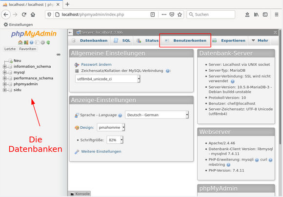
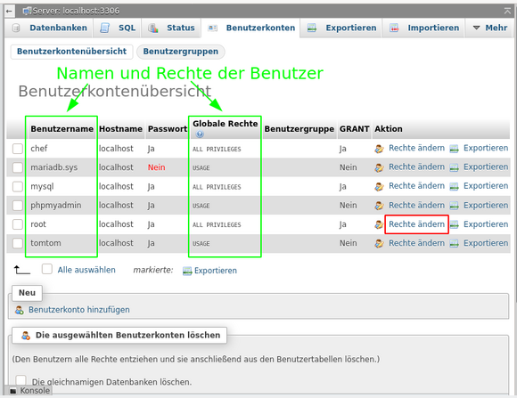
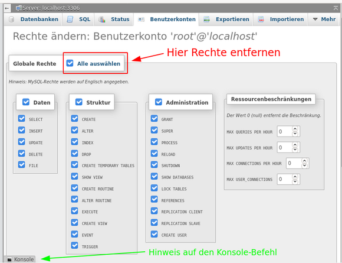

% LAMP - MariaDb 

ANFANG   INFOBEREICH FÜR DIE AUTOREN  
Dieser Bereich ist vor der Veröffentlichung zu entfernen !!!  
**Status: RC2**

Änderungen 2020-12:

+ Inhalt vollständig erneuert.
+ Für die Verwendung mit pandoc optimiert.

ENDE   INFOBEREICH FÜR DIE AUTOREN

---

## MariaDb

### Erstkonfiguration

Nach der Installation, wie sie in [LAMP-Testserver für Entwickler](./lamp-start_de.htm) beschrieben wurde, ist MariaDB *'offen wie ein Scheunentor für jedermann'*, denn in der Grundeinstellung werden die beiden Benutzer *root* und *anonymous*, ohne Passwort erstellt und eine Testdatenbank angelegt.

Deshalb rufen wir das Programm **mysql_secure_installation** im root-Terminal auf.  
Hier nehmen wir eine ganze Reihe von Einstellungen zur Absicherung der Datenbank vor. Die notwendigen Eingaben sind so gekennzeichnet: "«- - [ ]".

~~~
# mysql_secure_installation  

In order to log into MariaDB to secure it, we'll need the current
password for the root user. If you've just installed MariaDB, and
you haven't set the root password yet, the password will be blank,
so you should just press enter here.

Enter current password for root (enter for none): «--[Enter]  
OK, successfully used password, moving on...

Setting the root password or using the unix_socket ensures that nobody can  
log into the MariaDB root user without the proper authorisation.

You already have your root account protected, so you can safely answer 'n'.

Switch to unix_socket authentication [Y/n]:   «--[n]  
 ... skipping.

You already have your root account protected, so you can safely answer 'n'.

Change the root password? [Y/n]:   «--[y]  
New password:                      «--[mein_mariadb_root_passwort]  
Re-enter new password:             «--[mein_mariadb_root_passwort]  
Password updated successfully!  
Reloading privilege tables..  
... Success!

By default, a MariaDB installation has an anonymous user, allowing anyone
to log into MariaDB without having to have a user account created for
them. This is intended only for testing, and to make the installation
go a bit smoother. You should remove them before moving into a
production environment.

Remove anonymous users? [Y/n]:   «--[y]  
... Success!

Normally, root should only be allowed to connect from 'localhost'. This
ensures that someone cannot guess at the root password from the network.

Disallow root login remotely? [Y/n]   «--[y]  
... Success!

By default, MariaDB comes with a database named 'test' that anyone can
access. This is also intended only for testing, and should be removed
before moving into a production environment.

Remove test database and access to it? [Y/n]   «--[y]  
- Dropping test database...  
... Success!  
- Removing privileges on test database...  
... Success!

Reloading the privilege tables will ensure that all changes made so far
will take effect immediately.

Reload privilege tables now? [Y/n]   «--[y]
... Success!

Cleaning up...

All done! If you've completed all of the above steps, your MariaDB  
installation should now be secure.

Thanks for using MariaDB!
~~~

Im Ergebnis hat der Benutzer *root* ein (hoffentlich sicheres) Passwort erhalten und er kann sich nicht mehr remote einloggen. Der Benutzer *anonymous* und die Datenbank *Test* wurden entfernt.

### Abfragen

Wir schauen uns das Ergebnis in Terminal an. Zuerst der Login zu MariaDb für dem Benutzer *root*. Nach der Eingabe des Passwortes sehen wir die Begrüßung und den neuen Promt `MariaDB [(none)]>`.

~~~
# mariadb -u root -p
Enter password:
Welcome to the MariaDB monitor.  [...]

MariaDB [(none)]>
~~~

Anschließend lassen wir uns die Benutzer und die vorhandenen Datenbanken anzeigen.

~~~
MariaDB [(none)]> SELECT User,Host FROM mysql.user;
+-------------+-----------+
| User        | Host      |
+-------------+-----------+
| mariadb.sys | localhost |
| mysql       | localhost |
| phpmyadmin  | localhost |
| root        | localhost |
+-------------+-----------+
4 rows in set (0.002 sec)

MariaDB [(none)]> SHOW DATABASES;
+--------------------+
| Database           |
+--------------------+
| information_schema |
| mysql              |
| performance_schema |
| phpmyadmin         |
+--------------------+
4 rows in set (0.001 sec)
~~~

Aus Sicherheitsgründen sollten wir **nie als Benutzer root** die täglichen Arbeiten in MariaDb erledigen. Wir legen je einen Benutzer als Ersatz für *root* und einen für die Arbeit mit der ebenfalls neu zu erstellenden Datenbank unseres Entwicklungsprojektes an. Später im Abschnitt [PHPMyAdmin](#phpmyadmin) entziehen wir dem Benutzer *root* die allumfassenden Rechte, damit ein potentieller Angreifer an dieser Stelle erfolglos bleibt.

### Eine Datenbank anlegen

Wir sind noch im Terminal als *MariaDb-root* angemeldet und erstellen für unser Projekt eine neue Datenbank:

~~~
MariaDB [(none)]> CREATE DATABASE sidu;
Query OK, 1 row affected (0.002 sec)
~~~

Das ist schon alles. Falls wir diese Datenbank löschen wollen hilft "DROP DATABASE sidu;"

### Einen Benutzer anlegen

Zuerst erstellen wir unseren Projekt-Benutzer mit dem Namen *tomtom* und weisen ihm anschließend alle Rechte an der Projekt-Datenbank *sidu* zu:

~~~
MariaDB [(none)]> CREATE USER tomtom@localhost IDENTIFIED BY '<hier ein Passwort für tomtom eingeben>';
Query OK, 0 rows affected (0.002 sec)

MariaDB [(none)]> GRANT ALL ON sidu.* TO tomtom@localhost;
Query OK, 0 rows affected (0.001 sec)
~~~

Nun die gleiche Prozedur für den Benutzer *chef*, der die Aufgabe von *root* übernehmen soll.

~~~
MariaDB [(none)]> CREATE USER chef@localhost IDENTIFIED BY '<hier ein Passwort für chef eingeben>';
Query OK, 0 rows affected (0.002 sec)

MariaDB [(none)]> GRANT ALL ON *.* TO chef@localhost WITH GRANT OPTION;
Query OK, 0 rows affected (0.001 sec)

MariaDB [(none)]> FLUSH PRIVILEGES;
~~~

Die neuen Benutzer unterscheiden sich in ihren Rechten.

*tomtom* hat alle Rechte **nur** für die Datenbank *sidu* ( `sidu.*` ).  
*chef* hat alle Rechte an allen Datenbanken ( `*.*` ) und Benutzern ( `WITH GRANT OPTION` ).

Der Benutzer *chef* kann somit die Funktion des Benutzers *root* übernehmen.

---

## phpMyAdmin

Wie zuvor gesehen, lässt sich MariaDb vollständig über die Komandozeile verwalten. Wer die Syntax beherrscht, und dafür ist profundes Fachwissen erforderlich, kommt auf diesem Weg schnell zum gewünschten Ergebnis.

Wir verwenden das für weniger erfahrene Benutzer besser geeignete Progrann *phpMyAdmin* und geben in die Adresszeile des Browsers  
**http://localhost/phpmyadmin/**  
ein.

Um, wie oben angeführt, dem Datenbank-Admin *root* die Rechte zu entziehen, benutzen wir im Anmeldefenster gleich unseren neuen Datenbank-Admin *chef* mit seinem Passwort.

Im Startfenster sehen wir in der linken Spalte alle Datenbanken. Im Hauptteil wählen wir den Reiter `Benutzerkonten`.

Die Benutzerkontenübersicht stellt alle Benutzer und in Kurzform deren Rechte dar. Wir wählen hier für den Benutzer *root* den Schalter `Rechte ändern`.

Nun sehen wir für den Benutzer *root* die detaillierten Rechte. Hier sind wir zu unserer eigenen Sicherheit grob und entziehen ihm alle Rechte.

Bestätigt wird die Aktion ganz unten mit dem Schalter `OK`. Interessant dürfte auch der Schalter `Konsole` sein, der am unteren Fensterrand eine solche öffnet. Hier kann man direkt Konsolebefehle eingeben und es werden die vom Programm generierten und ausgeführten Befehle angezeigt.  
Mit unserem Beispiel sieht das so aus:

~~~
REVOKE ALL PRIVILEGES ON *.* FROM 'root'@'localhost';
REVOKE GRANT OPTION ON *.* FROM 'root'@'localhost';
GRANT USAGE ON *.* TO 'root'@'localhost' REQUIRE NONE WITH MAX_QUERIES_PER_HOUR 0 
 ->  MAX_CONNECTIONS_PER_HOUR 0 MAX_UPDATES_PER_HOUR 0 MAX_USER_CONNECTIONS 0;
~~~

Um PHPMyAdmin zu verlassen, benutzen wir in der linken Spalte das Tür-Ikon.

PHPMyAdmin bietet umfangreiche Möglichkeiten zur Verwaltug der Datenbanken ihrer Tabellen und deren Inhalte. Beachtet werden sollte der Reiter `Exportieren` im Hauptfenster, hinter dem sich die Möglichkeit zur Datensicherung findet.

---

## Quellen

[MariaDb Dokumentation](https://mariadb.com/kb/en/documentation/) (englisch)

---

Zuletzt bearbeitet: 2020-12-20

