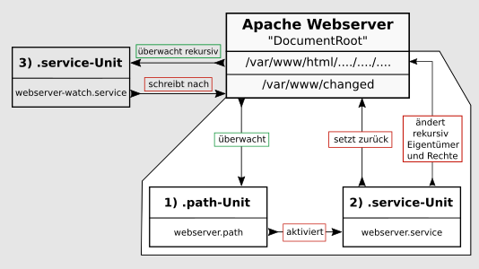

% Systemd - path

ANFANG   INFOBEREICH FÜR DIE AUTOREN  
Dieser Bereich ist vor der Veröffentlichung zu entfernen !!!  
**Status: RC2**

Änderungen 2021-02:

+ Neu "systemd-path Unit"
+ Für die Verwendung mit pandoc optimiert.

ENDE   INFOBEREICH FÜR DIE AUTOREN

---

## systemd der System- und Dienste-Manager

Die grundlegenden und einführenden Informationen zu Systemd enthält die Handbuchseite [Systemd-Start](./systemd-start_de.htm).  
In der vorliegenden Handbuchseite erklären wir die Funktion der Unit **systemd.path**, mit der systemd Pfade überwacht und Pfad-basierte Aktionen auslöst.

---

## systemd.path

Die "*.path-Unit*" ermöglicht es, bei Änderungen an Dateien und Verzeichnissen (Pfaden) eine Aktion auszulösen.  
Sobald ein Ereignis eintritt, kann Systemd einen Befehl oder ein Skript über eine Service Unit ausführen. Die "*.path-Unit*" ist nicht in der Lage Verzeichnisse rekursiv zu überwachen. Es können aber mehrere Verzeichnisse und Datein angegeben werden.  
Die Pfad-spezifischen Optionen werden in dem Abschnitt *[Path]* konfiguriert.

---

### Benötigte Dateien

Die **systemd-path**-Unit benötigt für ihre Funktion mindestens zwei Dateien mit vorzugsweise dem gleichen Namen, aber unterschiedlicher Namenserweiterung, im Verzeichnis */lib/systemd/system/*. Das sind die

+ Path-Unit-Datei (\<name\>.path), welche die Überwachung und den Auslöser für die Service-Unit enthält  
    und die  
+ Service-Unit-Datei (\<name\>.service), welche die zu startende Aktion enthält.  
    Für umfangreichere Aktionen erstellt man zusätzlich ein Skript in */usr/local/bin/*, das von der Service-Unit ausgeführt wird.

### .path-Unit Optionen

Die *.path-Unit* muss zwingend die Sektion *[Path]* enthalten, in der festgelegt wird wie und was zu überwachen ist.

Die speziellen Optionen sind:

+ PathExists=  
    prüft, ob der betreffende Pfad existiert. Wenn es zutrifft, wird die zugehörige Unit aktiviert.
    
+ PathExistsGlob=  
    Wie oben, unterstützt Datei-Glob-Ausdrücke.
    
+ PathChanged=  
    beobachtet eine Datei oder einen Pfad und aktiviert die zugehörige Unit, wenn Änderungen auftreten.  
    Aktionsauslösende Änderungen sind:
    + Erstellen und Löschen von Dateien.  
    + Atribute, Rechte, Eigentümer.  
    + Schließen der zu beobachtenden Datei nach Schreibzugriff und schließen irgendeiner Datei nach Schreibzugriff bei Beobachtung des Pfades.
    
+ PathModified=  
    wie zuvor, aber zusätzlich wird die zugehörige Unit bei einfachen Schreibzugriffen aktiviert, auch wenn die Datei nicht geschlossen wird.
    
+ DirectoryNotEmpty=  
    aktiviert die zugehörige Unit wenn das Verzeichnis nicht leer ist.
    
+ Unit=  
    die zu aktivierende, zugehörige Unit. Zu beachten ist auch, dass die *.path-Unit* standardmäßig die "*.service-Unit*" mit dem gleichen Name aktiviert. Nur bei Abweichungen hiervon ist die Option *Unit=* innerhalb der Sektion *[Path]* notwendig.
    
+ MakeDirectory=  
    das zu beobachtenden Verzeichnis wird vor der Beobachtung erstellt.
    
+ DirectoryMode=  
    legt bei Verwendung, für das zuvor erstellte Verzeichnis, den Zugriffsmodus in oktaler Notation fest. Standardmäßig 0755.

#### Das Beispiel

An einem Beispiel, das auf der Konfiguration des Apache-Webservers entsprechend unserer Handbuchseite [LAMP - Apache, Benutzer und Rechte](./lamp-apache_de.htm#benutzer-und-rechte) basiert, wollen wir das Zusammenspiel der *.path-Unit* mit anderen *systemd-Unit* verdeutlichen.

Zuerst eine graphische Übersicht, die die Abhängigkeiten der *systemd-Units* unseres Beispiels darstellt:

Der weiß hinterlegte Teil in der Graphik verdeutlicht die Kernfunktion der *.path-Unit*. Sie überwacht die Datei "*/var/www/changed*" und aktiviert bei Änderungen die zugehörige *.service-Unit*. Diese wiederum führt dann die gewünschten Aktionen im Verzeichnis "*/var/www/html/*" aus und stellt die Datei "*/var/www/changed*" zurück.  
Die im grau hinterlegten Bereich gezeigte .service-Unit "*webserver-watch.service*" übernimmt die rekursive Überwachung von *DocumentRoot* des Apache-Webservers.

### .path-Unit anlegen

Wir legen die Datei *webserver.path* im Verzeichnis */lib/systemd/system/*, die die Datei */var/www/changed* auf Änderungen überwacht, mit folgendem Inhalt an:

~~~
[Unit]
Description=Monitoring "webserver-changed" file!
BindsTo=webserver-watch.service
After=webserver-watch.service

[Path]
PathModified=/var/www/changed

[Install]
WantedBy=multi-user.target
~~~

#### Erklärungen

Sektion [Unit]:  
Die Option "*BindsTo=*" stellt die stärkste verfügbare Bindung zweier systemd-Einheiten aneinander dar. Falls eine von ihnen während des Starts oder des Betriebs in einen Fehlerzustand übergeht, wird die andere auch unmittelbar beendet.  
Zusammen mit der Option "*After=*" wird erreicht, dass die *webserver.path-Unit* erst startet, wenn die *webserver-watch.service-Unit* ihren erfolgreichen Start an systemd zurückmeldet.

Sektion [Path]:  
"*PathModifid=*" ist die richtige Wahl. Die Option reagiert auf Änderungen in der Datei */var/www/changed*, selbst wenn die Datei nicht geschlossen wird.  
Die Option "*PathModifid=*" (oder andere, siehe oben) kann mehrfach angegeben werden.

### .service-Unit anlegen

Die *webserver.service-Unit* wird von der *webserver.path-Unit* aktiviert und kontrolliert und benötigt daher keine *[Install]* Sektion. Somit reichen die Beschreibung der Unit in der Sektion *[Unit]*, und in der Sektion *[Service]* die auszuführenden Befehle, aus.

Wir legen die Datei *webserver.service* im Verzeichnis */lib/systemd/system/* mit folgendem Inhalt an.

~~~
[Unit]
Description="Change permissions in webserver folder"

[Service]
Type=oneshot
ExecStartPre=/usr/bin/truncate -s 0 /var/www/changed
ExecStart=/usr/bin/chown -R www-data /var/www/html/
ExecStart=/usr/bin/chmod -R g+w /var/www/html/
ExecStart=/usr/bin/chmod -R o-r /var/www/html/
~~~

#### Erklärungen

Sektion [Service]:  
"*ExecStart=*"-Befehle werden nur ausgeführt, nachdem sich alle "*ExecStartPre=*"-Befehle erfolgreich beendet haben.
Zuerst wird die Datei */var/www/changed* auf 0-Bite zurückgesetzt und danach der Rest ausgeführt.

#### Zusätzliche .service-Unit anlegen

Da die *.path-Unit* Verzeichnisse nicht rekursiv überwachen kann, benötigen wir für unser Beispiel eine zusätzliche *.service-Unit*. Wir legen die Datei *webserver-watch.service* im Verzeichnis */lib/systemd/system/* mit folgendem Inhalt an.

~~~
[Unit]
Description=Watching webservers folder.
Before=webserver.path
Wants=webserver.path

[Service]
Type=forking
ExecStart=inotifywait -dqr -e move,create -o /var/www/changed /var/www/html/

[Install]
WantedBy=multi-user.target
~~~

Anmerkung:  
Interressant ist, dass systemd intern das inotify-API für *.path-Unit* verwendet, um Dateisysteme zu überwachen, jedoch deren Rekursiv-Funktion nicht implementiert.

#### Erklärungen

Die Sektion [Unit]:  
"*Before=*" und "*Wants=*" sind die entsprechenden Korrellationen zu "*BindsTo=*" und "*After=*" aus der *webserver.service-Unit*.

Sektion [Service]:  
*inotifywait* protokolliert in die Datei */var/www/changed*, die außerhalb von *DocumentRoot* des Apache-Webservers liegt.

### .path-Unit eingliedern

Auf Grund der Abhängigkeit gliedern wir zuerst die *webserver.path-Unit* und dann die *webserver-watch.service-Unit* in systemd ein. Die *webserver.service-Unit* benötigt und beinhaltet keine [Install]-Sektion. Bei dem Versuch sie einzugliedern erhielten wir eine Fehlermeldung.

~~~
# systemctl enable webserver.path
Created symlink /etc/systemd/system/multi-user.target.wants/webserver.path \
  → /lib/systemd/system/webserver.path.
  
# systemctl enable webserver-watch.service
Created symlink /etc/systemd/system/multi-user.target.wants/webserver-watch.service \
  → /lib/systemd/system/webserver-watch.service.
~~~

Nun ist das Monitoring auch gleich aktiv, wie uns die Statusausgaben aller drei Units zeigen.

~~~
# systemctl status webserver-watch.service
● webserver-watch.service - Watching webservers folder.
     Loaded: loaded (/lib/systemd/system/webserver-watch.service; enabled; vendor preset: enabled)
     Active: active (running) since Sun 2021-02-21 19:25:20 CET; 1min 49s ago
    Process: 23788 ExecStart=inotifywait -dqr -e move,create -o /var/www/changed /var/www/html/ \
      (code=exited, status=0/SUCCESS)
   Main PID: 23790 (inotifywait)
      Tasks: 1 (limit: 2322)
     Memory: 216.0K
        CPU: 5ms
     CGroup: /system.slice/webserver-watch.service
             └─23790 inotifywait -dqr -e move,create -o /var/www/changed /var/www/html/

Feb 21 19:25:20 lap1 systemd[1]: Starting Watching webservers folder....
Feb 21 19:25:20 lap1 systemd[1]: Started Watching webservers folder..

# systemctl status webserver.path
● webserver.path - Monitoring "webserver-changed" file!
     Loaded: loaded (/lib/systemd/system/webserver.path; enabled; vendor preset: enabled)
     Active: active (waiting) since Sun 2021-02-21 19:25:20 CET; 3min 27s ago
   Triggers: ● webserver.service

Feb 21 19:25:20 lap1 systemd[1]: Started Monitoring "webserver-changed" file!.

# systemctl status webserver.service
● webserver.service - Change permissions in webservers folder
     Loaded: loaded (/lib/systemd/system/webserver.service; static)
     Active: inactive (dead)
TriggeredBy: ● webserver.path
~~~

Der Status "Active: inactive (dead)" der letzten Ausgabe ist der normale Zustand für die Unit *webserver.service*, denn diese Unit ist nur dann aktiv, wenn sie von *webserver.path* angestoßen wurde ihre Befehlskette auszuführen. Danach geht sie wieder in den inaktiven Zustand über.

#### webserver.service-Unit manuell ausführen

Sollte es einmal hilfreich oder nötig sein die Dateirechte in *DocumentRoot* des Apache-Webservers manuell zu ändern, setzen wir einfach diesen Befehl ab:

~~~
# systemctl start webserver.service
~~~

Eine erneute Statusabfrage generiert zusätzlich einige Protokollzeilen, denen wir den erfolgreichen Durchlauf der Befehlskette entnehmen können.

~~~
# systemctl status webserver.service
● webserver.service - Change permissions in webservers folder
     Loaded: loaded (/lib/systemd/system/webserver.service; static)
     Active: inactive (dead) since Mon 2021-02-22 17:55:36 CET; 1min 43s ago
TriggeredBy: ● webserver.path
    Process: 2822 ExecStartPre=truncate -s 0 /var/www/changed (code=exited, status=0/SUCCESS)
    Process: 2823 ExecStart=chown -R www-data /var/www/html1/ (code=exited, status=0/SUCCESS)
    Process: 2824 ExecStart=chmod -R g+w /var/www/html1/ (code=exited, status=0/SUCCESS)
    Process: 2825 ExecStart=chmod -R o-r /var/www/html1/ (code=exited, status=0/SUCCESS)
   Main PID: 2825 (code=exited, status=0/SUCCESS)
        CPU: 19ms

Feb 22 17:55:36 lap1 systemd[1]: Starting Change permissions in webservers folder...
Feb 22 17:55:36 lap1 systemd[1]: webserver.service: Succeeded.
Feb 22 17:55:36 lap1 systemd[1]: Finished Change permissions in webservers folder.
~~~

---

## Quellen

[Deutsche Manpage 'systemd.path'](https://manpages.debian.org/testing/manpages-de/systemd.path.5.de.html)

Ein anders gelagertes Beispiel:  
[PRO-LINUX.DE, Systemd Path Units...](https://www.pro-linux.de/artikel/2/1994/systemd-path-units-zum-%C3%9Cberwachen-von-dateien-und-verzeichnissen-verwenden.html)

---

Seite zuletzt aktualisert 2021-02-22

