% Installation on HDD

## Installation on HDD

### Data backup

> **IMPORTANT: ALWAYS CREATE A DATA BACKUP!**  
> If the installation target is already home to an operating system or data is to be preserved, please always create a backup before installing siduction.  

### Installation preparations

First, change the boot order so that the medium to be booted (DVD, flashcard, or USB stick) is at the top of the list. On most computers, pressing the **`F2`** or **`Del`** key during the boot process takes you to the UEFI or BIOS setup. Alternatively, pressing **`F12`**, **`F11`**, **`F7`**, or **`F8`** (depending on the hardware manufacturer's specifications) during the boot process will take you directly to the boot menu where you can select the live media as the boot drive.

siduction usually starts without problems now. If this is not the case, boot options (cheat codes), which can be passed to the boot manager, are helpful. The manual page [Cheatcodes](0204-cheatcodes_en.md#boot-options-and-cheat-codes) explains the possible options.  
At the start screen, use the arrow keys to navigate to *"From CD/DVD/ISO: ..."* or *"From Stick/HDD: ..."* (according to the used live medium) and press **`e`**. This takes you to the kernel command line where you can add the cheatcodes. Pressing **`F10`** will continue the boot process.

**Before the installation, please remove all USB sticks, cameras, etc.**

If siduction is not to be installed from, but **to a USB medium**, a different procedure is necessary. See the manual page [Installation to a USB medium](0207-iso-to-usb-sd_en.md#iso-to-usb-stick---memory-card).

**HDD, RAM, and Swap**

The minimum requirements for installing the siduction variants are described on the manual page [Live ISO content](0201-cd-content_en.md#minimum-system-requirements).  
With 15 GB hard disk space and 2 GB RAM you are currently on the safe side. When installing on a partition formatted with Btrfs, we advise 50 GBytes of disk space.  
A swap partition should be created on PCs with 1 GByte RAM or less. More than 2 GByte swap is rarely required and only useful for suspend to disk and server systems.

### Partitioning and file systems

The [Partitioning Installation Media](0310-part-size-examp_en.md#partitioning-of-installation-media) manual page includes several examples that take into account different hard drive sizes and offers suggestions for partitioning single-boot and dual-boot systems. In the section [File Systems for Partitions](0310-part-size-examp_en.md#file-systems-of-the-partitions), we describe which file systems are appropriate for the partitions in each situation.  
We recommend leaving the `/home` directory on the root partition. The `/home` directory should be the place where individual configurations are stored, and only those. For all other private data, including `.ssh`, `.gnupg`, and the mail archives, a separate data partition should be created and linked to the `/home` directory if necessary. The advantages for data stability, data backup, and also in case of data recovery are almost immeasurable.  

The partitioning can be done during installation or already in advance during the live session with the following programs:  
[Gparted](0312-part-gparted_en.md#partitioning-with-gparted), a graphical user interface program for GTK desktops  
KDE Partition Manager, another graphical user interface program for Qt desktops  
[cfdisk](0314-part-cfdisk_en.md#partitioning-with-fdisk), a program for the terminal with a user-friendly ncurses interface. Suitable for UEFI hardware with GPT partition tables and for older hardware or smaller drives such as USB sticks and memory cards with BIOS and MSDOS partition tables.

### Duplication to another computer

The following console command creates a list of installed software packages. This list can be used to install an identical software selection on another computer or in the event of a new installation:

~~~
~# dpkg -l|awk '/^ii/{ print $2 }'|grep -v -e ^lib -e -dev -e $(uname -r) >/home/username/installed.txt
~~~

We recommend to copy this text file to a USB drive or a disk of your choice.  
The text file can then be copied to the target systems `$HOME` directory and be used as a reference to install the required program packages. You can install the complete package list via

~~~
~# apt install $(/home/username/installed.txt)
~~~

If you want to replace an old siduction installation with a new one, using the old system's `installed.txt` file on the new system will most likely cause serious problems. It is better to compare an `installed-old.txt` file from the old system with an `installed-new.txt` file from the new system using *diff*. Then, install the desired packages on the new siduction installation.

### The Calamares installer

During the installation, the computer should preferably be connected to the Internet because Calamares uses the GeoIP service to determine default settings for localization and time.

 1. The installation program can be started comfortably via the  icon on the desktop or in the menu: *"System"* > *"Install system"*.

 2. After a double click on the icon, Calamares starts and we see the "*Welcome*" window.

    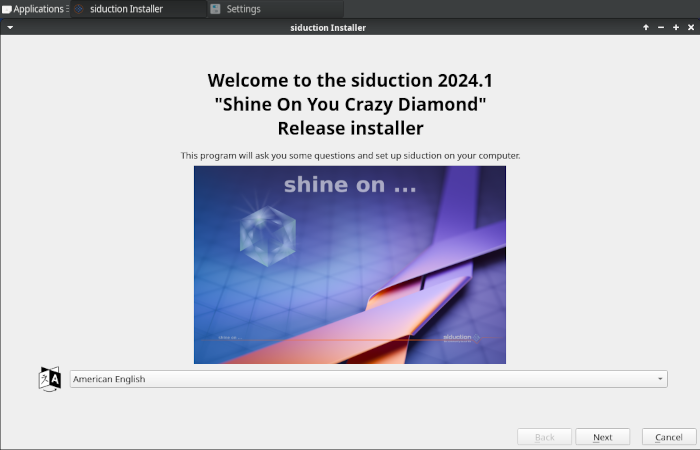

    If an internet connection is provided, the correct language should already be set here.

 3. Next, there is the option to select additional, non-free software sources. If this option is activated, the sources *contrib* and *non-free* are also activated and it is possible to install non-free drivers (e.g. Nvidia) and proprietary software.

    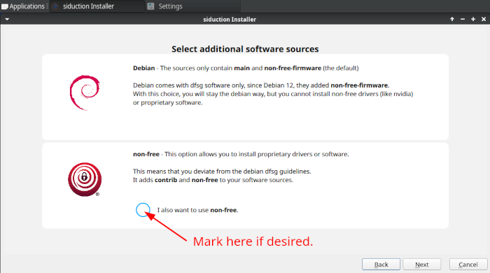 

 4. In the next window "Location", you have the possibility to make changes to *region*, *timezone*, and *system language*, as well as the date and number *format*.

    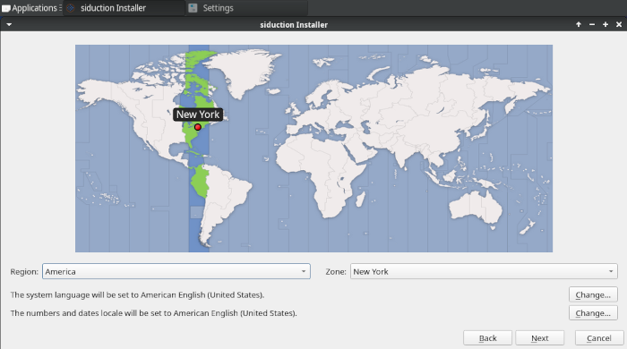 

 5. Next, you can set up the keyboard.

    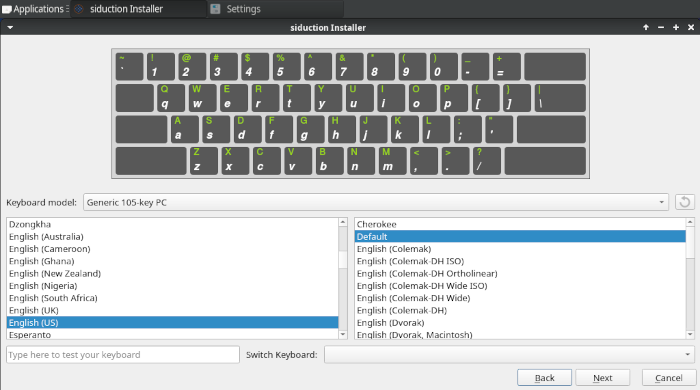

    In the upper section, the keyboard is displayed graphically and the changes are visible immediately. At the bottom, there is an input line to test the keyboard layout.

 6. Then we reach the already mentioned partitioning, which determines the parts of the harddisk(s) siduction uses.

    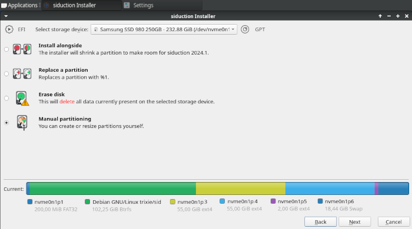

    In our example, we use *"Manual partitioning"* because the partitions have already been created in advance and we only need to select the correct installation target. After clicking `Next`, the following window appears where we can select and edit the individual partitions.

    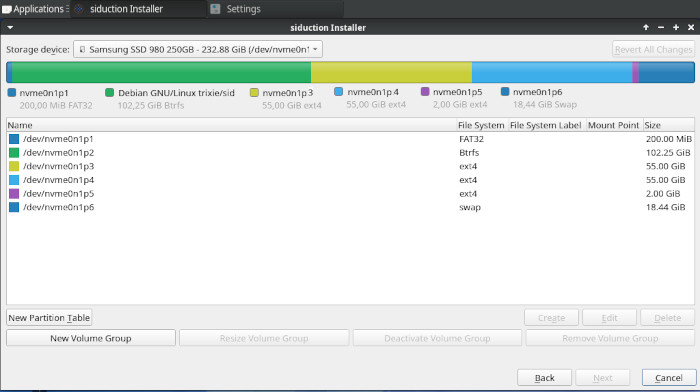

    We use the partitions:    
    `nvme0n1p1` for `/boot/efi`  
    `nvme0n1p4` for `/` (root)  
    `nvme0n1p3` for `/data` together with the Linux system already present on `nvme0n1p2`.

    After selecting the desired partition and pressing the `Change` button, a window opens where we enter the above mountpoint and also format `nvme0n1p4` with the **ext4** file system. The partition `nvme0n1p3` is not formatted because we want to use the data already stored there together with the existing Linux system.  
    We do not need to edit the swap partition `nvme0n1p6` since it will be automatically detected and integrated during the installation.  
    We can see the result of our efforts in the next image.

    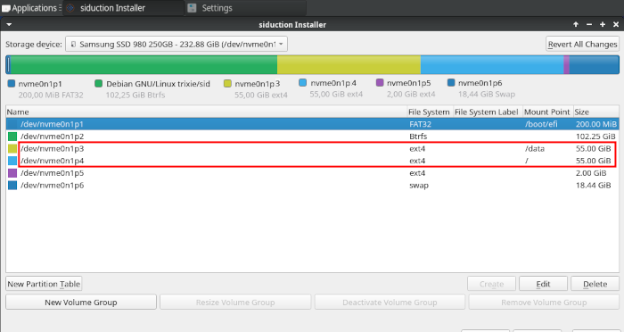

 7. Next, we set username, login name, computer name, user password, and root password (remember them well!). The passwords should not be too simple for security reasons. Additional users can be added after installation in a terminal with [adduser](#add-user).

    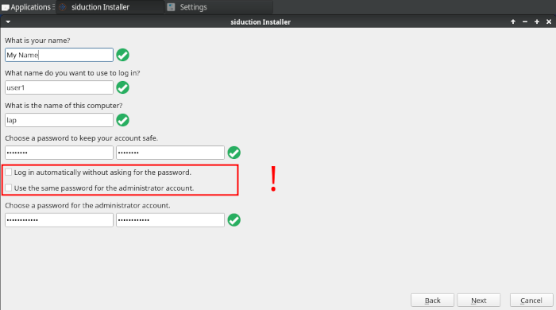

    We explicitly recommend not to use the options  
    "*Log in automatically without asking for the password*" and  
    "*Use the same password for the administrator account*".  
    They both represent a security risk on their own (see also [sudo](0701-term-konsole_en.md#work-as-root)). If both options are enabled, entering passwords is just a farce!

 8. After pressing the `Next` button, a summary of all previously made entries appears. Now you still have the possibility to make changes via `Back`. If you are satisfied with the result, a click on `Install` opens the small warning window in which you have to confirm the installation.

    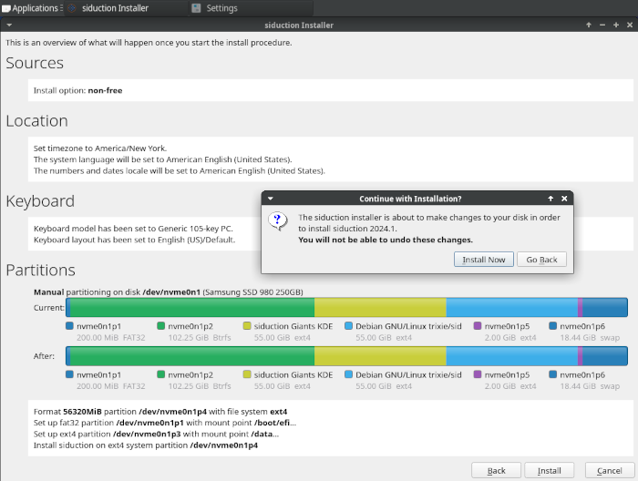 

 9. Now the installation starts. This takes some time depending on the hardware. The progress will be displayed respectively. Even if it takes a little longer, please do not abort the installation, but give the process time.

    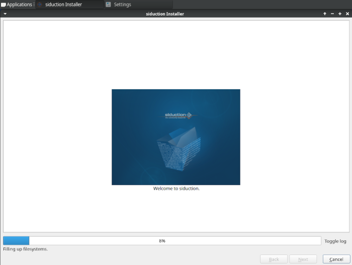

10. At the end, we get the possibility to reboot into the newly installed system. 

    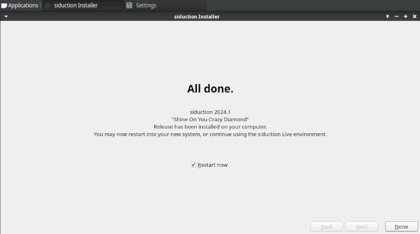

    Remove the USB stick with the live medium before rebooting!

### Encrypt system

The partitioning described in step 6 above is now slightly different.  
We also use the “*Manual partitioning*” option here. The encrypted system requires at least three partitions. According to the partitioning used above, these are

`/dev/nvme0n1p1` unencrypted and mounted at `/boot/efi`,  
`/dev/nvme0n1p5` unencrypted and mounted at `/boot`,  
`/dev/nvme0n1p4` for the encrypted system.

The partition `/dev/nvme0n1p4` requires a different file system to the one used previously. Therefore, the first step is to delete the partition and create a new partition in the empty, unused area.

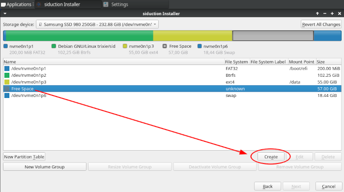

In the next step, the function *"Encrypt"* is selectable now.

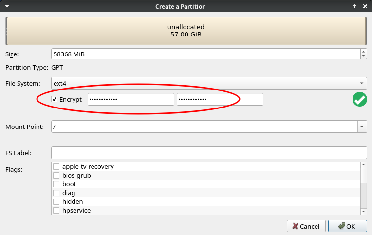

We enter our password and then select the root directory `/` as mount point.  
After finishing the partitioning, we continue the installation with the menu item *"User"* as described above in step 7.

### The cli-installer and fll-installer

**Installing siduction via the terminal or TTY**

With the inclusion of Calamares as a graphical installer, the fll-installer became increasingly obsolete. As a result, the cli-installer and the fll-installer have remained virtually unchanged since 2018. Since siduction intends to continue offering a NOX flavor, the cli- and fll-installer duo required a major overhaul with the integration of current features.

Key changes:  
- Updated outdated commands, prompts, and dialogs.  
- Nonfree sources are now opt-in.  
- Full support for UEFI GPT.  
- Support for the Btrfs file system, including the creation of subvolumes as is standard with siduction.  
- Choice of boot managers: systemd-boot and GRUB.  
- Consistent user interface design across all dialogs.  
- Certain components of the graphical user interface have been removed.  

In summary:

*Risen from the morgue of outdated fullstory packages.*

A particular highlight is the integration of the systemd-boot boot manager, which is now available in all flavors during the initial installation. If you have a simple hardware setup, systemd-boot is a good choice.  
For more information, see our [systemd-boot](0717-systemd-boot_en.md#systemd-boot) manual page.

The *cli-installer* guides the user through the configuration process, suggests appropriate actions, checks dependencies and requirements, and provides information about the settings that have been configured. Finally, the fll-installer starts and installs siduction onto the hard drive.  
You can cancel the program at any time.

**Run cli-installer**

As mentioned earlier, the *cli-installer* is available in all flavors.  
It can be run either in the graphical interface, in a terminal, or after switching to a TTY. In that case, execute the following command.

As *siducer*

~~~
$ sudo cli-installer
~~~

or if root privileges have already been obtained using the **`su`** command

~~~
# cli-installer
~~~

A user-friendly ncurses interface guides you through the program's dialogs to gather all the information needed to install siduction.

### Add user

To add new users with automatic takeover of group permissions, run the following command as **root**:

~~~
~# adduser <username>
~~~

Pressing the **`Enter`** key will bring up more options that allow additional settings. Finally, a prompt appears, asking to enter the password twice.

siduction specific desktop icons (for the manual and IRC) must be added by yourself. 

To remove a user, enter:

~~~
~# deluser <username>
~~~

For more information, see the man pages **`man adduser`** and **`man deluser`** .

Last edited: 2026-05-29

