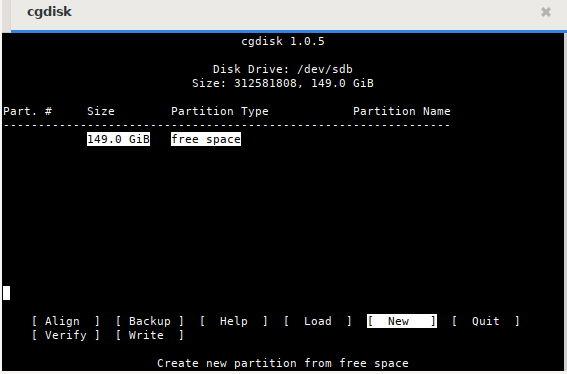
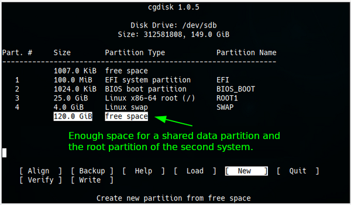
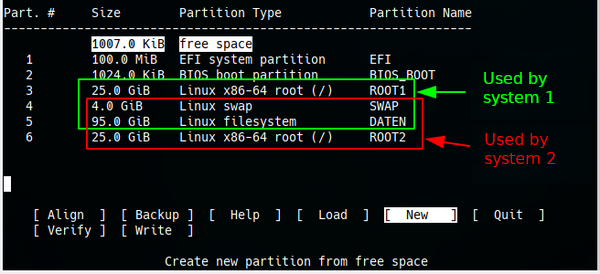
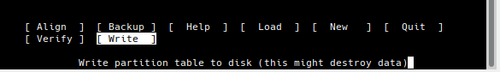
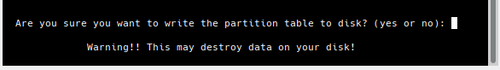

BEGINNING   INFO AREA FOR THE AUTHORS
This area is to be removed when the status RC3 is reached. The first line of the file must contain the title (% my-title) !!!  
**Status: RC2**

Necessary work:

+ check spelling  

Work done

+ check intern links  
+ check extern links  
+ check layout  

END   INFO AREA FOR THE AUTHORS  
% Partitioning with gdisk

## Partitioning with gdisk

**Why use gdisk (GPT fdisk)?**

*gdisk* is derived from **G**lobally Unique Identifier **P**artition **T**able (GPT) and is an application to partition disks of any size. *gdisk* is absolutely required for **disks larger than 2TB**.  
*gdisk* ensures that partitions are set up for SSDs (or for storage that does not have 512 byte sectors).

A key advantage of GPT is that you no longer have to rely on the MBR's inherent primary, extended, or logical partitions. GPT can support an almost unlimited number of partitions and is limited only by the amount of space reserved for partition entries on the GPT volume. It should be noted that the *gdisk* application defaults to 128 partitions.

If GPT is used on small USB/SSD disks (for example on a USB stick with 8GB), this could have a counterproductive effect if data is to be exchanged between different computers or operating systems.  
For this purpose, and if older hardware is used, we better use *fdisk*, which creates partition tables based on the MBR. See the manual page [Partitioning with Cfdisk](0314-part-cfdisk_en.md#partitioning-with-fdisk).

**Important notes**

+ The terms UEFI and EFI are interchangeable and refer to the same concept - **U**nified **E**xtensible **F**irmware **I**nterface.  
  See [Wikipedia UEFI](https://en.wikipedia.org/wiki/Unified_Extensible_Firmware_Interface).  
  The GTP is a part of the UEFI standard.

+ Use GPT disks

    + GPT disks can be used under Linux on computers with 32 bit and 64 bit.

    + Some operating systems do not support GPT disks.  
    This includes all MS operating systems before Windows Vista SP1.  
    Please consult the documentation of the respective system.

+ Booting from GPT media

    + Dual and triple boot from GPT media with Linux, BSD and Apple is supported with **EFI** mode with 64 bit.

    + Dual boot of GPT volumes with Linux and MS Windows is possible from Windows Vista SP1. Prerequisite for Windows is the 64 bit version.

+ Graphical partitioning programs for GPT  
Besides the command line program gdisk, graphical applications like *gparted* and *partitionmanager* support GPT disks. Nevertheless we recommend gdisk to prevent unwanted anomalies. *Gparted - gparted* as well as *KDE Partition Manager - partitionmanager* (and others) are nevertheless great tools especially to visualize partitioning.

**Basic reading:**

+ man gdisk

+ [GPT fdisk Tutorial by Roderick W. Smith](http://www.rodsbooks.com/gdisk/)

+ [Wikipedia UEFI operating system support](https://en.wikipedia.org/wiki/Unified_Extensible_Firmware_Interface#Operating_systems)

+ [Wikipedia GUID partition table](https://en.wikipedia.org/wiki/GUID_Partition_Table)

### Partitioning a hard disk

> **Back up data beforehand!**  
> When using any partitioning software, there is a risk of data loss. Data that should be preserved should always be backed up beforehand on another data medium.

In the following example we will format a 150GB hard disk so that two Linux systems can be installed as dual boot afterwards. So that the advantages of the UEFI come to bear, we need in the GPT an *EFI system* partition and for the second stage of the GRUB Bootloader a *BIOS boot* partition.  
We show the necessary steps with the partitioning program *cgdisk*, which supports GPT with UEFI.

*cgdisk* is the curses-based program variant of *gdisk*. It provides a user-friendly interface within the terminal.  
Navigation is done using the arrow keys.

+ For the partitions **`up`** and **`down`**.
+ For the action selection **`right`** and **`left`**.
+ With **`Enter`** the selection or input is confirmed.

### use cgdisk

The boot command in a root terminal is: **cgdisk /dev/sdX**.

*cgdisk* starts with a warning message if no GPT is found.

We need a total of six partitions for the two operating systems: Two ROOT, one shared DATA, and one SWAP partition for swap space. In addition, the *EFI system* partition already mentioned above (maximum 100MB) and the *BIOS-boot* partition (1MB).  
We recommend leaving the **/home** directory on the ROOT partition. The **/home** directory should be the place where the individual configurations are stored, and only these. A separate data partition should be created for all other private data. The advantages for data stability, data backup and also in case of data recovery are almost immeasurable.

The start image

#### Create partition

We select *New* and confirm with *Enter*. With a second *Enter* we accept the default first sector for the new partition. Then we enter the desired size of "100M" for the *EFI-System* partition and confirm.

Now we are expected to enter the type code for the partition.

After entering "L" a long list of codes and their usage appears. The integrated search function simplifies the selection. For us the following codes are necessary:  
ef00 for EFI system  
ef02 for BIOS-boot  
8200 for Swap  
8304 for Linux root  
8300 for Linux data

So we enter "ef00" and confirm. Afterwards we may optionally assign a name (label), which was done in the example, and confirm the entry again. With the partitions for BIOS-boot, Linux-root and Swap we proceed after the same pattern. The next picture shows the result of our efforts. As we can see there is still plenty of space for a second system and especially for a shared data partition.

After the two partitions are created, we can see the partitioning of the entire disk in the next image. 

The partitions that the two systems will use later in operation are color-coded.  
At the beginning and the end there are still small, free areas. They are created by aligning the partition to the block boundaries of the disk and can also appear between the partitions. With *Align* the value for the number of sectors can be changed. For SSD and M2 disk it is usually 2048 sectors and for old disks 512 sectors. *gdisk* reads the metadata of the hard disks and sets the value for the sectors afterwards. Therefore usually no change is necessary.

Additional, detailed information about the partitions can be seen if the command *info* is used.

With *Verify* the partitioning is checked and possible errors are shown.

Here everything is ok.  
If errors are reported, we mark the partition and use the command *Info*, and decide if the partition has to be deleted and recreated and if thereby e.g. the size has to be changed. If a repair is not possible with these means, the [Advanced commands from gdisk](0313-part-gdisk_en.md#advanced-commands-of-gdisk) are available to experienced users.

#### Delete partition

To delete a partition, we select it and use the command *Delete*.

If necessary we do the same with other partitions and then we can create the partitions again with changed values.

#### Write GPT

If the partitioning of the hard disk corresponds to our ideas we check again with the command *Verify* whether everything is in order. If no errors are displayed, we choose *Write* and

may answer the security query with "yes".

The warning should be taken seriously, because after pressing the *Enter* key all data that was previously on the disk disappears into nirvana.

Since *cgdisk* only creates partitions, but no file systems, each of the new partitions must be formatted. With *Quit* *cgdisk* is terminated.

### Formatting the partitions

We stay in the root terminal and display the paths with the numbers for each partition:

~~~
fdisk -l | grep /dev/sdb
~~~

The command generates the following output:

~~~
Disk /dev/sdb: 149.5 GiB, 160041885696 bytes, 312581808 sectors
/dev/sdb1 2048 206847 204800 100M EFI system
/dev/sdb2 206848 208895 2048 1M BIOS boot
/dev/sdb3 208896 52637695 52428800 25G Linux root (x86-64)
/dev/sdb4 52637696 61026303 8388608 4G Linux swap
/dev/sdb5 61026304 260255743 199229440 95G Linux filesystem
/dev/sdb6 260255744 312581808 52326064 25G Linux root (x86-64)
~~~

With this information, we format our previously created partitions.

Please be sure to read the **man mke2fs**, **man mkfs.fat** and **man mkswap**.

The EFI system partition will be given a FAT32 file system.

~~~
mkfs.vfat /dev/sdb1
~~~

**The BIOS_Boot partition must not be formatted!**  
If the boot manager *GRUB* finds the *EFI-System* and the *BIOS\_Boot* partition during the installation, it uses them, no matter which installation target we have specified.

We format the Linux partitions 'sdb3', 'sdb5' and 'sdb6' with *ext4*.

~~~
mkfs.ext4 /dev/sdb3
~~~

The swap partition is formatted with:

~~~
mkswap /dev/sdb4
~~~

to set it up. After that we make it with:

~~~
swapon /dev/sdb4
~~~

to the system and check if the swap space is available:

~~~
swapon -s
Filename Type Size Used Priority
/dev/sdb4 partition 4194304 0 -2
~~~

If swap was detected correctly:

~~~
swapoff /dev/sdb4
~~~

**Next, it is essential to reboot the system so that the new partitioning and file system scheme is read by the kernel.**

### Booting with GPT-UEFI or GPT-BIOS

If a bootable volume is to be created with GPT, there are two ways to create the boot sector of a GPT volume.

These possibilities are:

+ The computer (the mainboard) has a UEFI

+ UEFI is to be used to boot the GPT medium.

**or** 

+ The computer (mainboard) has **no** UEFI but a BIOS. (All mainboards before 2009 do not have UEFI).

+ The BIOS should be used to boot the GPT medium.

#### Booting with UEFI

If UEFI is to be used for booting, a FAT formatted **EFI System** partition (type "EF00" ) must be created as the first partition, and an unformatted **BIOS boot** partition (type "EF02" ) must be created as the second. The first partition contains the boot loader(s).  
During the installation of siduction, any choices made by install-gui as to where to install the boot loader are ignored if the aforementioned partitions exist. The siduction boot loader is stored in the *EFI system* partition at "/efi/siduction". The EFI system partition is also mounted as "/boot/efi" as long as the mount other partitions option is selected. The mount of the *EFI system* partition does not have to be specified in the installer.

#### Booting with BIOS

If the system does not have UEFI, the first thing to do is to create a **BIOS boot** partition. This replaces the sector of an MBR-partitioned disk that is between the partitioning table and the first partition, and Grub is written directly to it.  
The partition should have the size of 200MB. (The reason for this size instead of the conventional 32MB is to have a sufficiently large partition available in case of a switch to UEFI).

### Advanced commands of gdisk

*gdisk* has advanced options and security mechanisms not available in *cgdisk*.

If problems are detected (e.g. overlapping partitions or non-matching main and backup partition tables), it is possible to fix them with various options in the **recovery & transformation** menu. We start *gdisk* with

~~~
gdisk /dev/sdb
~~~

At the command prompt **Command (? for help):** we enter the command **r** to get into the submenu of *recovery & transformation* and then the **?**.

~~~
recovery/transformation command (? for help): ?
b use backup GPT header (rebuilding main)
c load backup partition table from disk (rebuilding main)
d use main GPT header (rebuilding backup)
e load main partition table from disk (rebuilding backup)
f load MBR and build fresh GPT from it
g convert GPT into MBR and exit
h make hybrid MBR
i show detailed information on a partition
l load partition data from a backup file
m return to main menu
o print protective MBR data
p print the partition table
q quit without saving changes
t transform BSD disklabel partition
v verify disk
w write table to disk and exit
x extra functionality (experts only)
? print this menu
~~~

A third menu, *experts* , is reached with **x** from either the *main menu* or the *recovery & transformation menu*.

~~~
recovery/transformation command (? for help): x

Expert command (? for help): ?
a set attributes
c change partition GUID
d display the sector alignment value
e relocate backup data structures to the end of the disk
g change disk GUID
i show detailed information on a partition
l set the sector alignment value
m return to main menu
n create a new protective MBR
o print protective MBR data
p print the partition table
q quit without saving changes
r recovery and transformation options (experts only)
s resize partition table
v verify disk
w write table to disk and exit
z zap (destroy) GPT data structures and exit
? print this menu
~~~

This menu allows low-level editing such as changing the partition GUID or the disk GUIDs (**c** or **g** ). The **z** option instantly destroys the GPT data structures. This can be useful if the GPT volume is to be used with a different partitioning scheme. If these structures are not erased, some partitioning programs may have problems because of the presence of two partitioning schemes.

Despite all this: the options of the menus *recovery & transformation* and *experts* should only be used if you are very familiar with GPT. As a "non-expert" you should only use these menus if a disk is damaged. Before any drastic action the option **b** in the main menu should be used to create a backup copy in a file and save it on a separate medium. This will allow the original configuration to be restored if the action does not go as desired.

Last edited: 2021-22-08

