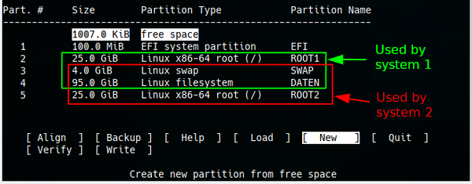

% Partitioning with gdisk

## Partitioning with gdisk

**Why use gdisk (GPT fdisk)?**

**gdisk** is derived from **G**lobally Unique Identifier **P**artition **T**able (GPT) and is an application for partitioning disks of any size. gdisk is absolutely required for **disks larger than 2TB**.  
It ensures that partitions are set up for SSDs (or for storage that does not have 512 Byte sectors).

A key advantage of GPT is that you no longer have to rely on the MBR's inherent primary, extended, or logical partitions. GPT can support an almost unlimited number of partitions and is limited only by the amount of space reserved for partition entries on the GPT volume. It should be noted that the gdisk application defaults to 128 partitions.

If GPT is used on small USB/SSD drives (for example on a USB drive with 8GB), this could have a counterproductive effect in case data is to be exchanged between different computers or operating systems.  
For this purpose, and if older hardware is used, you should use *fdisk*, which creates partition tables based on the MBR. See the manual page [Partitioning with Cfdisk](0314-part-cfdisk_en.md#partitioning-with-fdisk).

**Important notes**

+ The terms UEFI and EFI are interchangeable and refer to the same concept - **U**nified **E**xtensible **F**irmware **I**nterface.  
  See [Wikipedia UEFI](https://en.wikipedia.org/wiki/Unified_Extensible_Firmware_Interface).  
  GPT is a part of the UEFI standard.

+ Using GPT disks

    + GPT disks can be used on Linux systems with 32 bit and 64 bit.

    + Some operating systems do not support GPT disks.  
    This includes all MS operating systems before Windows Vista SP1.  
    Please consult the documentation of the respective system.

+ Booting from GPT media

    + Dual and triple boot from GPT media with Linux, BSD, and Apple is supported with 64-bit **EFI** mode.

    + Dual boot of GPT volumes with Linux and MS Windows is possible since Windows Vista SP1. Prerequisite for Windows is the 64-bit version.

+ Graphical partition editors for GPT  
Besides the command line program `gdisk`, graphical applications like `gparted` and KDE's `partitionmanager` support GPT disks. Nevertheless, we recommend gdisk to prevent unwanted anomalies. `gparted` as well as `partitionmanager` (and others) are, however, great tools, especially to visualize partitioning.

**Essential reading matter:**

+ man gdisk
+ [GPT fdisk Tutorial by Roderick W. Smith](http://www.rodsbooks.com/gdisk/)
+ [Wikipedia UEFI operating system support](https://en.wikipedia.org/wiki/Unified_Extensible_Firmware_Interface#Operating_systems)
+ [Wikipedia GUID partition table](https://en.wikipedia.org/wiki/GUID_Partition_Table)

### Partitioning a hard disk

> **Back up data beforehand!**  
> When using any partitioning software, there is a risk of data loss. Data you want to preserve should always be backed up beforehand on another data medium.

In the following example, we will format a 150 GB hard disk so that two Linux systems can be installed as dual boot afterwards. In order to benefit from UEFI's advantages, we need an *EFI system* partition in the GPT.  
We show the necessary steps with the partitioning program `cgdisk`, which supports GPT with UEFI.

### Use cgdisk

cgdisk can only be used with non-mounted disks. For example, you can use a siduction live medium to edit the only available hard disk, or you can use cgdisk from the running system to partition an additional hard disk or USB stick.

The boot command in a root terminal is: **`cgdisk /dev/sdX`**.  
`cgdisk` is the curses-based program variant of `gdisk`. It provides a user-friendly interface within the terminal.  
Navigation is done using the arrow keys:

+ **`up`** and **`down`** for the partitions
+ **`right`** and **`left`** to select an action
+ **`Enter`** to confirm the selection or input

`cgdisk` starts with a warning message if no GPT is found.

We need a total of five partitions for the two operating systems: two ROOT partitions, one shared DATA partition, and one SWAP partition for swap space. In addition, the *EFI system* partition already mentioned above (maximum 100MB) are required.  
We recommend leaving the `/home` directory on the ROOT partition. The `/home` directory should be the place where the individual configurations are stored, and only these. A separate data partition should be created for all other private data. The advantages for data stability, data backup, and also in case of data recovery are almost immeasurable.

The start screen:

**Create partition**

We select *"New"* and confirm with **`Enter`**. Hitting **`Enter`** a second time, we accept the default first sector for the new partition. Then we enter the desired size of `100M` for the *EFI-System* partition and confirm.

Now we are expected to enter the type code for the partition.

After entering **`L`**, a long list of codes and their usage appears. The integrated search function simplifies the selection. For us, the following codes are necessary:  
*"ef00"* for EFI system  
*"8200"* for Swap  
*"8304"* for Linux root  
*"8300"* for Linux data

So we enter `ef00` and confirm. Afterwards, we may optionally assign a name (label), which has been done in the example, and confirm the entry again. We proceed after the same pattern for the partitions Linux-root, and Swap. The next picture shows the result of our efforts. As we can see, there is still plenty of space for a second system and especially for a shared data partition.

After the two partitions have been created, we can see the partitioning of the entire disk in the next image. 

The partitions that the two systems will use later during operation are color-coded.  
At the beginning and the end, there are still small, free areas. They are created by aligning the partition to the block boundaries of the disk and can also appear between the partitions. With *"Align"* the value for the number of sectors can be changed. It is usually 2048 sectors for SSD and M2 disks and 512 sectors for old disks. `gdisk` reads the metadata of the hard disks and sets the value for the sectors afterwards. Therefore usually no change is necessary.

Additional, detailed information about the partitions can be seen by entering the command *"Info"*.

With *"Verify"* the partitioning is checked and possible errors are shown.

Here, everything is ok.  
If errors are reported, we mark the partition and use the command *"Info"*. Then we decide if the partition has to be deleted and recreated and if e.g. the size has to be changed as well. If a repair is not possible by these means, the [Advanced commands of gdisk](0313-part-gdisk_en.md#advanced-commands-of-gdisk) are available for experienced users.

**Delete partition**

To delete a partition, we select it and use the command *"Delete"*.

If necessary, we do the same with other partitions and then we can create the partitions again with changed values.

**Write GPT**

If the partitioning of the hard disk corresponds to our ideas, we check once more whether everyting is in order with the command *"Verify"*. If no errors are displayed, we choose *Write* and

may answer the security query with "yes".

The warning should be taken seriously because after pressing the **`Enter`** key, all data that was previously on the disk disappears into nirvana.

Since `cgdisk` only creates partitions but no file systems, each of the new partitions must be formatted. With The *"Quit"* command terminates `cgdisk`.

### Formatting the partitions

We stay in the **root** terminal and display the paths with the numbers for each partition:

~~~
fdisk -l | grep /dev/sdb
~~~

The command generates the following output:

~~~
Disk /dev/sdb: 149.5 GiB, 160041885696 bytes, 312581808 sectors
/dev/sdb1      2048    206847    204800 100M EFI System
/dev/sdb2    206848  52635647  52428800  25G Linux root
/dev/sdb3  52635648  61024255   8388608   4G Linux swap
/dev/sdb4  61024256 260270079 199245824  95G Linux filesyst
/dev/sdb5 260270080 312581807  52311728  25G Linux root
~~~

With this information, we format our previously created partitions.

Please read **`man mke2fs`**, **`man mkfs.fat`**, and **`man mkswap`**.

The EFI system partition will be given a **FAT32** file system.

~~~
mkfs.vfat /dev/sdb1
~~~

The EFI partition must be the first partition of the hard disk and must be mounted under `/boot/efi/` to comply with the siduction standard.  
If the boot manager GRUB finds such a prepared *EFI-System* partition during the installation, it will use it.

We format the Linux partitions sdb2, sdb4, and sdb5 with **ext4**.

~~~
mkfs.ext4 /dev/sdb2
~~~

To set up the swap partition, format it with

~~~
mkswap /dev/sdb3
~~~

Now the system needs to know about this partition:

~~~
swapon /dev/sdb3
~~~

Check if the swap space is available:

~~~
swapon -s
Filename   Type       Size     Used  Priority
/dev/sdb3  partition  4194304  0     -2
~~~

If swap was detected correctly:

~~~
swapoff /dev/sdb3
~~~

We then inform the kernel about the changes with the command **`systemctl daemon-reload`**.

### Booting with GPT-UEFI or GPT-BIOS

If a bootable volume is to be created with GPT, there are two ways to create the boot sector of a GPT volume.

These possibilities are:

+ The computer (the mainboard) has a UEFI and UEFI shall be used to boot the GPT medium.

or

+ The computer (mainboard) has **no** UEFI but a BIOS. The BIOS should boot the GPT medium. (All mainboards before 2009 do not have UEFI.)

**Booting with UEFI**

If UEFI is to be used for booting, an *"EFI System"* partition (type "ef00" ) formatted with FAT32 must be created as the first partition and mounted under`/boot/efi`. This partition contains the boot loader(s).  
The boot loader of siduction is stored in the directory `/boot/efi/EFI/siduction/`.

**Booting with BIOS**

If the system does not have a UEFI, the first partition must be a *"BIOS boot"* partition (type "ef02" ). Grub is written directly to this partition. It replaces the sector of an MBR-partitioned disk that is located between the partitioning table and the first partition.  
The partition should have the size of 200MB. The reason for this size instead of the conventional 32MB is to have a sufficiently large partition available in case of a switch to UEFI.

### Advanced commands of gdisk

`gdisk` has advanced options and security mechanisms not available in `cgdisk`.

If problems are detected (e.g. overlapping partitions or non-matching main and backup partition tables), it is possible to fix them with various options in the **recovery & transformation** menu. We start `gdisk` with

~~~
gdisk /dev/sdb
~~~

At the command prompt **Command (? for help):**, we enter the command **r** to get into the submenu of *"recovery & transformation"* and then **?**.

~~~
recovery/transformation command (? for help): ?
b use backup GPT header (rebuilding main)
c load backup partition table from disk (rebuilding main)
d use main GPT header (rebuilding backup)
e load main partition table from disk (rebuilding backup)
f load MBR and build fresh GPT from it
g convert GPT into MBR and exit
h make hybrid MBR
i show detailed information on a partition
l load partition data from a backup file
m return to main menu
o print protective MBR data
p print the partition table
q quit without saving changes
t transform BSD disklabel partition
v verify disk
w write table to disk and exit
x extra functionality (experts only)
? print this menu
~~~

A third menu, *"experts"* , is reached with **`x`** from either the *"main menu"* or the *"recovery & transformation menu"*.

~~~
recovery/transformation command (? for help): x

Expert command (? for help): ?
a set attributes
c change partition GUID
d display the sector alignment value
e relocate backup data structures to the end of the disk
g change disk GUID
i show detailed information on a partition
l set the sector alignment value
m return to main menu
n create a new protective MBR
o print protective MBR data
p print the partition table
q quit without saving changes
r recovery and transformation options (experts only)
s resize partition table
v verify disk
w write table to disk and exit
z zap (destroy) GPT data structures and exit
? print this menu
~~~

This menu allows low-level editing such as changing the partition GUID or the disk GUIDs (**`c`** or **`g`** ). The **`z`** option instantly destroys the GPT data structures. This can be useful if the GPT volume is to be used with a different partitioning scheme. If these structures are not erased, some partition editors may have problems because of the presence of two partitioning schemes.

Despite all this: the options of the menus *"recovery & transformation"* and *"experts"* should only be used if you are very familiar with GPT. As a "non-expert", you should only use these menus if a disk is damaged. Before any drastic action, the option **`b`** in the main menu should be used to create a backup copy in a file and save it on a separate medium. This will allow the original configuration to be restored if the action does not go as desired.

Last edited: 2023-11-08

