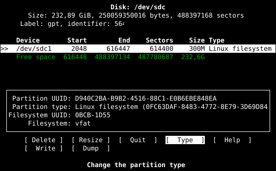
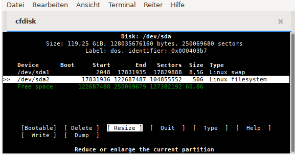
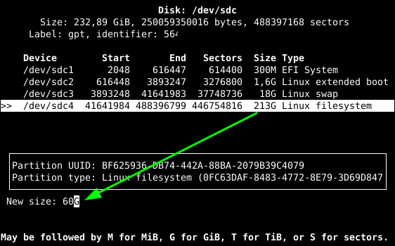
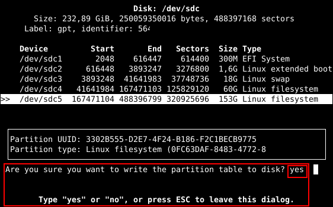

% Partitioning with cfdisk

## Partitioning with fdisk

> **ATTENTION!**  
> Creating partition tables, partitions, and editing partitions will destroy all data on the affected device.

The introduction of GPT partition tables based on UEFI began in 2000. The newer **G**lobally Unique Identifier **P**artition **T**able (GPT) standard, which is part of the UEFI standard, has replaced MBR on current hardware and allows disks/partitions larger than 2 TBytes and a theoretically unlimited number of primary partitions. More information about this can be found in [Wikipedia GUID partition table](https://en.wikipedia.org/wiki/GUID_Partition_Table).

**fdisk** and **cfdisk**, which has a more user-friendly ncurses interface, allow you to edit DOS partition tables based on BIOS and GPT partition tables based on UEFI.

If you want to not only edit an existing partition table, but also create a new one or switch from DOS to GPT, the command line program `parted` is the right choice. A short command creates a new GPT partition table on `/dev/sda`.

~~~
parted /dev/sda mktable gpt
~~~

The action must be confirmed again, as all data currently stored on the device will be lost.

### Information about storage devices

Information about the devices can be easily obtained from an pop-up window by hovering the mouse over the icon of a device on the desktop. This works both from the live ISO and with siduction installed.  
We can obtain more detailed information in a root terminal using `lsblk`, `blkid`, and `fdisk`. In addition to the excerpt shown below, the  
**`fdisk -l | tee /root/fdisk-l_$(date +%F_%H-%M-%S)`**  
command also creates a timestamped file in the root user's directory. This can be very helpful if problems arise.

~~~
[...]
Disk /dev/sda: 149.5 GiB, 160041885696 bytes, 312581808 sectors
Disk model: FUJITSU MHY2160B
Units: sectors of 1 * 512 = 512 bytes
Sector size (logical/physical): 512 bytes / 512 bytes
I/O size (minimum/optimal): 512 bytes / 512 bytes
Disklabel type: dos
Disk identifier: 0xXXXXXXXX

Device   Boot   Start       End   Sectors Size Id Type
/dev/sda1        2048  83888127  83886080  40G 83 Linux
/dev/sda2    83888128  88291327   4403200 2,1G 82 Linux swap
/dev/sda4    88291328 312581807 224290480 107G  5 Extended
/dev/sda5    88293376 249774079 161480704  77G 8e Linux LVM
/dev/sda6   249776128 312581807  62803632  30G 8e Linux LVM

Disk /dev/nvme0n1: 465,76 GiB, 500107862016 bytes, 976773168 sectors
Disk model: CT500P3SSD8
Units: sectors of 1 * 512 = 512 bytes
Sector size (logical/physical): 512 bytes / 512 bytes
I/O size (minimum/optimal): 512 bytes / 512 bytes
Disklabel type: gpt
Disk identifier: XXXXXXXX-XXXX-XXXX-XXXX-XXXXXXXXXXXX

Device        Start       End   Sectors  Size Type
/dev/sdb1      2048    206847    204800  100M EFI System
/dev/sdb2    206848 922953727 922746880  440G Linux filesyst
/dev/sdb3 922953728 976766975  53813248 25,7G Linux swap
~~~

**DOS partition table**

DOS partition tables are considered obsolete on current laptop and PC hardware and should no longer be used there. They are more commonly found on smaller storage devices such as USB sticks or memory cards.  
The partitions in a DOS partition table can be of the type *primary*, *extended*, and *logical*. They are defined by a number between 1 and 15.  
A maximum of four primary partitions can be created. One of these partitions can be an extended partition. Within the extended partition, up to eleven logical partitions are possible. This limits the number of partitions to 14.  
Primary or extended partitions are assigned a label between 1 and 4 (for example, sda1 to sda4). Logical partitions are always grouped together and are part of an extended partition. Their labels start with number 5 and end with number 15.

**Example**

~~~
4 partitions, all primary:

|sda1|sda2|sda3|sda4|

6 mountable partitions
  2 primary, 1 extended within 4 logical:

|sda1|sda2-
           |
         |sda4|  (extended partition)
           |
           |sda5|sda6|sda7|sda8|
~~~

*/dev/sda5* can only be a logical partition (in this case the first logical one on this device).

**GPT partition table**

Unlike the DOS partition table, the GPT partition table allows disks/partitions larger than 2 TB and a theoretically unlimited number of primary partitions. There are no extended partitions and no logical partitions.  
The example in the following chapter, *Use cfdisk*, is based on a hard disk with a GPT partition table.

### Use cfdisk

> **Backup data beforehand!**  
> There is a risk of data loss when using any partition editor. Always back up data you want to keep on another disk first.

Please only use the cfdisk program on a hard disk where none of the partitions are mounted.  
We start cfdisk in a root console (after **`su`**, you will be prompted to enter the root password).

~~~
user1@pc1:/$ su
password:
root@pc1:/#
cfdisk /dev/sdc
~~~

**The user interface**

On the first screen, cfdisk shows the current partition table. At the bottom of the window, there are some command buttons. To switch between partitions, use the arrow keys **`up`** and **`down`**. To select commands, use the arrow keys **`right`** and **`left`**. The **`Enter`** key is used to execute the command.

The hard disk */dev/sdc* contains only an empty GPT partition table.

**Creating a new partition**

In the first step, we create a 300 MB Efi System Partition (ESP). The already selected command **`New`** is confirmed with the **`Enter`** key.

 

In order for the UEFI to recognize the ESP, its partition type must be set to *EFI System*. We continue with the command **`Type`**.

The arrow keys take us to *EFI System*. The GUID of the partition type is displayed at the bottom. The **`Enter`** key completes the selection.

In the next steps, we create three more partitions using the same procedure.

1,6G Typ: Linux extended boot  
18G Typ: Linux swap  
213G Typ: Linux filesystem

The result:

For our siduction, we now have a 213 GB partition. This is useful if we want to use LVM or the Btrfs file system. Another option would be a 60 GB system partition and another 153 GB partition for independent data. Both will later receive the ext4 file system.

**Resize a partition**

Highlight the partition */dev/sdc4*, select the command **`Resize`**, and confirm.

We change the size to 60G. Again, the **`Enter`** key completes the process.

Then we create a partition of type *Linux filesystem* with the entire remainder (153 GB).  
The partitioning is now complete.

**Write partition table**

Once everything has been partitioned, the result can be saved with the **`Write`** command. The partition table is now written to the disk.

Since this will delete all existing data on the hard drive, you should be absolutely sure before typing **`yes`** and confirming again with **`Enter`**.

**Quit cfdisk**

By entering the command *"Quit"*, we can quit the program. After leaving cfdisk and before the installation, you should reboot in any case to read in the partition table again.

### Formatting partitions

There are several file systems for Linux that can be used. There are **Ext2**, **Ext4**, **Btrfs**, **XFS**, **JFS**, and **ZFS**.  
Ext2 may be of interest when accessing from Windows, as there are Windows drivers for this file system. [Ext2 file system for MS Windows (drivers and documentation)](http://www.fs-driver.org/).

For normal use, we recommend the ext4 file system. It is siduction's default file system. 

After exiting cfdisk, the root console continues to be used. Formatting requires root privileges.  
The command is **`mkfs.ext4 /dev/sdXX`**. For “XX”, enter the name of the selected partition.

~~~
mkfs.ext4 /dev/sdc4
[...]
mkfs.ext4 /dev/sdc5
~~~

Once formatting is complete, a message will appear indicating that the operation was successful. If this is not the case, something went wrong during partitioning or the partition is not a Linux partition. We can check this with:

~~~
fdisk -l /dev/sdc
~~~

If necessary, partitioning must be repeated.

If the formatting was successful, this procedure can be repeated for the other partitions, adapting the command according to the partition and the desired file system (e.g.: `mkfs.ext2` or `mkfs.fat` or `mkfs.btrfs`, etc.).  
Please read the man page **man mkfs**.

Following our example, the partitions /dev/sdc1 and /dev/sdc2 are assigned a FAT file system of type 32.

~~~
mkfs.fat -F 32 /dev/sdc1
[...]
mkfs.fat -F 32 /dev/sdc2
~~~

Finally, format the swap partition, in this case sdc3:

~~~
mkswap /dev/sdc3
~~~

Next, the swap partition is activated:

~~~
swapon /dev/sdc3
~~~

After that, you can check in the console if the swap partition is recognized:

~~~
swapon -s
~~~

With the swap partition mounted, the output of the previous command should look something like this:

~~~
Filename        Type        Size       Used   Priority
/dev/sdc3       partition   37748736   0      -2
~~~

We then inform the kernel about the changes with the command **`systemctl daemon-reload`**.

Now the installation can begin.

Last edited: 2026/02/21

