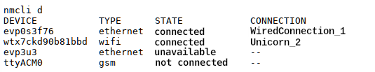
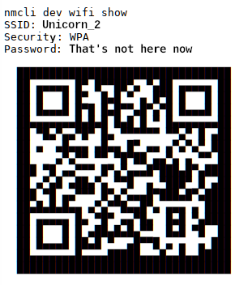

% Network Manager

## Network Manager Command Line Tool

**General hints**

The network manager is now integrated in all graphical user interfaces of siduction and is mostly self-explanatory. It replaces the network commands `ifup`, `ifdown`, and `ifconfig` used in the terminal. The prejudice that the network manager is not suitable for the command line or even runs unstable belongs to the realm of fairy tales. If no graphical user interface is available, or the command line is preferred, **nmcli** is a powerful command line alternative for the daily use of the network manager.

In the following examples we assume two configured connections: a Wi-Fi connection (name: *"Unicorn\_2"*, interface *"wtx7ckd90b81bbd"*, (formerly: wlan)) and a wired connection (name: *"WiredConnection\_1"*, interface *"evp0s3f76"* (former: eth0)). Please adapt the connection names to your circumstances.

**Installation of the Network Manager**

If the network manager is not available on your system, you can install it. The following command will install all packages you need to configure every possible connection type (mobile broadband, Wi-Fi, and LAN connections), as well as the graphical KDE plasma widget for the NM. Please enter everything in one line and remember that you need **root** privileges.

~~~
# apt install network-manager modemmanager mobile-broadband-provider-info network-manager-pptp
 plasma-nm network-manager-vpnc network-manager-openvpn
~~~

### Use Network Manager

The entries can be made both in a virtual terminal (key combination **`Ctr`**+**`Shift`**+**`F2`**) and in the console of a graphical user interface. In the examples shown, the information has been changed for privacy reasons.

**Show configured connections**

The command **`nmcli c`** can be used to display the configured connections that have been created on the system.

In the above example, there are four connections: WLAN, 2x LAN, and a mobile broadband connection.

**Show information about Wi-Fi networks**.

To display all available Wi-Fi networks in a compact form, use the command **`nmcli dev wifi list`**.

**Display configured devices**

If you want to know which devices (interfaces) are known to the network manager, enter **`nmcli d`**.

Very detailed information (properties) about the own available connections can be displayed through **`nmcli dev show`**. Here only the excerpt for the Wi-Fi:

The Wi-Fi access data can be displayed with **`nmcli dev wifi show`**.

The additionally generated QR code simplifies the login for smartphones and tablets.

**Switch connections**

To change a connection type, e.g. from LAN to Wi-Fi connection, you have to disconnect the existing active connection and activate the new one. Here, you definitely have to specify the interface because a **`nmcli con down id <name>`** will work, but the connection, if it is a system connection, will be re-established immediately.

To prevent the automatic connection, the command **`nmcli dev disconnect <interface_name>`** is useful.  
First we terminate the LAN connection and then query the status:

~~~
# nmcli dev disconnect evp0s3f76
Device "evp0s3f76" has been disconnected successfully.
# nmcli dev status
DEVICE TYPE STATE CONNECTION 
evp0s3f76 ethernet not connected --
wtx7ckd90b81bbd wifi not connected --
evp3u3 ethernet not available --
ttyACM0 gsm not connected --
~~~

Now enable the Wi-Fi connection with **`nmcli con up id <connection_name>`**:

~~~
# nmcli con up id Unicorn_2
Connection was successfully activated 
# nmcli dev status
DEVICE TYPE STATE CONNECTION 
wtx7ckd90b81bbd wifi connected Unicorn_2
evp0s3f76 ethernet not connected --
evp3u3 ethernet not available --
ttyACM0 gsm not connected --
~~~

You can also put everything in one line, then the change will take effect immediately.

From LAN to Wi-Fi:

~~~
nmcli dev disconnect evp0s3f76 && sleep 2 && nmcli con up id Unicorn_2
~~~

Reversed from Wi-Fi to LAN:

~~~
nmcli dev disconnect wtx7ckd90b81bbd && sleep 2 && nmcli con up id 'WiredConnection_1'.
~~~

### Further information

+       
  ~~~
  man nmcli
  ~~~

+ [Ubuntu community NetworkManager](https://help.ubuntu.com/community/NetworkManager)

Last edited: 2022/04/03

