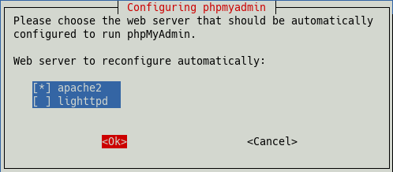

% LAMP test server for developers (local)

## LAMP web server

**A local test server for developers**

The acronym **LAMP** refers to a set of free software used to run dynamic web sites:

+ **L**inux: operating system
+ **A**pache: web server
+ **M**ariaDb: database server (as of Debian 9 'Stretch', previously mySQL)
+ **P**HP, Perl, and/or Python: scripting languages

Use cases as a server:

1. **a local test server for webdesigners without Internet connection (see this chapter)**
2. a private (data) server with Internet connection
3. a private web server with full Internet connection
4. a commercial web server

Our goal is to set up a LAMP test server for developers that is directly connected to the workstation PC via LAN. Furthermore, for security reasons, the server should not be connected to a local network or even to the Internet.
The only exception is that the server will be temporarily connected to the Internet via a second network interface exclusively for system and software updates.

> Please note:  
> The desktop PC used for daily work should not be used as a server. Instead, a separate PC should be used, which does not perform any other tasks.

At least 500MB RAM should be available in the server PC. Less RAM will cause problems because a server with MariaDb/MySQL needs a lot of RAM to run appropiately.

The packages to install are:

~~~
apache2
mariadb-server
mariadb-client
php
php7.4-mysql
phpmyadmin
~~~

As usual with siduction, we run the installations in the "multi-user.target" (init 3) in the terminal.

**Preparations**

If the command line browser *w3m* has not been installed yet, we will do it now:

~~~
# apt update
# apt install w3m
~~~

This allows us to test *Apache* and *PHP* immediately in the terminal and return to the graphical user interface only after all necessary installations have been completed.

Now we need to clean up apt.  
The command **`apt autoremove`** should result in the following output. If not, we confirm the removal of unneeded packages with `j`.

~~~
#apt autremove
Package lists are read... Done
Dependency tree is built.
Status information is read.... Done
0 updated, 0 reinstalled, 0 to remove, and 0 not updated.
~~~

In case of a corrupted installation, this will simplify the repair.  
See below [Troubleshooting](0520-lamp-start_en.md#troubleshooting).

It is useful to note down some data already before the installation.

Necessary during the installation:

+ a **password** for the database user **root** in *phpMyAdmin*

Later, necessary for the configuration:

+ **Apache**  
    + *Server Name*
    + *Server alias*
    + the server's *IP address*
    + the PC's *Name*
    + the PC's *IP address*

+ **MariaDB:**  
    + the *name of the database* to be used for the development project
    + the *name* (login name) of a new databank user for the development project
    + the *password* for the new databank user
    + the *name* (login name) of a new database administrator
    + the *password* for the database administrator

### Install Apache

In order to install the Apache web server, you only need the following two commands. The install command gets the additional packages *apache2-data* and *apache2-utils*. Then we query the status of Apache and test the start and stop instructions right away.

~~~
# apt update
# apt install apache2
[...]
The following NEW packages will be installed:
  apache2 apache2-data apache2-utils
[...]
Do you want to continue? [Y/n] y
[...]

# systemctl status apache2.service
apache2.service - The Apache HTTP Server
     Loaded: loaded (/lib/system/system/apache2.service;
             enabled; vendor preset: enabled)
     Active: active (running) since Sun 2020-12-06 [...]
[...]
~~~

As you can see, Apache has been activated immediately.

~~~
# systemctl stop apache2.service
# systemctl status apache2.service
apache2.service - The Apache HTTP Server
     Loaded: loaded (/lib/system/system/apache2.service;
             enabled; vendor preset: enabled)
     Active: inactive (dead) since Sun 2020-12-06 [...]
[...]

# systemctl start apache2.service
# systemctl status apache2.service
apache2.service - The Apache HTTP Server
     Loaded: loaded (/lib/system/system/apache2.service;
             enabled; vendor preset: enabled)
     Active: active (running) since Sun 2020-12-06 [...]
[...]
~~~

The Apache web server is loaded and can be handled without any problems. Now we check its function with:

~~~
w3m http://localhost/index.html
~~~

The Apache welcome page with **It works!** appears.  
We exit w3m with **`q`** and confirm with **`y`**.

The directory **/etc/apache2/** is called **ServerRoot**. It contains the configuration.  
The directory **/var/www/html/** is called **DocumentRoot**. It contains the website's files.

For more information and security hints, please refer to the manual page  
[LAMP-Apache](0521-lamp-apache_en.md#set-up-apache).

### Install MariaDb

The installation of MariaDb is similarly simple. Just install the metapackages *mariadb-server* and *mariadb-client*.

~~~
# apt install mariadb-server mariadb-client
[...]
The following NEW packages will be installed:
galera-4 libcgi-fast-perl libcgi-pm-perl libdbd-mariadb-perl
libfcgi-perl libhtml-template-perl libmariadb3
mariadb-client mariadb-client-10.5 mariadb-client-core-10.5
mariadb-common mariadb-server mariadb-server-10.5
mariadb-server-core-10.5 mysql-common socat
[...]
Do you want to continue? [Y/n] y
~~~

For more information on MariaDb and configuration, see our manual in [LAMP-MariaDB](0522-lamp-sql_en.md#set-up-mariadb)

### Install PHP

To install the PHP scripting language, simply enter the command:

~~~
# apt install php
[...]
The following NEW packages will be installed:
apache2-bin libapache2-mod-php7.4 libaprutil1-dbd-sqlite3
libaprutil1-ldap php php-common php7.4 php7.4-cli
php7.4-common php7.4-json php7.4-opcache php7.4-readline
[...]
Would you like to continue? [Y/n] y
~~~

As before, the metapackage additionally brings in a whole bunch of dependencies.  
To check if php is running correctly after installation, create the file `info.php` in `/var/www/html` using the phpinfo() function this way:

~~~
mcedit /var/www/html/info.php  
~~~

Insert the following text:

~~~
<?php
phpinfo();
?>
~~~

Save with **`F2`** and terminate mcedit with **`F10`**.

After that the terminal browser w3m will be linked to it:

~~~
w3m http://localhost/info.php  
or  
w3m http://yourip:80/info.php  
~~~

~~~
PHP logo

PHP version 7.4.11

System       Linux <hostname> 5.9.13-towo.1-siduction-amd64
Build Date   Oct 6 2020 10:34:39
server API   Apache 2.0 Handler
...
~~~

If we get an output that starts as shown above and contains all php configurations and basic settings, PHP is working and uses the *Apache 2.0 Handler* as *server API*.  

We exit w3m with **`q`** and confirm with **`y`**.

Now we need the module *php7.4-mysql*, so MariaDB/mysql will be supported in PHP.

~~~
# apt install php7.4-mysql
~~~

If we now go back to the "http://localhost/info.php" page, we will find the entries for *mysqli* and *mysqlnd* in the modules section (they are sorted alphabetically).

For more information on configuring PHP and managing its modules, see the manual page [LAMP-PHP](0523-lamp-php_en.md#set-up-php)

### Install phpMyAdmin

To administer the MariaDb database, we need *phpmyadmin*:

~~~
# apt install phpmyadmin
[...]
The following NEW packages will be installed:
dbconfig-common dbconfig-mysql icc-profiles-free
libjs-openlayers libjs-sphinxdoc libjs-underscore
libonig5 libzip4 php-bacon-qr-code php-bz2
php-dasprid-enum php-gd php-google-recaptcha
php-mbstring php-mysql php-phpmyadmin-motranslator
php-phpmyadmin-shapefile php-phpmyadmin-sql-parser
php-phpseclib php-psr-cache php-psr-container
php-psr-log php-symfony-cache php-symfony-cache-contracts
php-symfony-expression-language php-symfony-var-exporter
php-symfony-service-contracts php-tcpdf php-twig
php-twig-extensions php-xml php-zip php7.4-bz2 php7.4-gd
php7.4-mbstring php7.4-xml php7.4-zip phpmyadmin
0 updated, 38 reinstalled, 0 to remove and 60 not updated.
There are still 15.7 MB of archives to be downloaded out
of 15.8 MB. After this operation, 70.9 MB of additional
disk space will be used.
Do you want to continue? [Y/n] y
~~~

During the installation, two dialogs will appear.  
In the first one, at the beginning, we select *"apache2"* and confirm with *"ok"*.

In the second one, at the end of the installation, we select *"yes"*.

In the following dialogs we need the password for the database user **phpmyadmin** (see the chapter *Preparations*).

### Other software

If you are interested in developing websites, you can install a CMS for example, *WordPress*, *Drupal*, or *Joomla*, but you should consider our manual pages [LAMP-Apache](0521-lamp-apache_en.md#set-up-apache) and [LAMP-MariaDb](./0522-lamp-sql_en.md#mariadb-setup) for the configuration of the server and MariaDb beforehand.

### Status data log files

**Apache**

The configuration status of the Apache web server can be output with **`apache2ctl -S`**.  
The output shows the status without any changes to the configuration immediately after installation.

~~~
# apache2ctl -S
AH00558: apache2: Could not reliably determine the server's
fully qualified domain name, using 127.0.1.1. Set the 'ServerName' directive
directive globally to suppress this message
VirtualHost configuration:
[::1]:80     127.0.0.1 (/etc/apache2/sites-enabled/000-default.conf:1)
127.0.0.1:80 127.0.0.1 (/etc/apache2/sites-enabled/000-default.conf:1)
ServerRoot: "/etc/apache2"
Main DocumentRoot: "/var/www/html"
Main ErrorLog: "/var/log/apache2/error.log"
Mutex default: dir="/var/run/apache2/" mechanism=default 
Mutex mpm-accept: using_defaults
Mutex watchdog-callback: using_defaults
PidFile: "/var/run/apache2/apache2.pid"
Define: DUMP_VHOSTS
Define: DUMP_RUN_CFG
User: name="www-data" id=33
Group: name="www-data" id=33
~~~

The manual page [LAMP-Apache](0521-lamp-apache_en.md#set-up-apache) contains a number of hints for customizing the configuration.  
The directory `/var/log/apache2/` contains the log files. A look into them is helpful to identify error causes.

**MariaDB**

In the console, the command

~~~
# systemctl status mariadb.service
~~~

shows the current status of MariaDB and the last ten log entries.  
The last twenty lines of the systemd journal are shown by

~~~
# journctl -n 20 -u mariadb.service
~~~

The command

~~~
# journctl -f -u mariadb.service
~~~

keeps the connection to the journal open and continuously shows the new entries.  
For more information, see the manual page [LAMP-MariaDB](0522-lamp-sql_en.md#set-up-mariadb).

**PHP**

The Apache server stores the error messages of PHP in its log files under `/var/log/apache2/`. Erroneous PHP functions generate a message on the called web page.  
This behavior can be configured in the `php.ini` files of the respective interface.  
See the [LAMP-PHP](0523-lamp-php_en.md#set-up-php) manual page.

### Troubleshooting

The examples listed here show some troubleshooting possibilities.

**File right in "DocumentRoot"**

If calling the files `index.html` and `info.php` fails immediately after installation, please be sure to check the ownership and group membership of the web page directory first and change them if necessary:

~~~
# ls -la /var/www/html
drwxr-xr-x 2 www-data www-data 4096 14 Dec 18:56 .
drwxr-xr-x 3 root root 4096 14 Dec 18:30 ...
-rw-r--r-- 1 www-data www-data 10701 14 Dec 19:04 index.html
-rw-r--r-- 1 root root 20 14 Dec 19:32 info.php
~~~

In this case the Apache test page is displayed, the PHP status page is not. Then, the spirited use of

~~~
# chown -R www-data:www-data /var/www/html
~~~

will help. Now you should be able to call both pages.

**HTML page load error**

The web page **http://localhost/index.html** is not displayed and the browser reports a page load error.

We query the status of the Apache web server:

~~~
# systemctl status apache2.service
apache2.service - The Apache HTTP Server
     Loaded: loaded (/lib/system/system/apache2.service
             enabled; vendor preset: enabled)
     Active: failed (Result: exit-code) since
             Mon 2020-12-14 18:29:23 CET; 13min ago
       Docs: https://httpd.apache.org/docs/2.4/
    Process: 4420 ExecStart=/usr/sbin/apachectl start
             (code=exited, status=1/FAILURE)

Dec 14 18:29:23 lap1 systemd[1]: Starting The Apache HTTP Server...
Dec 14 18:29:23 lap1 apachectl[4423]: AH00526: Syntax error on line 63 of /etc/apache2/conf-enabled/security.conf:
[...]
~~~

We see that the file `security.conf` has an error in line 63.  
We edit the file and try again.

~~~
# systemctl start apache2.service
# systemctl status apache2.service
apache2.service - The Apache HTTP Server
     Loaded: loaded (/lib/system/system/apache2.service
             enabled; vendor preset: enabled)
     Active: active (running) since
             Mon 2020-12-14 18:34:59 CET; 3s ago
[...]
~~~

In general, a reload or restart of Apache is necessary after each configuration change.

**Check Apache log files**

A look into the log files under `/var/log/apache2/` helps to detect errors in the configuration of the network or the Apache server.

**PHP, info.php only white page**

This means that PHP is active but cannot display the page.  
Please check:

+ The content of the `info.php` file must be exactly the same as the example given in the PHP chapter.

+ Check the file permissions as explained at the beginning of the Troubleshooting chapter and change them if necessary.

+ If additional PHP modules have been installed or the configuration has been changed and the web server has not been restarted, this might help:

  ~~~
  # systemctl restart apache2.service
  ~~~

**phpMyAdmin - Error**

The call of http://localhost/phpmyadmin fails with the message "*phpMyAdmin - Error*" and the following information is displayed.

~~~
Error during session start; please check your PHP and/or
webserver log file and configure your PHP installation
properly. Also ensure that cookies are enabled in your
browser.

session_start(): open(SESSION_FILE, O_RDWR) failed: Permission denied (13)
session_start(): Failed to read session data: files (path: /var/lib/php/sessions)
~~~

Check the permissions for the `/var/lib/php/sessions/` folder:

~~~
# ls -l /var/lib/php/
~~~

The output should contain this line:

~~~
drwx-wx-wt 2 root root 4096 14 Dec 17:32 sessions
~~~

Note the sticky bit (*"t"*) and the owner *"root.root"*. If there are any discrepancies, we will fix the error.

~~~
# chmod 1733 /var/lib/php/sessions
# chown root:root /var/lib/php/sessions
~~~

Now the login to *phpmyadmin* is possible.

#### If nothing helps

Installing the LAMP stack takes less than fifteen minutes. However, troubleshooting can take hours.  
Therefore, if the previously mentioned measures do not lead to a solution, it makes sense to remove the LAMP stack or parts of it and reinstall it. If, as mentioned in the chapter *Preparations*, apt has been cleaned up, the command **`apt purge`** helps to remove the previously installed packages with their configuration files without disturbing any other packages.

Here is an example with Apache:

~~~
# apt purge apache2
Package lists are read... Done
Dependency tree is built.
Status information is read.... Done
The following packages were installed automatically and are
no longer needed:
apache2-data apache2-utils
Use "apt autoremove" to remove them.
The following packages are REMOVED:
  apache2*
0 updated, 0 reinstalled, 1 to remove, and 0 not updated.
~~~

apache2 is removed and the packages *apache2-data* and *apache2-utils* have still remained.  
Now please **don't use apt autoremove** because then the configuration files, where the error may be, will be left behind.  
We use the command **`apt purge`**.

~~~
# apt purge apache2-data apache2-utils
~~~

If necessary, we do the same with the other parts of the program. Then we start a new attempt.

### Security

The installation explained so far leads to a web server that is **"open like a barn door for everyone "**. Therefore, it should only be used standalone at a workstation and not connected to the private network and in no case to the Internet.

For securing the server, please read the manual pages  
[LAMP-Apache](0521-lamp-apache_en.md#set-up-apache), 
[LAMP-MariaDB](0522-lamp-sql_en.md#set-up-mariadb), 
[LAMP-PHP](0523-lamp-php_en.md#set-up-php)  
regarding the configuration.

After that, exclusively for system and software updates, the server can be temporarily connected to the Internet via a second network interface.

Last edited: 2022/04/03

