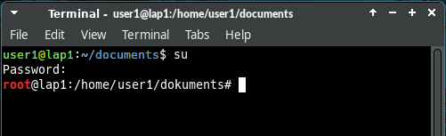

BEGINNING   INFO AREA FOR THE AUTHORS
This area is to be removed when the status RC3 is reached. The first line of the file must contain the title (% my-title) !!!  
**Status: RC1**

Necessary work:

+ check intern links  
+ check extern links  
+ check layout  
+ check spelling  

Work done

END   INFO AREA FOR THE AUTHORS  
% Terminal - command line

## Terminal - command line

A terminal, also called a console, is a program that allows one to interact directly with the GNU/Linux operating system through directly executed commands. The terminal, also often called the "shell" or "command line", is an extremely powerful tool and well worth the effort to learn the basics of its use.

In siduction, you can invoke the terminal/console by clicking on the PC monitor icon to the right of the menu, or by going to Menu > System > Terminal, or, even easier, by typing *kons* or *term* into the menu search bar. 

After calling the terminal you will see the prompt "prompt":

~~~
username@hostname:~$
~~~

**username** in the above example corresponds to the username of the logged in user. The tilde **~** shows you are in your home directory **/home/username** , and the dollar sign (the prompt) **$** means you are logged into the terminal with limited user privileges. At the end, the cursor is blinking. All this is the command line. This is where you enter commands that you want the terminal to execute.

Many commands can only be executed with root rights, i.e. administrator rights. Root rights can be obtained by typing **su** and pressing `Enter`. After that you have to enter the root password. The password is not displayed on the screen during the input. (See below [work-as-root](#work-as-root)).

If the input is correct, the command line now shows:

~~~
root@hostname:/home/username#
~~~

Note that the dollar sign **\$** has been replaced by a hash **#**. In a terminal, the hash **#** always means that you are logged in with root privileges.  
When command line commands are specified in the manual, the information before the prompt ($ or #) is omitted. A command like:

~~~
# chmod g+w <file>
~~~

means: you open a terminal, log in as root (su) and execute the command at a root prompt **#**. The hash **#** is not included.

Another note:  
For users who are new to the terminal, it is often confusing if no message appears after executing a command, but only the empty prompt again. This is intentional and means that the command was executed without errors. (In the example above, the group members were given write permissions to the \<file\>).

### Work as root

> **Caution.  
> While logged into the terminal with root privileges, you are allowed to do anything, e.g. delete files, without which the operating system will stop working, and so on. When working with root privileges, one must be aware of *what* one is doing, because it is easily possible to cause irreparable damage to the operating system.

It must be taken into account that all actions, if provided for in the program, are also executed with root privileges. The simple copy command *cp \<source\> \<destination\>* in a user directory leads to files with the owner *ROOT* in the destination directory. This is probably not wanted and also not useful.

Therefore: **Work as root only where it is really necessary!**.

**About su**

A number of commands must be started with root privileges. These rights can be obtained by entering **su**. After entering the correct password the root prompt appears.

~~~
$ su
Password: 
#
~~~

Now it is possible to execute all commands in the terminal and start all programs that require root privileges. You can exit this state by typing

~~~
# exit
$
~~~

and the prompt for the user appears again.

**About su-to-root**

In contrast to the general command **su**, **su-to-root** allows the execution of programs with graphical user interface with root privileges. **su-to-root** transfers X properties to the target user using 'su'. The input is:

~~~
su-to-root -X -c <program>
~~~

If error messages related to **dbus** occur, expand the input:

~~~
su-to-root -X -c 'dbus-launch <program>'
~~~

Another terminal opens, into which the root password is to be entered. If successful, the desired program will launch with root privileges.  
Examples of using graphical applications via *su-to-root* are: editing a configuration file with a text editor, using the partition manager gparted or using file managers like dolphin or thunar.

**Use in desktop environments:**

+ Plasma (KDE and LXQt)  
  The command is not necessary in Plasma and is not supported, because for programs that need root privileges a password prompt occurs and for the editor the prompt occurs when you want to save the changed file. Therefore only use **su** in the terminal, if necessary.
+ Gnome and Cinnamon  
  The behavior is similar to Plasma, except that the command (su-to-root) is supported, but not necessary.
+ XFCE and Xorg  
  Here the command unfolds its full power, and one is able to start the desired graphical program with root privileges. One is however also in the obligation to consider, when and with which program root rights are really necessary.
  
> Under no circumstances should productive programs that are normally started with user rights be booted as root with this option: Internet browsers, e-mail programs, office programs, etc.

**sudo is not configured**

**sudo** is only available in live mode, because no root password is set in live mode.  
After an installation **sudo** is not enabled. The reason is: If an attacker grabs the user password, he does not yet gain super-user privileges and cannot make any harmful changes to the system.

Another problem with **sudo** is that a root application running with the user configuration can change permissions and thus make them unusable for the user. The use of **su** or **su-to-root** is recommended!

If you want to use *sudo* despite all warnings, you have to add the corresponding $user to the sudo group!

This can be done with the command "adduser USER GROUP" as root.

As an alternative to *sudo* you can also take *doas* (apt install doas) and set it up.

* https://man.openbsd.org/doas
* https://github.com/slicer69/doas

### Colored terminal

Colored prompts on the terminal can save you from unpleasant or catastrophic errors if you are **root #** performing a task you meant to do as **user $**.  
That's why in siduction, by default, the **user $**'s prompt is green, blue, and white, and **root #**'s has the word "root" displayed in red.  

The focus when working with the terminal should be on the input and output of the commands and not on colored prompts. In siduction we nevertheless decided to use the colors to give users a warning when they are system administrators with root privileges.  

**Change prompt color**

Before changing the configuration file, we first create a backup copy in the terminal with a date stamp.

~~~
$ cp ~/.bashrc ~/.bashrc_$(date +%F)
~~~

Then we open the file **~/.bashrc** with a text editor of our choice (e.g.: kate, gedit, mcedit, vim...) and look for the following line, which is located approximately in the middle of the file:

~~~
PS1='${debian_chroot:+($debian_chroot)}\[\033[01;32m\]\u@\h\[\033[00m\]:\[\033[01;34m\]\w\[\033[00m\]\$ '
~~~

The font and color code are immediately followed by the promt parts that are to receive this representation. The following figure shows the relation between the prompt parts and their abbreviations.

The following table explains the values of the syntax "\[\033[**01;32**m\]", where the bold part determines the font attributes and the color.

| font code | font attribute | color code | color |
| --- | ---| --- | --- |
| 00m | Default for font and color |
| 00;XX | default font | XX;m | default color |
| 01;XX | bold | XX;30 | black |
| 02;XX | dark | XX;31 | red |
| 03;XX | italic | XX;32 | green |
| 04;XX | underlined | XX;33 | yellow |
| 05;XX / 06;XX | flashing | XX;34 | blue |
| 07;XX | block, inverted | XX;35 | magenta |
| 08;XX | background color (invisible) | XX;36 | cyan |
| 09;XX | strikethrough | XX;37 | white |

The "PS1" line quoted above is therefore displayed as follows:

| font code | prompt parts and their display |
| --- | --- |
| [01;32m\]\\u@\\h | user, @ and host get the attributes "bold" and "green" |
| [00m\]: | colon gets the default attributes of the terminal |
| [01;34m\]\w | the working directory gets the attributes "bold" and "blue" |
| [00m\]\$ | the prompt gets the default attributes of the terminal |

If the color is to be removed from the prompt, we prefix the PS1 line with a hash **#** and a **space**. This comments out the line. Now it is sufficient to add the line

~~~
PS1='${debian_chroot:+($debian_chroot)}\[\033[00m\]\u@\h:\w\$ '
~~~

immediately as the next line.

If the color is to be changed in the prompt, the color coding must be adjusted for each part of the prompt.

~~~
 PS1='${debian_chroot:+($debian_chroot)}\[\033[03;32m\]\u@\h\[\033[01;34m\]:\w\[\033[00m\]\$ '
~~~

This code example creates a prompt in which **username @ hostname** is green and italicized; the **:** and the **working directory** are blue and bold; the **$** character and the command prompt are given the contrasting color to the background of the terminal.

The new colors and formats appear after opening a new terminal.

**Color settings of the terminal**

In the menu of the terminal, under *Edit* - *Settings...* - tab *Colors*, there are a myriad of setting options. We recommend a rather plain setting.

### When the terminal hangs

Sometimes a terminal can no longer respond as desired. This is usually because a program has terminated with an error and left the terminal in an abnormal state. Then

~~~
reset
~~~

must be entered and the enter key 'Enter' must be pressed.

If the output of a terminal appears distorted, this can usually be fixed by pressing `Ctrl` + `l`, this will rebuild the terminal window. Such distortions usually occur when working with programs that use an ncurses interface, for example *cgdisk*.

A terminal may appear frozen, but this is usually not the case; input continues to be processed even if it does not appear to be so. This can be caused by accidentally pressing `Ctrl` + `s`. In this case `Ctrl` + `q` can be tried to free the console again.

### Help in the terminal

Most commands/programs have command line help and also instructions. The instructions are called "man page" or "manual page". The syntax to call the "man page" is:

~~~
$ man <command>
~~~

or

~~~
$ man -k <keyword>
~~~

This calls the "man page" of a command. Navigation in the "man pages" is done by the arrow keys, they are terminated with "q" for quit. Example:

~~~
$ man apt-get
~~~

To exit a man page, type `q`. 

Another useful tool is the "apropos" command. "Apropos" allows you to search the man pages for a command if, for example, you forget the syntax. Example:

~~~
$ apropos apt-
~~~

This lists all commands for the package manager apt. "apropos" is a powerful tool, for more in-depth information about "apropos" see.

~~~
$ man apropos
~~~

### Linux console commands

A very good introduction to the BASH console can be found at [linuxcommand.org](http://linuxcommand.org/)(english).

Of course you can also use your favorite search engine to find more.

### Using scripts

A console script is a convenient way to bundle several commands into one file. Entering the filename of the script executes the commands that are in the script. siduction comes with some very useful scripts that provide simplifications to system administration.

A script is started in the console as follows, if you are in the same directory:

~~~
./name_of_script
~~~

Some scripts require root access, depending on the scope of the script.

**Installation and execution**

Use wget to load a script onto the machine, and it is best to place it in the recommended directory, for example to **/usr/local/bin**. To copy and paste in the console, the mouse can also be used after gaining root privileges with **su**.

**Example with wget and root privileges**

~~~
$ su
password:
# cd /usr/local/bin
# wget -c ftp://<removed_server>/script-name.sh
~~~

After that, the file must be made executable:

~~~
# chmod +x script-name.sh
~~~

Since the directory */usr/local/bin* is included in the search path of root, the simple command for root is sufficient

~~~
# script-name.sh
~~~

is sufficient to start the script.

The file can also be loaded onto the computer with a browser and moved to the appropriate location, but it must be made executable even then.

**Example with wget as user**

This is how to save a file in \$HOME (the prompt is '$') as a user:

~~~
$ wget -c ftp://<removed_server>/user-script-name.sh
$ chmod +x user-script-name.sh
~~~

The script is started like this:

~~~
$ ./user-script-name.sh
~~~

Of course, this will only work as *user* if the script does not contain any commands that require root privileges.

Last edited: 2021-14-08

