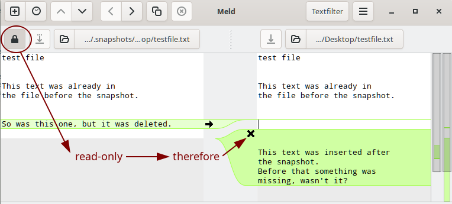

% Btrfs and Snapper

## Btrfs

Btrfs is a modern copy-on-write (COW) file system for Linux.  
siduction supports installation into a partition formatted with *Btrfs*. The release of 2022.12.0 enables you  to manage snapshots of Btrfs with Snapper and to boot via Grub. The installer creates subvolumes within the selected partition for the root directory `@`, the user directories `@home` and `@root`, the directories `@tmp` and `@var@log`, and a subvolume `@snapshots` for system snapshots.

Btrfs works well with SSDs and conventional hard disks. Its own built-in RAID mechanism (RAID 0, 1, and 10 are supported) works reliably even with disks of different sizes. Metadata and file data are handled differently by Btrfs. Usually, metadata is stored twice even with only one drive. If multiple drives are present, the administrator can set different RAID levels for the metadata and file data within the same file system.  
Btrfs manages the data within the drives in subvolumes, superficially similarly to conventional partitions. It can take snapshots of the subvolumes, which can be used for data reconstruction if needed. A mounted Btrfs file system behaves mostly like any other Linux file system. Occasionally, however, some differences come to light because Btrfs does most of its work in the background. For example, deleting a large file without immediately increasing the available free space causes confusion. Some time later, the missing space is there after all, or not if a previous snapshot references the file.

There is a lot of documentation about Btrfs on the Internet. We will therefore not repeat the extensive possibilities as well as the commands and their application here. Reading **`man btrfs`** and **`man btrfs-<command>`** is mandatory. In addition, we recommend the extensive [kernel.org Wiki](https://btrfs.wiki.kernel.org/index.php/Main_Page) and the detailed documentation on [readthedocs.io](https://btrfs.readthedocs.io/en/latest/index.html).

**Use Btrfs**

For the advanced features of Btrfs (snapshots, compression, defragmentation, self-recovery for data and metadata, integrated volume management, ...) e.g. compared to ext4, we need recognizably larger drives. Currently, this is usually not a problem, because even inexpensive PCs and laptop often have 500 GB drives.  
As a minimum size of the Btrfs drive, into which the complete installation should take place, we recommend 100 GB. Depending on the volume of private data, this can be considerably more. If you want to use Btrfs only for the root partition, it should have a size of at least 50 GB. For users who do not want to allocate that much space, the usual approach is to use either Btrfs without snapshots or ext4.  
Btrfs understands arbitrary abbreviations on the command line for its commands and options, as long as they are unique. For example, **`btrfs su li /`** becomes **`btrfs subvolume list /`** internally.

### Btrfs subvolume

During the first install to a single partition, the following subvolumes are created.

| Subvolume | Mount point | Remarks |
| --- | --- | ----- |
| @ | / | |
| @home | /home | |
| @root | /root | The **root** user |
| @tmp | /tmp | |
| @var@log | /var/log | |
| @snapshots | /.snapshots | Snapshots of @ are stored here |

For Btrfs, they are all located at the highest level (*top level 5*). It is also called *"flat layout "* because there are no nestings. The file system root itself is not mounted, but the *top level 5* subvolumes are. It is no longer necessary to mount the "root" device if only the contents of the subvolumes are of interest. During operation, we are already in the subvolume `@`.

The command **`btrfs subvolume list /`** prints all subvolumes of the file system root. The `-t` option creates a clearly arranged list. 

~~~
# btrfs subvolume list -t /
ID   gen    top level  path
--   ---    ---------  ----
256  22981  5          @
257  22952  5          @root
258  22982  5          @daten
269  22972  5          @var@log
260  22967  5          @snapshots
261  22967  5          @tmp
~~~

**The default subvolume**.

In siduction the subvolume `@` should be set as default from the beginning, because in case of a rollback the command **`snapper rollback <No>`** is used. If no default subvolume was set before, Snapper will do it now with the rollback subvolume.  
This can lead to considerable confusion if the user in the console usually mounts the root partition using the device file and the command **`mount -t btrfs /dev/sdxX /mnt/`**. This is because after setting a default subvolume, the *top level 5* subvolumes are no longer accessible with this command.

The following commands first show the state without a default subvolume, next the subvolume `@` with ID 256 is set as default. The output of the last command shows the change.

~~~
# btrfs subvolume get-default /
ID 5 (FS_TREE)
# btrfs subvolume set-default 256 /
# btrfs subvolume get-default /
ID 256 gen 22981 top level 5 path @
~~~

**Mount subvolume**

As described before, the access to the *top level 5* subvolumes changes after setting a default subvolume.  
Example without default subvolume:

~~~
# mount -t btrfs /dev/sdxX /mnt/
# ls /mnt/
@  @daten  @root  @snapshots  @tmp  @var@log
~~~

Example after setting the subvolume `@` as default:

~~~
# mount -t btrfs /dev/sdxX /mnt/
# ls /mnt/
bin    disks  initrd.img      lib64   proc  srv  var
boot   etc    initrd.img.old  libx32  root  sys  vmlinuz
daten  fll    lib             media   run   tmp  vmlinuz.old
dev    home   lib32           mnt     sbin  usr
~~~

To get to the *top level 5* subvolumes with the default subvolume set, the *subvolid* must be specified in the mount command.  
Example with default subvolume and mount option `subvolid=5`:

~~~
# mount -t btrfs -o subvolid=5 /dev/sdxX /mnt/
# ls /mnt/
@  @daten  @root  @snapshots  @tmp  @var@log
~~~

After installation, the `/etc/fstab` file already contains all the necessary entries to automatically mount the subvolumes.  
To show how to manually mount a subvolume and to extend the `/etc/fstab` file, we use the `@data` subvolume created in the next chapter.

With the command  
**`mount -t btrfs -o subvol=@data,defaults /dev/sdxX /data/`**  
we mount the subvolume manually.  
This simple variant is not suitable for permanent use. It also suppresses the advantageous capabilities of Btrfs. We look at an entry from the `/etc/fstab` file.

~~~
# grep home /etc/fstab
UUID=<here>  /home  btrfs  subvol=/@home,defaults,noatime,space_cache=v2,autodefrag,compress=zstd 0 0
~~~

The option *"space_cache=v2"* caches the addresses of the free blocks on the drive to speed up write operations.  
The option *"autodefrag "* ensures defragmentation of the files during runtime.  
We achieve data compression with the *"compress=zstd"* option.

Our self-created subvolume `@data` should be automatically and permanently available with these options. Therefore we add the required entry to `/etc/fstab` either with an editor or by means of two commands.

~~~
# echo "# Extended by root on $(date +%F)" >> /etc/fstab
# grep home /etc/fstab | sed 's!home!data!g' "$@" >> /etc/fstab
~~~

Immediately after, the subvolume is available by the short command **`mount /data`** and it is mounted like all the others at every boot.

**Create new subvolume**

To create a new *top level 5* subvolume `@data`, we mount the siduction Btrfs partition under `/mnt`.

~~~
# mount -t btrfs -o subvolid=5 /dev/sdxX /mnt/
# ls /mnt/
@  @home  @root  @snapshots  @tmp  @var@log
~~~

The *ls* command shows the existing *top level 5* subvolumes after installation.  
Now we create the new subvolume as well as its mount point and reissue the contents of `/mnt`. 

~~~
# btrfs subvolume create /mnt/@data
# mkdir /mnt/@/data
# ls /mnt/
@  @data  @home  @root  @snapshots  @tmp  @var@log
~~~

To allow normal users access to the directory, we change the group:

~~~
# chgrp users /mnt/@/data
~~~

Subvolumes can also be nested and thus be created within existing subvolumes. For a better overview, we rather recommend the flat scheme.

### Btrfs snapshot

A snapshot is a subvolume like any other, but with a given initial content. Viewed in the file manager, it appears to contain a complete copy of the original subvolume. Btrfs is a copy-on-write file system, so it is not necessary to actually copy all the data. The snapshot simply has a reference to the current filesystem root of its original subvolume. Only when something is changed does Btrfs create a copy of the data. File changes in a snapshot do not affect the files in the original subvolume.

A snapshot is not recursive. A subvolume or snapshot is effectively a barrier. Files in nested subvolumes do not appear in the snapshot. Instead, there is a blind subvolume, which could cause confusion in nested layouts. The non-recursive behavior explains why siduction created additional subvolumes during installation. Thus, private and variable data from `@home`, `@root`, `@tmp`, and `@var@log` subvolumes do not end up in a snapshot of `@`.

It should be noted that snapshots of Btrfs file systems are in no way a substitute for thoughtful data protection. Even for RAID1 and RAID10 systems with Btrfs, the focus is on failover and not on backup.

**Create snapshot**

> **Caution**  
> Use only if you do **not** want to use Snapper.

Since a snapshot is a subvolume within its source, it makes sense to create a corresponding subdirectory. For the example we take our self created subvolume `@data`, create the directory and immediately afterwards the first snapshot.

~~~
# mkdir /data/.snapshots
# btrfs subvolume snapshot -r /data/ /date/.snapshots/01
~~~

The command is syntactically reminiscent of a simple copy operation, where `01` is the folder where the files of the snapshot are located.  
By default, snapshots are created with read and write access. With the `-r` option they are read-only. We strongly advise using the `-r` option because a snapshot represents the state of the subvolume at the time it is created. How to access the data of a snapshot is explained in the manual in the chapters starting with ["Snapper Rollback"](0704-sys-admin-btrfs-snapper_en.md#snapper-rollback).

## Snapper

Snapper is a tool for managing file system snapshots on Linux for Btrfs file systems and thin-provisioned LVM volumes. Besides creating and deleting snapshots, it can also compare snapshots and undo differences between snapshots. It allows users to view older versions of files and undo changes. In addition, Snapper supports automatic snapshots according to schedules or to actions.

The default configuration of Snapper in siduction includes automatic pre- and post-snapshots of the `@` subvolume when changes are made to the system and preparation of scheduled snapshots for any other subvolumes.

The Snapper files are located in:

+ `/usr/bin/` The `snapper` executable program.  
+ `/usr/lib/snapper/` Utilities for snapper.  
+ `/etc/default/snapper` An overview of the configured subvolumes.  
+ `/etc/snapper/configs/` The configuration files of the configured subvolumes.  
+ `/usr/share/snapper/config-templates/` The configuration templates.  
+ `/var/log/snapper.log` Snapper's log file.

Please read the man pages **`man snapper`** and **`man snapper-configs`**.

### Snapper configuration

Snapper requires a configuration file for each subvolume that will contain snapshots. siduction automatically creates the `/etc/snapper/configs/root` configuration file for the `@` subvolume during installation. For the other subvolumes, we need to create configurations ourselves if needed, following the pattern below.

~~~
# snapper -c <config_name> create-config -t <config_template> <subvolume_mount_point>
~~~

But before we do that, let's take a look at the default configuration and see which settings make sense.  
The following list shows the configuration for subvolume `@` with the name `root`, the values of the default template `default`, and the values of the `user` template which we will create later:

~~~
Snapper configuration
-----------------------+-------+-------+-------+
Subvolume              |   @   |  --   |  --   |
-----------------------+-------+-------+-------+
conf-name or templ-name| root  |default| user  |
=======================+=======+=======+=======+
Key                    | Value | Value | Value |
-----------------------+-------+-------+-------+
ALLOW_GROUPS           | users |       | users |
ALLOW_USERS            |       |       |       |
BACKGROUND_COMPARISON  | yes   | yes   | yes   |
EMPTY_PRE_POST_CLEANUP | yes   | yes   | yes   |
EMPTY_PRE_POST_MIN_AGE | 1800  | 1800  | 1800  |
FREE_LIMIT             | 0.2   | 0.2   | 0.2   |
FSTYPE                 | btrfs | btrfs | btrfs |
NUMBER_CLEANUP         | yes   | yes   | yes   |
NUMBER_LIMIT           | 50    | 50    | 5     |
NUMBER_LIMIT_IMPORTANT | 10    | 10    | 2     |
NUMBER_MIN_AGE         | 1800  | 1800  | 1800  |
QGROUP                 |       |       |       |
SPACE_LIMIT            | 0.5   | 0.5   | 0.5   |
SUBVOLUME              | /     | /     | /     |
SYNC_ACL               | yes   | yes   | yes   |
TIMELINE_CLEANUP       | yes   | yes   | yes   |
TIMELINE_CREATE        | no    | yes   | yes   |
TIMELINE_LIMIT_DAILY   | 10    | 10    | 2     |
TIMELINE_LIMIT_HOURLY  | 10    | 10    | 10    |
TIMELINE_LIMIT_MONTHLY | 10    | 10    | 0     |
TIMELINE_LIMIT_WEEKLY  | 0     | 0     | 1     |
TIMELINE_LIMIT_YEARLY  | 10    | 10    | 0     |
TIMELINE_MIN_AGE       | 1800  | 1800  | 1800  |
~~~

Snapper works together with systemd. Some settings regarding the handling of automatic snapshots are hidden in the associated systemd units. The chapter ["Snapper and systemd"](0704-sys-admin-btrfs-snapper_en.md#snapper-and-systemd) explains the functions and gives hints for their adjustment.

For each APT action, the **Apt snapshot** *"pre "* and *"post "* are created. The key `NUMBER_LIMIT=50` causes the most recent twenty-five snapshot pairs to be preserved.

Snapper automatically creates **timeline snapshot** if the `TIMELINE_CREATE=yes` key is set in the configuration files. The systemd unit `snapper-timeline.timer` activates the associated service unit every hour. According to the *default* configuration, Snapper keeps at least ten `HOURLY`, `DAILY`, `MONTHLY`, and `YEARLY` snapshots each.

This adds up the held snapshots considerably. The *Kept snapshots 1* table takes into account the *default* configuration for the `@home` subvolume and the *root* configuration for `@` with one dist-upgrade a day.

Kept snapshots 1

| subvolume | @ |home |
| :----------------| :-----: | :-----: |
| on 1st day     |  2 | max. 24 |
| after 1 day    |  2 | 10 + max. 24 |
| after 5 days   | 10 | 15 + max. 24 |
| after 1 week   | 14 | 17 + max. 24 |
| after 1 month  | 50 | 21 + max. 24 |
| after 6 months | 50 | 26 + max. 24 |
| after 1 year   | 50 | 30 + max. 24 |
| after 10 years | 50 | 40 + max. 24 |

*"+ max 24"* describes the number of *HOURLY Timeline Snapshot* created before `snapper-cleanup.timer` is activated. The very first *Timeline Snapshot* vagabonds for at least ten years and one day in our file system. Who would want to reset their production system to this snapshot and keep all the data for so long?  
Note: Snapper and snapshots are not a means of backing up data. They enable a prompt system reset in case of occurring errors or actions with unintended effects triggered by us.

For these reasons we generate a new configuration template from the file `/usr/share/snapper/config-templates/default` with the values of the *"user"* column from the table *"Snapper Configuration"* shown above and save it under the name `user` in same folder. Then we create the configuration for our subvolume `@data`.

~~~
# snapper -c data_pr create-config -t user /data
~~~

This:

1. creates the `/etc/snapper/configs/data_pr` configuration file based on the `/usr/share/snapper/config-templates/user` template.  
2. creates the `/data/.snapshots` subvolume where future snapshots of `@data` will be stored. The path of a snapshot is `/data/.snapshots/#/snapshot`, where # is the snapshot number.  
3. adds the name of the `data_pr` configuration to the key *"SNAPPER_CONFIGS"* in the `/etc/default/snapper` file.

Now the configuration is active. If, as in our example, the key `TIMELINE_CREATE=yes` is set, systemd takes over the regular creation of *"timeline snapshots"* through its timers.  
We compare the held snapshots once more.

Kept snapshots 2

| Subvolumen | @ | @home | @data |
| :----------------| :-----: | :-----: | :-----: |
| on 1st day     |  2  | max. 24 | max. 24 |
| after 1 day    |  2  | 10 + max. 24 | 2 + max. 24 |
| after 5 days   | 10  | 15 + max. 24 | 2 + max. 24 |
| after 1 week   | 14  | 17 + max. 24 | 3 + max. 24 |
| after 1 month  | 50  | 21 + max. 24 | 3 + max. 24 |
| after 6 months | 50  | 26 + max. 24 | 3 + max. 24 |
| after 1 year   | 50  | 30 + max. 24 | 3 + max. 24 |
| after 10 years | 50  | 40 + max. 24 | 3 + max. 24 |

After one week, the subvolume `@data` constantly keeps one weekly snapshot, two daily snapshots of the previous day, and up to twenty-four snapshots of the current day. If you think that the maximum of twenty-four daily snapshots is too much, please have a look at the following chapter *Snapper and systemd*.

We can also change individual *key=value* pairs on the command line. In the example we reduce the number of held numbered snapshot in the `root` configuration.

~~~
# snapper -c root set-config NUMBER_LIMIT=20
~~~

Now the most recent ten instead of twenty-five pre- and post-snapshot pairs remain after APT actions. For standard use on a laptop or PC, this value should be sufficient.  
At this point, every siduction user should weigh up how many snapshots they want to keep and for how long, and adjust the configuration accordingly. 

### Snapper and systemd

Snapper installs three systemd unit pairs to create or delete snapshots depending on APT actions and time.

+ When creating snapshots with the keys  
  `DISABLE_APT_SNAPSHOT="no"` in the `/etc/default/snapper` file  
  with the help of the Systemd unit  
  `grub-btrfs.path` and `grub-btrfs.service`  
  and  
  `TIMELINE_CREATE="yes"` in the configuration files of the subvolumes  
  with the help of the Systemd unit  
  `snapper-timeline.timer` and `snapper-timeline.service`.

+ When deleting snapshots with the keys  
  `EMPTY_PRE_POST_CLEANUP=yes`,  
  `NUMBER_CLEANUP=yes`,  
  `TIMELINE_CLEANUP=yes` in the configuration files of the subvolumes  
  with the help of the Systemd unit  
  `snapper-cleanup.timer` and `snapper-cleanup.service`.

The fact that Snapper creates a pre- and post-snapshot for every APT action should definitely be kept in siduction. siduction is a rolling release based on Debian sid. It is quite possible to get single packages that do not work as intended when upgrading. A rollback with Snapper is then a good alternative for the user to continue to work reliably.

On the other hand the *TIMTLINE* function offers room for individual adjustments. The right addressees are the two timer units `snapper-timeline.timer` and `snapper-cleanup.timer`. The former is the timer for creating snapshots, the latter determines the time for removing old and empty snapshots.

The manual page [*systemd-timer*](0716-systemd-timer_en.md#systemd-timer) explains how the timer unit works.

Now we turn to the contents of the systemd unit `snapper-timeline.timer` in the directory `/lib/systemd/system/`.

~~~
[Unit]
Description=Timeline of Snapper Snapshots
Documentation=man:snapper(8) man:snapper-configs(5)

[Timer]
OnCalendar=hourly

[Install]
WantedBy=timers.target
~~~

With the command **`systemctl edit --full snapper-timeline.timer`** we open a text editor and change the file as follows:

~~~
[Unit]
Description=Timeline of Snapper Snapshots
Documentation=man:snapper(8) man:snapper-configs(5)

[Timer]
#OnCalendar=hourly
OnBootSec=30
OnUnitActiveSec=2h

[Install]
WantedBy=timers.target
~~~

With this change, we get a snapshot thirty seconds after the boot and every two hours thereafter. From now on, Snapper creates a maximum of twelve snapshots every day instead of twenty-four.  
We save the file and close the editor. systemd creates the changed file with the same name in the `/etc/systemd/system/` directory and runs the **`systemctl daemon-reload`** command to load the changed configuration.

The second systemd timer unit `snapper-cleanup.timer` takes care of disposing of old, excess and empty snapshots. It has the following content:

~~~
[Unit]
Description=Daily Cleanup of Snapper Snapshots
Documentation=man:snapper(8) man:snapper-configs(5)

[Timer]
OnBootSec=10m
OnUnitActiveSec=1d

[Install]
WantedBy=timers.target
~~~

With the knowledge of the contents of the TIMELINE timer we can weigh now whether the configuration is meaningful. For someone who restarts his PC every day, the key `OnBootSec=10m` might be rather unfavorable if he finds that a serious error has crept in shortly before closing time on the previous day. In this case it probably makes more sense to set the key to `OnBootSec=4h`. The file is changed in the same way as in the example shown above.

### Snapper - manual snapshots

Of course, with Snapper we can also create snapshots independently of the automatic actions. For this, the executing user must be listed in the subvolume's Snapper configuration with group or user rights.

The syntax of the command corresponds to the following pattern which also shows frequently used options.

~~~
# snapper -c <config_name> create -t <type> -d <description> -c <cleanup-algorithm> -u <userdata>
~~~

+ snapper **-c \<config_name\>** create  
  This snapper command creates a snapshot of the subvolume of the named configuration. If the option is missing, Snapper applies the command to the `@` subvolume with the `root` configuration. This rule applies to all Snapper commands.  
+ **-t \<type\>**  
  specifies the type of snapshot to create. Possible values: `single`, `pre`, `post`.  
+ **-d \<description\>**.  
  may contain any text. Use `"` if spaces or special characters are included.  
+ **-c \<cleanup-algorithm\>**.  
  This option determines the rules according to which the snapshot should be automatically deleted. Possible values: `number`, `timeline`, `pre`, `post`. If this option is missing, the snapshot will be kept until the user deletes it manually.  
+ **-u \<userdata\>**  
  specifies user data for the snapshot. The format must be *key=value*. Multiple user data must be separated by a comma, for example `author=Tom,important=yes`.

Snapper always creates snapshots in *read-only* mode. You can change the default with the `--read-write` option. Changing data in a snapshot will lead to inconsistent data sets. We strongly advise against this unless you know exactly what you are doing.

Now we create a snapshot and display the snapshots of the same configuration.

~~~
$ snapper -c data_pr create -t single -d "AB finished" -c number -u user=Pit
$ snapper -c data_pr list
 #|Typ   |Pre #|Date    |User|Cleanup |Description|Userdata
--+------+-----+--------+----+--------+-----------+--------
 0|single|     |        |root|        |current    |
88|single|     |22:00:38|root|timeline|timeline   |
90|single|     |11:34:41|root|timeline|timeline   |
91|single|     |11:36:23|user|number  |AB finished|user=Pit
~~~

The snapshot we (user) created has # 91. Unfortunately we made the mistake to let the snapshot be handled according to the cleanup rule *number*. We change this with the *`modify -c ""`* option so that Snapper will not delete it automatically. 

~~~
$ snapper -c data_pr modify -c "" 91
$ snapper -c data_pr list
 #|Typ   |Pre #|Date    |User|Cleanup |Description|Userdata
--+------+-----+--------+----+--------+-----------+--------
 0|single|     |        |root|        |current    |
88|single|     |22:00:38|root|timeline|timeline   |
90|single|     |11:34:41|root|timeline|timeline   |
91|single|     |11:36:23|user|        |AB finished|user=Pit
~~~

Snapshot # 91 will now remain until we delete it ourselves.

**Delete snapshot**

We can delete any snapshot at any time as long as we have the rights to do so. Snapper does not care about the delete action, because on each run the cleanup algorithm checks which snapshots are kept. The preceding chapter [Snapper Configuration](0704-sys-admin-btrfs-snapper_en.md#snapper-configuration) also explains in detail the settings with which we can adjust the cleanup algorithm if necessary. 

The following command removes snapshot # 91 from our `@data` subvolume.

~~~
$ snapper -c data_pr delete 91
~~~

The `delete 34-50` command deletes a number of snapshots.  
The snapshot # 0 with the description *"current"* is not deletable. It is the snapshot that is mounted to the file tree and in which we are currently working.

### Snapper rollback

If the system is damaged due to an action initiated by us that went completely out of control, or due to a faulty upgrade, Snapper allows you to use the *"rollback"* to return the system to one or more states that existed before the problems occurred.

**Prerequisites**  
A *"rollback"* is only supported with Btrfs for the root file system. The root file system must be on a single device, in a single partition, and on a single subvolume. Directories that are excluded from `/` snapshots, for example `/tmp`, can be on separate partitions.

**Performing a rollback**  
Before the rollback, we check if the rollback target works as expected. To do this, we boot into the desired snapshot, for example 13, using the *"siduction snapshots"* submenu. The system boots in *read-only* mode. We ignore the error message regarding *sddm*.
If it does, we reboot back to the current default subvolume. There we perform the rollback as **root**:

~~~
# snapper --ambit classic rollback
Ambit is classic.
Creating read-only snapshot of default subvolume. (Snapshot 15.)
Creating read-write snapshot of current subvolume. (Snapshot 16.)
Setting default subvolume to snapshot 16.
~~~

**Always execute rollback from the default subvolume specifying the subvolume number of the rollback target.**

The output precisely describes the rollback procedure. Afterwards the grub menu file *grub.cfg* is automatically updated to show the new snapshots in the submenu and snapshot 16 is used as the default subvolume. The grub menu file is updated whenever the paths of the btrfs-default subvolume, the booted subvolume, or the grub-default menu entry differ after a snapshot, rollback, or reboot.  
The **`snapper list`** command shows that we are currently in snapshot 12 and snapshot 16 is the new default subvolume. (The minus `-` after #12 and the plus `+` after #16.)

~~~
 # |Typ   |Pre #|Date    |User |Cleanup| Description   |
---+------+-----+--------+-----+-------+---------------+
 0 |single|     |        |root |       |current        |
12-|single|     |17:28:15|root |number |important      |
13 |pre   |     |11:34:41|root |number |apt            |
14 |post  |   13|11:35:56|root |number |apt            |
15 |single|     |12:05:23|root |number |rollback backup|
16+|single|     |12:05:23|root |       |r/W copy of #13|
~~~

We perform a reboot and select the Grub default entry. Now the `*` after #16 indicates that we are in this snapshot and it is the default subvolume.

~~~
 # |Typ   |Pre #|Date    |User |Cleanup| Description   |
16*|single|     |12:05:23|root |       |r/W copy of #13|
~~~

In the rollback target, the Grub menu file is also updated automatically. At this point, the Grub entry in the EFI / MBR still points to the previous default subvolume #12. We perform the command

~~~
# grub-install ...
~~~

to complete the rollback and tell Grub to use the new default subvolume #16 from now on.

### File rollback within the root file system

This is the undoing of changes to files. For this purpose, two shnapshots are compared and then the file to be changed is picked out. Afterwards you can see the changes and decide if you want to undo them.

The output of **`snapper list`** shows the currently existing snapshots of the subvolume @. (The columns have been shortened.) All snapshots with a digit # greater than zero represent the state of the file system at that exact time. The only exception is the one marked with a `*`. It was booted into and is the default snapshot. If no system rollback has been performed yet, snapshot 0 takes its place.

~~~
 # |Typ   |Pre #|Date    |User |Cleanup |Description|Us..
---+------+-----+--------+-----+--------+-----------+----
 0 |single|     |        |root |        |current    |
42 |single|     |09:50:36|root |        |IP pc1     |
43 |pre   |     |11:30:18|root |number  |apt        |
44 |post  |   43|11:34:41|root |number  |apt        |
45*|single|     |22:00:38|root |        |           |
46 |single|     |23:00:23|root |timeline|timeline   |
~~~

Two snapshots can be compared with:

~~~
# snapper status 42..45
[...]
c..... /etc/group
+..... /etc/group-
c..... /etc/hosts
[...]
~~~

Each line names a file and the type of change. A `+` at the beginning of the line means that the file was created, a `-` that the file was deleted, and a `c` that the contents of the file were changed.  
If the output includes a lot of lines, we redirect it to a file with the `-o </path/name>` option.

Differences in a file between two snapshots can be displayed with:

~~~
# snapper diff 42..45 /etc/hosts
--- /.snapshots/42/snapshot/etc/hosts
+++ /.snapshots/45/snapshot/etc/hosts
@@ -5,5 +5,3 @@
 ff02::2    ip6-allrouters
 # This host address
 127.0.1.1  lap1
-# added 2022-12-02
-192.168.3.1 pc1
~~~

If we want to undo the change, we use the command:

~~~
# snapper undochange 42..45 /etc/hosts
~~~

A *"file rollback"* within the root file system only makes sense if a snapshot is to be prepared for a *"system rollback"*, or the snapshot into which the system was booted is involved (recognizable by the `*` mark). It may be necessary to restart services or daemons, or even to reboot.  
It is also possible to include several files separated by spaces in the command.

*Caution*  
If the command **`snapper undochange 42..45`** is entered without specifying a file, Snapper will undo all changes between snapshots 42 and 45. The better alternative for such an operation is a *"system rollback"*.

### File rollback of user data

**With Snapper alone**

Snapper treats snapshot 0 as a snapshot, but it represents the current state of the subvolume and is thus variable. All other snapshots, as previously mentioned, represent the state of the file system at exactly its point in time. Changes between these snapshots therefore only act in the past.  
For us, this means that a *"file rollback"* of user data between snapshots 15 and 17 is worthless, since the operation does not affect the current state in our subvolume. So we always need snapshot 0 as a target for changes.

We look at such an operation using the `Test.txt` file in the `@data` subvolume.

~~~
$ snapper -c data_pr list
  #|Typ   |Pre #|Date    |User    |Cleanup   |Descr.
---+------+-----+--------+--------+----------+--------
 0 |single|     |        |root    |          |current
15 |single|     |12:50:48|root    |timeline  |timeline
16 |single|     |13:51:08|root    |timeline  |timeline
17 |single|     |14:51:26|root    |timeline  |timeline
~~~

The comparison between snapshot 15 and 16:

~~~
$ snapper -c data_pr status 15..16
[...]
+..... /data/user1/Test.txt
[...]
~~~

The file first appears in snapshot 16. We compare with the next snapshot.

~~~
$ snapper -c data_pr status 16..17
[...]
c..... /data/user1/Test.txt
[...]
~~~

The file was changed between snapshots 16 and 17.  
This is followed by a query with `diff` that prints the changes between 16 and 17.

~~~
$ snapper -c data_pr diff 16..17 /data/user1/Test.txt
--- /data/.snapshots/16/snapshot/user1/Test.txt
+++ /data/.snapshots/17/snapshot/user1/Test.txt
@@ -8,6 +8,8 @@
 test file

 This text was alreadey in
 the file before the snapshot 16.
 
-So was this one, but it was deteted.
+
+This text was inserted after the snapshot 16.
~~~

Since the file has not been modified since snapshot 17, the **`$ snapper -c data_pr diff 16..0 /data/user1/Test.txt`** command does not produce any other output for comparing snapshot 16 with the current contents of the file.

Now we put the `undochange` command between 16 and 0. After that the *Test.txt* contains the first six lines from snapshot 16.

~~~
$ snapper -c data_pr undochange 16..0 /data/user1/Test.txt
create:0 modify:1 delete:0

$ cat /data/user1/Test.txt
test file

This text was alreadey in
the file before the snapshot 16.

So was this one, but it was deteted.
~~~

A deleted file is promoted back to the current directory with the same command. Only the feedback from Snapper changes slightly.

~~~
$ snapper -c data_pr undochange 16..0 /data/user1/Test.txt
create:1 modify:0 delete:0
~~~

**With Snapper and Meld**

The preceding procedure always restores a file as a whole to the state corresponding to the selected snapshot. Individual parts of the changes cannot be applied in this way.  
The comparison program **Meld** fills exactly this gap. *Meld* is additionally able to insert parts at any place in the current document via *copy & paste* (an advantage also towards **Kompare** of the KDE Desktop). In siduction, *Meld* is not installed by default. We will make up for this.

The actions of Snapper are always possible for the non **root** user if the key `ALLOW_GROUPS=users` is set in the configuration file for the subvolume. This is the default. However, they are denied access to the snapshot files within the file system because the `/.snapshots` directory is readable and executable only by **root**. To work with *Meld*, we change this.

Make snapshots readable for users and install *Meld*. (Run as **root**.)

~~~
# chmod a+rx /data/.snapshots
# apt update && apt install meld
~~~

As a reminder, snapshots in Btrfs are always stored in read-only mode. The only exception is the `system rollback` snapshot.

We use snapper to select file changes in the same way as before. The command **`$ snapper -c data_pr diff 16..0 /data/user1/Test.txt`** contains the exact path to the file `Test.txt` in the snapshot.

~~~
$ snapper -c data_pr diff 16..0 /data/user1/Test.txt
--- /data/.snapshots/16/snapshot/user1/Test.txt
+++ /data/user1/Test.txt
[...]
~~~

We start *Meld* and select the two files with their paths for the file comparison. The differences are immediately visible.

A click on the arrow transfers the line to our current file. Another click on the cross removes the other lines. A transfer to the file in the snapshot is not possible, because the file system of the snapshot is read-only.

Since Snapper shows us the exact path to our file in the snapshot, we also have the very conventional option of copying a file from the snapshot to our current working directory.

~~~
$ cp /data/.snapshots/16/snapshot/user1/Test.txt /home/user1/Test.txt
~~~

### Sources BTRFS and Snapper

+ **`man btrfs`** and **`man btrfs-subvolume`** as well as other subpages of *"man btrfs "*  
+ [Btrfs wiki from kernel.org](https://btrfs.wiki.kernel.org/index.php/Main_Page)  
+ [Btrfs documentation](https://btrfs.readthedocs.io/en/latest/index.html)  
+ [Btrfs snapshot in grub menu](https://github.com/Antynea/grub-btrfs)  
+ **`man snapper`** and **`man snapper-configs`**  
+ [Snapper project page](http://snapper.io/)  
+ [Snapper on GitHub](https://github.com/openSUSE/snapper)

Last edited: 2023-06-11

