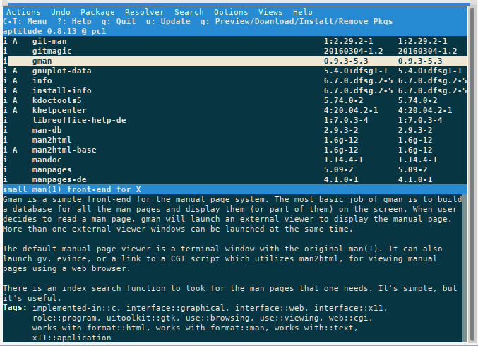

BEGINNING   INFO AREA FOR THE AUTHORS
This area is to be removed when the status RC3 is reached. The first line of the file must contain the title (% my-title) !!!  
**Status: RC1**

Necessary work:

+ check intern links  
+ check extern links  
+ check layout  
+ check spelling  

Work done

END   INFO AREA FOR THE AUTHORS  
BEGINNING   INFO AREA FOR THE AUTHORS  
This area is to be removed when the status RC3 is reached. The first line of the file must contain the title (% my-title) !!!  
**Status: RC1**

Necessary work:

+ check intern links  
+ check extern links  
+ check layout  
+ check spelling  

Work done

END   INFO AREA FOR THE AUTHORS  
% A small APT cookbook

## APT package management

APT is an acronym for **A**dvanced **P**ackaging **T**ool and provides a collection of programs and scripts that assist the system and administrator in installing and managing Debian packages.  
A complete description of the APT system can be found in [Debian's APT-HOWTO](https://wiki.debian.org/DebianPackageManagement).

### apt and apt-get

**apt** is intended as an end-user interface and, compared to more specialized tools such as **apt-get** and **apt-cache**, enables some options more suitable for interactive use by default. With **apt** not all options of **apt-get** and **apt-cache** are available. Please read the man pages of **apt**, **apt-get** and **apt-cache**. The following table shows the respective commands and their basic meaning.

| apt | apt-get | short info |
| --- | --- | --- |
| [apt update](0705-sys-admin-apt_en.md#apt-update) | apt-get update | Refresh the package database. |
| apt upgrade | apt-get upgrade | Update the system to the latest available package versions. |
| [apt full-upgrade](0705-sys-admin-apt_en.md#updating-the-system) | apt-get dist-upgrade | Upgrades the system to the latest available package versions even if it means removing already installed packages. |
| apt full-upgrade -d | apt-get dist-upgrade -d | Upgrades the system as before, but only downloads and does not install anything.  |
| [apt install](0705-sys-admin-apt_en.md#install-packages) | apt-get install | Install one or more packages. |
| [apt remove](0705-sys-admin-apt_en.md#remove-packages) | apt-get remove | Remove one or more packages. |
| [apt purge](0705-sys-admin-apt_en.md#remove-packages) | apt-get purge | Remove one or more packages including configuration files. |
| - [apt-mark hold](0705-sys-admin-apt_en.md#hold-or-downgrade-a-package) | Prevents apt from installing another version of the package.  |
| - | [apt-mark unhold](0705-sys-admin-apt_en.md#hold-or-downgrade-a-package) | Cancels the 'apt-mark hold' command. |
| [apt search](0705-sys-admin-apt_en.md#searching-for-program-packages) | apt-get search | Searches for packages according to the pattern entered. (regex possible) |
| [apt show](0705-sys-admin-apt_en.md#package-search-in-the-terminal) | apt-cache show | Display the details of a package. |
| [apt list](0705-sys-admin-apt_en.md#package-search-in-the-terminal) | apt-cache policy | Show the installed, or installable version of a package. |

### sources.list - List of sources

The "APT" system needs a configuration file which contains information about the location of installable and upgradeable packages. In general, this file is called sources.list. Modern systems now use modularized sources to improve the overview.

siduction provides the sources in this folder:

~~~
/etc/apt/sources.list.d/
~~~

Inside this directory are the following files by default: 

~~~
debian.list
extra.list
fixes.list
~~~

This has the advantage that it is easier to automatically select from mirror servers ("mirror switching"), and it also makes it easier to add or replace source lists.

Custom source list files can be added with the naming /etc/apt/sources.list.d/*.list. For example, on a siduction, /etc/apt/sources.list.d/extra.list might look like this:

~~~
This is the default mirror, chosen at first boot.
# One might consider to choose the geographically nearest or the fastest mirror.
deb http://packages.siduction.org/extra unstable main contrib non-free
#d eb-src http://packages.siduction.org/extra unstable main contrib non-free
~~~

under /etc/apt/sources.list.d/fixes.list it might look like this:

~~~
deb https://packages.siduction.org/fixes unstable main contrib non-free
#deb-src https://packages.siduction.org/fixes unstable main contrib non-free
~~~

and /etc/apt/sources.list.d/debian.list then contains the actual Debian repo:

~~~
# debian loadbalancer
deb http://deb.debian.org/debian/ unstable main contrib non-free
# deb-src http://deb.debian.org/debian/ unstable main contrib non-free
~~~

More entries for optional siduction repositories can be found at [siduction repositories](https://packages.siduction.org/).

For example, adding one or more Debian repositories would look like this:

~~~
#Debian
#Unstable
deb http://ftp.us.debian.org/debian/ unstable main contrib non-free
#deb-src http://ftp.us.debian.org/debian/ unstable main contrib non-free

# Testing
#deb http://ftp.us.debian.org/debian/ testing main contrib non-free
#deb-src http://ftp.us.debian.org/debian/ testing main contrib non-free

# Experimental
#deb http://ftp.us.debian.org/debian/ experimental main contrib non-free
#deb-src http://ftp.us.debian.org/debian/ experimental main contrib non-free
~~~

*TO NOTE:*  
This example uses the US Debian mirror starting with ftp.us. This setting can be changed as root by adjusting the country code (for example: ftp.at, ftp.de). Most countries have local Debian mirrors available. This provides a higher connection speed for the user and also saves bandwidth.

[List of currently available Debian servers and their mirrors.](https://www.debian.org/mirrors/)

### apt update

To get updated information about the packages, a database is kept with the needed entries. The apt program uses it when installing a package to resolve all dependencies and thus guarantee that the selected packages will work. The creation or update of this database is done with the command **apt update**.

~~~
root@siduction# apt update
Fetch:1 http://siduction.org sid Release.gpg [189B]
Fetch:2 http://siduction.org sid Release.gpg [189B]
Fetch:3 http://siduction.org sid Release.gpg [189B]
Get:4 http://ftp.de.debian.org unstable Release.gpg [189B]
Get:5 http://siduction.org sid Release [34.1kB]
Get:6 http://ftp.de.debian.org unstable Release [79.6kB]
Fetched 404 kB in 8 s (50.8 kB/s).
Package lists are read... Done
Dependency tree is built.
Status information is read.... Done
Upgrade available for 48 packages. Run "apt list --upgradable" to view them.
~~~

### Install packages

If we know the name of the package, the command **apt install <package name>** is sufficient.  
(See below for how to find a package).

> **Warning:**  
> Packages that are **not** installed in the 'multi-user.target' (formerly runlevel 3) can bring big, unsupportable problems!

Therefore we recommend the following procedure:

1. log out of the desktop environment
2. go into text mode with Ctrl+Alt+F2
3. log in as root

and then install the desired program package:

~~~
init 3
apt update
apt install <package name>
init 5 && exit
~~~

In the example below, the package "funtools" is installed.

~~~
root@siduction# apt install funtools
aketlists are read... Ready
Dependency tree is built.
Status information is read.... Done
The following additional packages are installed:
  libfuntools1 libwcstools1
The following NEW packages are installed:
  funtools libfuntools1 libwcstools1
0 updated, 3 reinstalled, 0 to remove and 48 not updated.
There are 739 kB of archives to download.
After this operation, 2,083 kB of additional disk space is used.
Do you want to continue? [Y/n] y
Fetch:1 http://deb.debian.org/debian unstable/main amd64 libwcstools1 amd64 3.9.5-3 [331 kB]
Fetch:2 http://deb.debian.org/debian unstable/main amd64 libfuntools1 amd64 1.4.7-4 [231 kB]
Fetch:3 http://deb.debian.org/debian unstable/main amd64 funtools amd64 1.4.7-4 [177 kB]
Fetched 739 kB in 0 s (1,678 kB/s).
Previously unselected package libwcstools1:amd64 is selected.
(Read database ... 279741 files and directories are currently installed).
Preparation for unpacking .../libwcstools1_3.9.5-3_amd64.deb ...
Unpacking libwcstools1:amd64 (3.9.5-3) ...
Previously unselected package libfuntools1:amd64 is selected.
Preparing to unpack .../libfuntools1_1.4.7-4_amd64.deb ...
Unpacking libfuntools1:amd64 (1.4.7-4) ...
Previously unselected package funtools is selected.
Preparing to unpack .../funtools_1.4.7-4_amd64.deb ...
Unpacking funtools (1.4.7-4) ...
libwcstools1:amd64 (3.9.5-3) is set up ...
libfuntools1:amd64 (1.4.7-4) is set up ...
funtools (1.4.7-4) is set up ...
triggers for man-db (2.8.5-2) are processed ...
triggers for libc-bin (2.28-8) are processed ...
~~~

### Remove packages

The **apt remove <package name>** command removes a package. Dependencies are not removed in the process:

~~~
root@siduction# apt remove gaim
Package lists are read... Done
Dependency tree is built.
Status information is read.... Done
The following packages were installed automatically and are no longer needed:
     libfuntools1 libwcstools1
Use "sudo apt autoremove" to remove them.
The following packages are REMOVED:
     funtools
0 updated, 0 reinstalled, 1 to remove and 48 not updated.
After this operation, 505 kB of disk space will be freed.
Do you want to continue? [Y/n] y
(Read database ... 279786 files and directories are currently installed).
Removing funtools (1.4.7-4) ...
Triggers for man-db (2.8.5-2) are processed ...
~~~

In the last case the configuration files are not removed from the system, they can be used again in a later reinstallation of the program package (in the example case gaim). If the configuration files should also be removed, then the following call is needed:

~~~
apt purge funtools
~~~

This will also remove the configuration files. If you want to see if configuration files of already removed programs are still on the system, you can easily get a result with **dpkg**:

~~~
dpkg -l | grep ^rc
rc colord 1.4.3-3.1 amd64 system service to manage device color profiles -- system daemon
rc hplip 3.18.10+dfsg0-1 amd64 HP Linux Printing and Imaging System (HPLIP)
rc libsensors4:amd64 1:3.4.0-4 amd64 library to read temperature/voltage/fan sensors
rc sane 1.0.14-13.1 amd64 scanner graphical frontends
rc sane-utils 1.0.27-3.1 amd64 API library for scanners -- utilities
rc systemd-coredump 240-1 amd64 tools for storing and retrieving coredumps
~~~

The packages listed here were removed without purgen.

### Hold or downgrade a package

Sometimes it may be necessary to revert to an earlier version of a package because the latest version has a serious bug.

**Hold**

~~~
apt-mark hold <package>
~~~

To end the hold of a package

~~~
apt-mark unhold <package>
~~~

This is how to search for packages that are placed on hold:

~~~
apt-mark showhold
~~~

Please keep in mind that hold is only an emergency measure. You will run into problems if you forget to release a hold in a timely manner. This is even more true the more (essential) dependencies the package has. So: please release holds only in case of emergency and as soon as possible.

**Downgrade (Deactualization)**

Debian does not support downgrading packages. In simple cases, installing older versions can succeed, but it can also fail spectacularly. For more information, see the Emergency downgrading chapter in the Debian Handbook.

Although downgrading is not supported, it can succeed for simple packages. The steps for a downgrade are now demonstrated on the package kmahjongg:

Unstable sources are added to /etc/apt/sources.list.d/debian.list with a hash sign "#".  
The sources for Testing are added to /etc/apt/sources.list.d/debian.list and the further commands are executed:  

~~~
apt update
apt install kmahjongg/testing
~~~

The now installed package is protected from updates, set to hold:

~~~
apt-mark hold kmahjongg
~~~

then the sources for testing are marked with a hash "#" in /etc/apt/sources.list.d/debian.list, while the hashes in front of the sources for unstable are removed again. After saving the changes:

~~~
apt update
~~~

When a new, bug-free package arrives in sid, you can reinstall the latest version if you exit the "hold" state:

~~~
apt-mark unhold kmahjongg
apt update
apt install kmahjongg / apt full-upgrade
~~~

### Updating the system

An upgrade of the whole system is performed with this command: **apt full-upgrade**. Before such an action, the current upgrade warnings on the main siduction page should be followed to check whether packages of one's own system are affected. If an installed package should be kept, i.e. put on hold, please refer to the [downgrade or "hold"](0705-sys-admin-apt_en.md#hold-or-downgrade-a-package) section of a package.

A simple "apt upgrade" of Debian Sid is usually not recommended. However, it can be helpful if there is a situation with many packages held or to be removed. Here an **apt upgrade** can update packages not affected by the situation.

How regularly should a system upgrade be performed?  
A system update should be performed regularly, every one to two weeks has proven to be a good guideline. Even monthly system updates should not cause any significant problems. Theoretically, the system can be updated several times a day after mirror synchronization every 6 hours. 

Experience shows that longer than two, maximum three months should not be waited. Special attention should be paid to program packages which do not come from the siduction or Debian repositories or which have been compiled by yourself, as they may lose their functionality after a system update via full-upgrade due to incompatibilities.

**Update not with live media**

The possibility of updating a siduction installation using a live medium does not exist. Below we describe in detail the upgrade process and why "*apt*" should be used.

### Updateable packages

After updating the internal database, you can find out for which packages a newer version exists (first you need to install apt-show-versions):

~~~
root@siduction# apt-show-versions -u
libpam-runtime/unstable upgradeable from 0.79-1 to 0.79-3
passwd/unstable upgradeable from 1:4.0.12-5 to 1:4.0.12-6
teclasat/unstable upgradeable from 0.7m02-1 to 0.7n01-1
libpam-modules/unstable upgradeable from 0.79-1 to 0.79-3.........
~~~

The same can be achieved with:

~~~
apt list --upgradable
~~~

The upgrade of a single package (here e.g. debtags-1.6.6.0) can be done considering the dependencies with:

~~~
root@siduction# apt install debtags-1.6.6.0
Package lists are read... Ready
Dependency tree is built... Done
The following packages are REMOVED:
  apt-index-watcher
The following packages are updated:
  debtags
1 updated, 0 reinstalled, 1 to remove and 0 not updated.
660kB of archives need to be fetched.
After unpacking, 1991kB of disk space will have been freed.
Do you want to continue [Y/n]?
Get:1 http://ftp.de.debian.org unstable/main debtags 1.6.6 [660kB]
Fetched 660kB in 1s (513kB/s)
(Read database ... 138695 files and directories are currently installed).
Remove apt-index-watcher ...
(Read database ... 138692 files and directories are currently installed).
Prepare to replace debtags 1.6.2 (with .../debtags_1.6.6_i386.deb) ...
Unpack replacement for debtags ...
Set up debtags (1.6.6) ...
Install new version of the configuration file /etc/debtags/sources.list ...
~~~

**Download (only)**

A little known but great option is the -d option:

~~~
apt update && apt full-upgrade -d
~~~

**-d** allows to save the packages of a full-upgrade locally without installing them. This can be done in a console while in X. The full-upgrade itself can be done later in init 3. This also gives one the opportunity to check for any warnings and then decide whether or not to perform the upgrade:

~~~
root@siduction#apt full-upgrade -d
Reading package lists... Done
Building dependency tree
Reading state information... Done
Calculating upgrade... Done
The following NEW packages will be installed:
  elinks-data
The following packages have been kept back:
  git-core git-gui git-svn gitk icedove libmpich1.0ldbl
The following packages will be upgraded:
  alsa-base bsdutils ceni configure-ndiswrapper debhelper
  discover1-data elinks file fuse-utils gnucash.........
35 upgraded, 1 newly installed, 0 to remove and 6 not upgraded.
Need to get 23.4MB of archives.
After this operation, 594kB of additional disk space will be used.
Do you want to continue [Y/n]?J 
~~~

**`J`** downloads the packages to be updated or reinstalled without changing the installed system.

After downloading the packages using "*full-upgrade -d*", they can be installed at any time according to the procedure in the following paragraph.

### run full-upgrade

> **Warning:**  
> A system update that is **not** performed in the 'multi-user.target' (formerly runlevel 3) can lead to problems when it comes to updates of the installed desktop environment or the X server!

Before updating the system, visit the [siduction home page](https://forum.siduction.org/) to find out about any upgrade warnings. These warnings are necessary because of the structure of Debian sid/unstable, which adds new program packages to its repositories several times a day.

  
  The following procedure should be followed:

1. log out of the desktop environment
  (this procedure is nowadays only recommended when updating X or the desktop environment itself, but does not hurt in other cases)
  
2. enter text mode with **`Ctrl`** + **`Alt`** + **`F2`**
3. log in as root

and then execute the following commands:

~~~
init 3
apt update
apt full-upgrade
apt clean
init 5 && exit
~~~

Please refrain from system updates with applications like synaptic, adept or kpackage!

### Why use apt exclusively

Package managers like adept, synaptic and kpackage cannot always correctly resolve the extensive changes in Sid (changes in dependencies, naming conventions, scripts, etc.). These are not bugs in these programs or mistakes made by the developers.

The mentioned programs are excellent for installing *Debian stable* and they are very good for searching program packages, but they are not adapted to the special tasks of the dynamic distribution Debian Sid. For installing, deleting and performing a system update *apt* should be used.

Package managers like adept, synaptic and kpackage are - technically speaking - non-deterministic. When using a dynamic distribution like Debian Sid with the addition of third party repositories whose quality cannot be tested by the Debian team, a system update can lead to disaster, as these package managers can make wrong decisions by automatically trying to solve the problem.

Furthermore, it should be noted that ALL GUI package managers must be run in X. System updates in X (even an anyway not recommended 'apt upgrade') will sooner or later cause you to irreversibly damage your system.

In contrast, apt does only what is requested. In the case of incomplete dependencies in Sid, i.e. when the system breaks (this can happen in Sid during structural changes), the causes can be precisely determined and thus repaired or bypassed. The own system does not "break". So if a system update feels like deleting half the system, apt leaves it up to the administrator to decide what to do, and does not act on its own.

This is the reason why Debian builds use apt and not other package managers.

### Searching for program packages

The APT system provides a number of useful search commands that search the APT database and output information about packages. In addition, there are some programs that graphically display the search.

#### Package search in the terminal

With the simple command **apt search <search pattern>** you get the list of all packages containing the search pattern. Searching with *search* allows the use of regex terms.

For example, if you search for "*gman*", you get this result:

~~~
user1@pc1:~$ apt search ^gman
Sorting... Done
Full text search... Done
gman/unstable,now 0.9.3-5.3 amd64 [installed]
  small man(1) front-end for X

gmanedit/unstable 0.4.2-7 amd64
  GTK+/GNOME editor for manual pages
~~~

Here the "^" means that "gman" must be at the beginning of the line. Without this character, the pattern will also find khan*gman* and lo*gman*ager, for example.

If you want more information about the current versions of a package, use:

~~~
user1@pc1:~$ apt show gman
Package: gman
Version: 0.9.3-5.3
Priority: optional
Section: doc
Maintainer: Josip Rodin <joy-packages@debian.org>
Installed-Size: 106 kB
Provides: man-browser
Depends: libc6 (>= 2.14), libgcc1 (>= 1:3.0), libglib2.0-0 (>= 2.12.0),
 libgtk2.0-0 (>= 2.8.0), libstdc++6 (>= 5), man-db, xterm | x-terminal-emulator
Suggests: gv, man2html, httpd, sensible-browser, evince
Tag: implemented-in::c, interface::graphical, interface::web, interface::x11,
 role::program, uitoolkit::gtk, use::browsing, use::viewing, web::cgi,
 works-with-format::html, works-with-format::man, works-with::text,
 x11::application
Download size: 34.3 kB
APT-Manual-Installed: yes
APT Sources: http://ftp.de.debian.org/debian unstable/main amd64 Packages
Description: small man(1) front-end for X
 Gman is a simple front-end for the manual page system. The most basic job
 of gman is to build a database for all the man pages and display them
 (or part of them) on the screen. When user decides to read a man page,
 gman will launch an external viewer to display the manual page. More than
 one external viewer windows can be launched at the same time.
 ...
~~~

All installable versions of the package (depending on the sources.list) can be listed as follows:

~~~
user1@pc1:~$ apt list gman
listing... Done
gman/unstable,now 0.9.3-5.3 amd64 [installed]
~~~

The command **aptitude** (in the terminal) opens the program of the same name in an ncurses environment. It is operated with the keyboard or mouse and offers various functions which can be reached via the upper menu bar. The use of APT or Aptitude is a matter of taste, but Aptitude is often "too smart" for the speed of Debian Unstable.

#### Graphical package search

The program **packagesearch** is very useful to search for suitable programs. Mostly "packagesearch" is not installed automatically; therefore:

~~~
apt update
apt install packagesearch
~~~

After the first start of packagesearch you have to select "apt" in *Packagesearch* > *Preferences* and occasionally an info window appears, which criticizes the absence of deborphan. Please use the information from deborphan with utmost caution.

Packagesearch is not intended to be used to install files/packages, but only as a graphical search engine. Upgrading and reinstalling files without first quitting X can cause problems (see above).

The following search criteria are available:

+ pattern (general search query)
+ tags (search based on debtags)
+ files (file names)
+ installed status
+ orphaned packages (orphaned packages)

In addition, a lot of information about Debian packages is provided, including which files are bundled in a package. More detailed information about using packagesearch can be found at *Help* > *Contents*.  Currently the user interface of packagesearch is English only.

A complete description of the APT system can be found in [Debian's APT-HOWTO](https://wiki.debian.org/DebianPackageManagement).

Last edited: 2021-22-08

