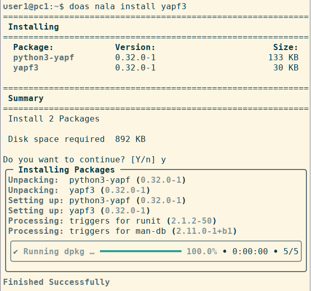
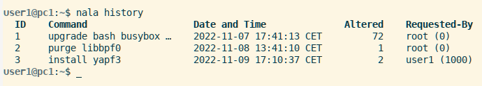
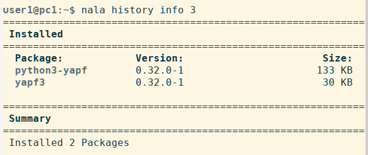
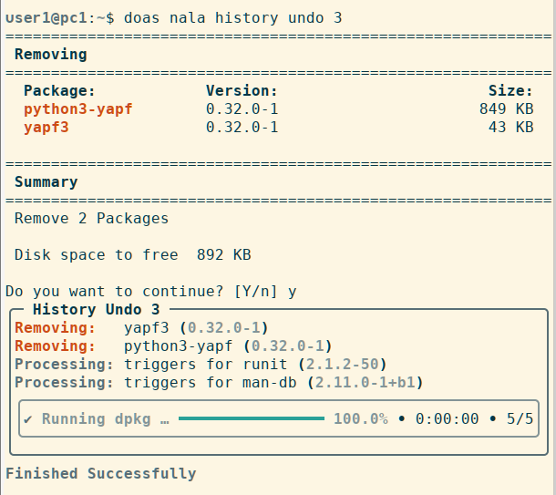

% Nala for package management

## Nala package management

**More user-friendly and powerful than APT**

Nala is a command line frontend for the APT package manager. It uses the `python-apt` API instead of the APT libraries to manage packages. The goal of Nala is to provide a clearer and more user-friendly display of the current package inventory as well as the requested actions and their execution. It also intends to speed up package download.

Nala uses many APT commands such as `install`, `remove`, `purge`, `update`, `show`, and `search`. It also implements the `history` command to see past transactions and allow the user to undo them, and the `fetch` command that displays a list of the fastest mirror servers to choose from. By default, Nala speeds up downloads by fetching three packets at a time from a server. The limit of three connections per mirror exists to minimize the load on the mirrors.

### Use Nala

As of siduction 2022.12.0, Nala is installed automatically and can be used immediately. It is not mandatory to use Nala, you can switch between APT and Nala at will. A look at the manpage **`man nala`** should be mandatory. Before use we strongly recommend to make a change in the configuration file `/etc/nala/nala.conf`.  

We change the value for the `auto_remove` configuration option to `false` as shown in the following listing:

~~~
# Set to false to disable auto auto-removing
auto_remove = false
~~~

The reason for this is the use of *debian sid* as basis for siduction. When upgrading sid, occasionally a situation may arise where significant parts of the system are to be removed. With the `auto_remove = true` option we have no way to investigate, check, and decide for ourselves if or which packages to remove. Even in normal operation packages should not be removed with `auto_remove`, but only after a visual check.

### Commands analogous to APT

Many of the commands known from APT are identical in Nala. By default, Nala always expects confirmation before performing a requested action that changes the system.

+ **`nala update`**  
  Updates the package information of the configured package sources.
  
+ **`nala install <package>`**  
  Installs the named package into our system.
  
+ **`nala remove <package>`**  
  Removes the named package from our system.
  
+ **`nala purge <package>`** or **`nala remove --purge <package>`**  
  Removes the named package with its configuration files from our system.
  
+ **`nala upgrade`**  
  Runs `update` followed by `dist-upgrade`.

The user-friendly formatting of the output in the terminal facilitates the overview, as the example shows.  
(To gain root privileges, *"doas"* was used in the command.)

In the first part of the output we get a list of the packages to be installed with the indication of their versions and size. After confirmation, the second part lists the actions performed.

### Commands that APT does not include

**"fetch" command**

The **`nala fetch`** command, run without any other options, automatically determines the distribution and release of our installation, searches for the fastest mirror servers, lists them for interactive selection, and, after selecting one or more servers, creates the file `/etc/apt/sources.list.d/nala-sources.list`.

The `-c, --country` option limits the search using the ISO country code. Multiple specifications of the option are allowed.  
The `--non-free` option adds contrib and non-free components to the file.

During download, up to three packages are fetched from the server simultaneously.

**"history" command**

The **`nala history`** command, called without a subcommand, shows a summary of all actions performed with Nala. Each line corresponds to an action and contains the ID, the command, the timestamp, the number of packages changed, and the user who requested the action. Actions performed by other programs are not recorded.

Details about an action from the history are shown by the same command with the attached subcommand `info <ID>`.

If we now want to undo the installation of *"yapf3"* with its dependencies, in our case *"python3-yapf "*, we use the subcommand `undo <ID>` for this.  
(Again, **user1** gets root privileges by using *"doas "*.)

In the first part of the output, we see the packages to be removed with the indication of their versions and size. After confirmation, the second part lists the actions performed.  
If we change our mind and want to use the packages again, the `nala history redo <ID>` command will help us to perform the action again. The `nala history clear <ID>` command can be used to remove entries from the history, `nala history clear --all` removes all entries.

In the Nala version 0.11.1 described here, the subcommands `undo <ID>` and `redo <ID>` currently only support the actions Install or Remove. In a future version, which will be based on the Rust programming language, it should be possible to roll back complete dist upgrades.

Last edited: 2022-11-09

