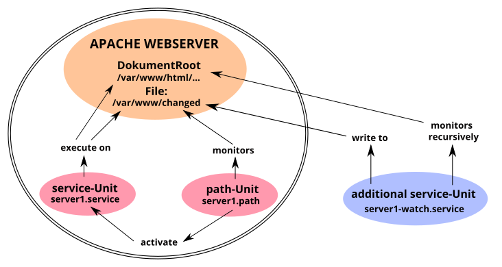

% Systemd - path

## systemd-path

The basic and introductory information about Systemd is contained in the manual page [Systemd-Start](./0710-systemd-start_en.md#systemd-der-system--und-dienste-manager) The sections *[Unit]* and *[Install]* concerning all unit files are covered by our manual page [Systemd Unit file](./0411-systemd-unit-file_en.md#systemd-unit-file).  
In this manual page, we explain the function of the **systemd.path** unit, which systemd uses to monitor paths and trigger path-based actions.

The "*.path-Unit*" makes it possible to trigger an action when files and directories (paths) are changed.  
Once an event occurs, Systemd can execute a command or script through a service unit. The "*.path-Unit*" is not able to monitor directories recursively. However, multiple directories and files can be specified.  
The path-specific options are configured in the *[Path]* section.

### Required files

The **systemd-path** unit requires at least two files with preferably the same name but different extensions in the directory */usr/local/lib/systemd/system/* for its function. (If necessary, create the directory beforehand with the command **`mkdir -p /usr/local/lib/systemd/system/`**). These are the

+ path unit file (\<name\>.path), which contains the monitoring and the trigger for the service unit  
    and  
+ service unit file (\<name\>.service), which contains the action to be started.  
    For more extensive actions, you also create a script in */usr/local/bin/* that is executed by the service unit.

### path-Unit options

The *.path-Unit* must contain the section *[Path]*, which defines how and what to monitor.

The special options are:

+ PathExists=  
    checks if the path in question exists. If it does, the corresponding unit will be activated.

+ PathExistsGlob=  
    As above, supports file glob expressions (see also the output of man glob.

+ PathChanged=  
    Observes a file or path and activates the associated unit when changes occur.  
    Action-triggering changes are:
    + Creation and deletion of files.  
    + Attributes, permissions, ownership.  
    + Closing the file being watched after write access and closing any file after write access when the path is watched.

+ PathModified=  
    as before, but in addition the associated unit is activated on simple write accesses, even if the file is not closed.

+ DirectoryNotEmpty=  
    activates the corresponding unit if the directory is not empty.

+ Unit=  
    activates the associated unit to be activated. It should also be noted that the *.path-Unit* activates the "*.service-Unit*" with the same name by default. Only in case of deviations from this the option *Unit=* within the section *[Path]* is necessary.

+ MakeDirectory=  
    the directory to watch will be created before watching.

+ DirectoryMode=  
    sets the access mode in octal notation when used for the previously created directory. Default 0755.

**An example**.  

Based on the Apache web server configuration according to our manual page [LAMP - Apache, Users and Rights](./0521-lamp-apache_en.md#users-and-rights), let's illustrate the interaction of *.path-Unit* with other *systemd-Unit*.

The figure *path-Unit-Function* represents the dependencies of the systemd units of our example.

The double-bordered part in the graphic illustrates the core function of the *.path-Unit*. The *server1.path* unit monitors the file "*/var/www/changed*" and activates the corresponding *server1.service* unit in case of changes. This in turn then performs the desired actions in the directory "*/var/www/html/*" and restores the file "*/var/www/changed*".  
The "*server1-watch.service*" unit outside the outline takes over the recursive monitoring of *DocumentRoot* of the Apache web server.

### create path unit

We create the file *server1.path* in the directory */usr/local/lib/systemd/system/*, which monitors the file */var/www/changed* for changes, with the following content:

~~~
[Unit]
Description=Monitoring "changed" file!
BindsTo=server1-watch.service
After=server1-watch.service

[Path]
PathModified=/var/www/changed

[Install]
WantedBy=multi-user.target
~~~

**Explanations  
Section [Unit]:  
The "*BindsTo=*" option represents the strongest available binding of two systemd units to each other. If one of them enters an error state during startup or operation, the other will also be terminated immediately.  
Together with the "*After=*" option, it is achieved that the *server1.path* unit starts only after the *server1-watch.service* unit reports its successful start back to systemd.

Section [Path]:  
"*PathModifid=*" is the correct choice. The option reacts to changes in the file */var/www/changed*, even if the file is not closed.  
The option "*PathModifid=*" (or others, see above) can be specified multiple times.

### service unit for path

The *server1.service* unit is activated and controlled by the *server1.path* unit and therefore does not need an *[Install]* section. Thus, the description of the unit in the *[Unit]* section, and in the *[Service]* section the commands to be executed, are sufficient.

We create the file *server1.service* in the directory */usr/local/lib/systemd/system/* with the following content.

~~~
[Unit]
Description=Change permissions in server1 folder

[Service]
Type=oneshot
ExecStartPre=/usr/bin/truncate -s 0 /var/www/changed
ExecStart=/usr/bin/chown -R www-data /var/www/html/
ExecStart=/usr/bin/chmod -R g+w /var/www/html/
ExecStart=/usr/bin/chmod -R o-r /var/www/html/
~~~

**Explanations**.  
Section [Service]:  
"*ExecStart=*" commands are executed only after all "*ExecStartPre=*" commands have completed successfully.
First the file */var/www/changed* is reset to 0-bite and then the rest is executed.

#### Create additional service unit

Since the *.path unit* cannot recursively monitor directories, we need an additional *.service unit* for our example. We create the file *server1-watch.service* in the directory */usr/local/lib/system/system/* with the following content.

~~~
[Unit]
Description=Watching server1 folder.
Before=server1.path
Wants=server1.path

[Service]
Type=forking
ExecStart=inotifywait -dqr -e move,create -o /var/www/changed /var/www/html/

[Install]
WantedBy=multi-user.target
~~~

Remark:  
Interestingly, systemd internally uses the inotify API for *.path-Unit* to monitor filesystems, but does not implement its recursive function.

**Explanations  
The [Unit] section:  
"*Before=*" and "*Wants=*" are the corresponding correlations to "*BindsTo=*" and "*After=*" from *server1.service-Unit*.

Service] section:  
*inotifywait* logs to the */var/www/changed* file located outside of *DocumentRoot* of the Apache web server.

### Include path unit

Due to the dependency, we first incorporate the *server1.path unit* and then the *server1-watch.service unit* into systemd. The *server1.service-unit* does not need and does not contain an [Install] section. When trying to include it, we received an error message.

~~~
# systemctl enable server1.path
Created symlink /etc/system/system/multi-user.target.wants/server1.path /usr/local/lib/system/system/server1.path.

# systemctl enable server1-watch.service
Created symlink /etc/system/system/multi-user.target.wants/server1-watch.service /usr/local/lib/system/system/server1-watch.service.
~~~

Now the monitoring is also immediately active, as the status outputs of all three units show us.

~~~
# systemctl status server1-watch.service
● server1-watch.service - Watching server1 folder.
     Loaded: loaded (/usr/local/lib/system/system/server1-watch.service; enabled; vendor preset: enabled)
     Active: active (running) since Sun 2021-02-21 19:25:20 CET; 1min 49s ago
    Process: 23788 ExecStart=inotifywait -dqr -e move,create -o /var/www/changed /var/www/html/ (code=exited, status=0/SUCCESS)
   Main PID: 23790 (inotifywait)
      Tasks: 1 (limit: 2322)
     Memory: 216.0K
        CPU: 5ms
     CGroup: /system.slice/server1-watch.service
             └─23790 inotifywait -dqr -e move,create -o /var/www/changed /var/www/html/

Feb 21 19:25:20 lap1 systemd[1]: Starting Watching server1 folder....
Feb 21 19:25:20 lap1 systemd[1]: Starting Watching server1 folder..

# systemctl status server1.path
● server1.path - Monitoring "changed" file!
     Loaded: loaded (/usr/local/lib/system/system/server1.path; enabled; vendor preset: enabled)
     Active: active (waiting) since Sun 2021-02-21 19:25:20 CET; 3min 27s ago
   Triggers: ● server1.service

Feb 21 19:25:20 lap1 systemd[1]: Started monitoring "changed" file!.

# systemctl status server1.service
● server1.service - Change permissions in server1 folder.
     Loaded: loaded (/usr/local/lib/system/system/server1.service; static)
     Active: inactive (dead)
TriggeredBy: ● server1.path
~~~

The state "Active: inactive (dead)" of the last output is the normal state for the unit *server1.service*, because this unit is only active if it was triggered by *server1.path* to execute its command chain. After that, it returns to the inactive state.

### Execute service unit manually

Should it ever be helpful or necessary to manually change the file permissions in *DocumentRoot* of the Apache web server, we simply issue this command:

~~~
# systemctl start server1.service
~~~

A new status query generates some additional log lines, from which we can see the successful completion of the command chain.

~~~
# systemctl status server1.service
● server1.service - Berechtigungen im Ordner server1 ändern
     Geladen: geladen (/usr/local/lib/systemd/system/server1.service; statisch)
     Aktiv: inaktiv (tot) seit Mon 2021-02-22 17:55:36 CET; vor 1min 43s
TriggeredBy: ● server1.path
    Process: 2822 ExecStartPre=truncate -s 0 /var/www/changed (code=exited, status=0/SUCCESS)
    Prozess: 2823 ExecStart=chown -R www-data /var/www/html1/ (code=exited, status=0/SUCCESS)
    Prozess: 2824 ExecStart=chmod -R g+w /var/www/html1/ (code=exited, status=0/SUCCESS)
    Prozess: 2825 ExecStart=chmod -R o-r /var/www/html1/ (code=exited, status=0/SUCCESS)
   Haupt-PID: 2825 (code=exited, status=0/SUCCESS)
        CPU: 19ms

Feb 22 17:55:36 lap1 systemd[1]: Starten Berechtigungen im Ordner server1 ändern...
Feb 22 17:55:36 lap1 systemd[1]: server1.service: Erfolglos.
Feb 22 17:55:36 lap1 systemd[1]: Fertig Berechtigungen im Ordner server1 ändern.
~~~

### Quellen systemd-path

[Deutsche Manpage 'systemd.path'](https://manpages.debian.org/testing/manpages-de/systemd.path.5.de.html)

Ein anders gelagertes Beispiel:  
[PRO-LINUX.DE, Systemd Path Units...](https://www.pro-linux.de/artikel/2/1994/systemd-path-units-zum-%C3%9Cberwachen-von-dateien-und-verzeichnissen-verwenden.html)

Seite zuletzt aktualisiert 2021-14-08

