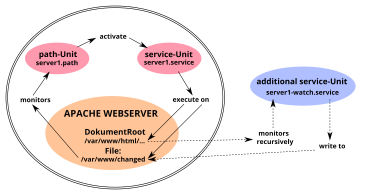

% Systemd - path

## systemd-path

The basic and introductory information about systemd can be found on the manual page [systemd-start](0710-systemd-start_en.md#systemd---the-system-and-services-manager). The sections *[Unit]* and *[Install]* concerning all unit files are covered by our manual page [systemd unit file](0711-systemd-unit-datei_en.md#systemd-unit-file).  
On this manual page, we explain the function of the **systemd.path** unit, which systemd uses to monitor paths and trigger path-based actions.

The path unit makes it possible to trigger an action when files and directories (paths) are changed.  
Once an event occurs, systemd can execute a command or script through a service unit. The path unit is not able to monitor directories recursively. However, multiple directories and files can be specified.  
The path-specific options are configured in the [Path] section.

### Required files

The **systemd-path** unit requires at least two files with preferably the same name but different extensions in the directory `/usr/local/lib/systemd/system/` for its function. (If necessary, create the directory beforehand with the command **`mkdir -p /usr/local/lib/systemd/system/`**.) These are

+ the path unit file (\<name\>.path), which contains the monitoring and the trigger for the service unit  
    and  
+ the service unit file (\<name\>.service), which contains the action to be started.  
    For more extensive actions, you also create a script in `/usr/local/bin/` that is executed by the service unit.

### Path unit options

The path unit must contain the [Path] section, which defines how and what to monitor.

The special options are:

+ `PathExists=`  
    checks if the path in question exists. If it does, the corresponding unit will be activated.

+ `PathExistsGlob=`  
    As above; supports file glob expressions (see also `man glob`).

+ `PathChanged=`  
    observes a file or path and activates the associated unit when changes occur.  
    Action-triggering changes are:
    + creation and deletion of files  
    + attributes, permissions, ownership  
    + closing the file being watched after write access and closing any file after write access when the path is watched

+ `PathModified=`  
    As before, but in addition the associated unit is activated on simple write accesses, even if the file is not closed.

+ `DirectoryNotEmpty=`  
    activates the corresponding unit if the directory is not empty.

+ `Unit=`  
    activates the associated unit to be activated. It should also be noted that the path unit activates the service unit with the same name by default. Only in case of deviations from this, the `Unit=` option within the [Path] section is necessary.

+ `MakeDirectory=`  
    The directory to be watched will be created before watching.

+ `DirectoryMode=`  
    sets the access mode in octal notation when used for the previously created directory (default: 0755).

**An example**  

Based on the Apache web server configuration according to our manual page [LAMP - Apache, users and rights](0521-lamp-apache_en.md#users-and-permissions), let's illustrate the interaction of path unit with another systemd unit.

The figure *Path unit function* represents the dependencies of the systemd units of our example.

The double-bordered part in the graphic illustrates the path unit's core function. The server1.path unit monitors the file `/var/www/changed` and activates the corresponding server1.service unit in case of changes. This in turn then performs the desired actions in the directory `/var/www/html/` and restores the file `/var/www/changed`.  
The server1-watch.service unit outside the outline takes over the recursive monitoring of the Apache web server's `DocumentRoot`.

### Create path unit

We create the file `server1.path` in the directory `/usr/local/lib/systemd/system/`, which monitors the file `/var/www/changed` for changes, with the following content:

~~~
[Unit]
Description=Monitoring "changed" file!
BindsTo=server1-watch.service
After=server1-watch.service

[Path]
PathModified=/var/www/changed

[Install]
WantedBy=multi-user.target
~~~

**Explanations**  
[Unit] section:  
The *"BindsTo="* option represents the strongest available binding of two systemd units to each other. If one of them enters an error state during startup or operation, the other one will also be terminated immediately.  
Together with the *"After="* option, it is achieved that the server1.path unit starts only after the server1-watch.service unit reports its successful start back to systemd.

[Path] section:  
*"PathModifid="* is the correct choice. The option reacts to changes in the file `/var/www/changed`, even if the file is not closed.  
The *"PathModifid="* option (or others, see above) can be specified multiple times.

### Service unit for path

The server1.service unit is activated and controlled by the server1.path unit and therefore does not need an [Install] section. Thus, the unit's description in the [Unit] section and the commands to be executed in the [Service] section are sufficient.

We create the file `server1.service` in the directory `/usr/local/lib/systemd/system/` with the following content.

~~~
[Unit]
Description=Change permissions in server1 folder

[Service]
Type=oneshot
ExecStartPre=/usr/bin/truncate -s 0 /var/www/changed
ExecStart=/usr/bin/chown -R www-data /var/www/html/
ExecStart=/usr/bin/chmod -R g+w /var/www/html/
ExecStart=/usr/bin/chmod -R o-r /var/www/html/
~~~

**Explanations**  
[Service] section:  
*"ExecStart="* commands are executed only after all *"ExecStartPre="* commands have completed successfully.
First the file `/var/www/changed` is reset to 0 byte and then the rest is executed.

**Create additional service unit**

Since the path unit cannot recursively monitor directories, we need an additional service unit for our example. We create the file `server1-watch.service` in the directory `/usr/local/lib/system/system/` with the following content.

~~~
[Unit]
Description=Watching server1 folder
Before=server1.path
Wants=server1.path

[Service]
Type=forking
ExecStart=inotifywait -dqr -e move,create -o /var/www/changed /var/www/html/

[Install]
WantedBy=multi-user.target
~~~

Remark:  
Interestingly, systemd internally uses the inotify API for path unit to monitor filesystems, but does not implement its recursive function.

**Explanations**  
[Unit] section:  
*"Before="* and *"Wants="* are the corresponding correlations to *"BindsTo="* and *"After="* from the server1.service unit.

[Service] section:  
*"inotifywait"* logs to the `/var/www/changed` file located outside of the Apache web server's `DocumentRoot`.

### Include path unit

Due to the dependency, we first incorporate the server1.path unit and then the server1-watch.service unit into systemd. The server1.service unit does neither need nor contain an [Install] section. When trying to include it, we receive an error message.

~~~
# systemctl enable server1.path
Created symlink /etc/system/system/multi-user.target.wants/server1.path /usr/local/lib/system/system/server1.path.

# systemctl enable server1-watch.service
Created symlink /etc/system/system/multi-user.target.wants/server1-watch.service /usr/local/lib/system/system/server1-watch.service.
~~~

Now the monitoring is also immediately active, as the status outputs of all three units show us.

~~~
# systemctl status server1-watch.service
server1-watch.service - Watching server1 folder.
  Loaded: loaded (/usr/local/lib/systemd/system/server1-watch.service; enabled; vendor preset: enabled)
  Active: active (running) since Sun 2021-02-21 [...]
 Process: 23788 ExecStart=inotifywait -dqr -e move,create
          -o /var/www/changed /var/www/html/ (code=exited
          status=0/SUCCESS)
Main PID: 23790 (inotifywait)
   Tasks: 1 (limit: 2322)
  Memory: 216.0K
     CPU: 5ms
  CGroup: /system.slice/server1-watch.service
             └─23790 inotifywait -dqr -e move,create
                -o /var/www/changed /var/www/html/

[...]systemd[1]: Starting Watching server1 folder....
[...]systemd[1]: Started Watching server1 folder..

# systemctl status server1.path
server1.path - Monitoring "changed" file!
  Loaded: loaded (/usr/local/lib/systemd/system/server1.path
          enabled; vendor preset: enabled)
  Active: active (waiting) since Sun 2021-02-21 [...]
Triggers: ● server1.service

Feb 21 19:25:20 lap1 systemd[1]: Started Monitoring "changed" file!.

# systemctl status server1.service
server1.service - Change permissions in server1 folder
     Loaded: loaded (/usr/local/lib/systemd/system/server1.service; static)
     Active: inactive (dead)
TriggeredBy: ● server1.path
~~~

The *"Active: inactive (dead)"* status of the last output is the normal state for the server1.service unit, because this unit is only active if it was triggered by server1.path to execute its command chain. After that, it returns to the inactive state.

### Execute service unit manually

Should it ever be helpful or necessary to manually change the file permissions in `DocumentRoot` of the Apache web server, we simply issue this command:

~~~
# systemctl start server1.service
~~~

A new status query generates some additional log lines, from which we can see the successful completion of the command chain.

~~~
# systemctl status server1.service
server1.service - Change permissions in server1 folder
     Loaded: loaded (/usr/local/lib/systemd/system/server1.service; static)
     Active: inactive (dead) since Mon 2021-02-22 [...]
TriggeredBy: ● server1.path
  Process: 2822 ExecStartPre=truncate -s 0 /var/www/changed
           (code=exited, status=0/SUCCESS)
  Process: 2823 ExecStart=chown -R www-data /var/www/html1/
           (code=exited, status=0/SUCCESS)
  Process: 2824 ExecStart=chmod -R g+w /var/www/html1/
           (code=exited, status=0/SUCCESS)
  Process: 2825 ExecStart=chmod -R o-r /var/www/html1/
           (code=exited, status=0/SUCCESS)
 Main PID: 2825 (code=exited, status=0/SUCCESS)
      CPU: 19ms

[...]systemd[1]: Starting Change permissions in server1
[...]systemd[1]: server1.service: Succeeded.
[...]systemd[1]: Finished Change permissions in server1
~~~

### Sources systemd-path

~~~
man systemd.path
~~~

Last edited: 2022/04/10

